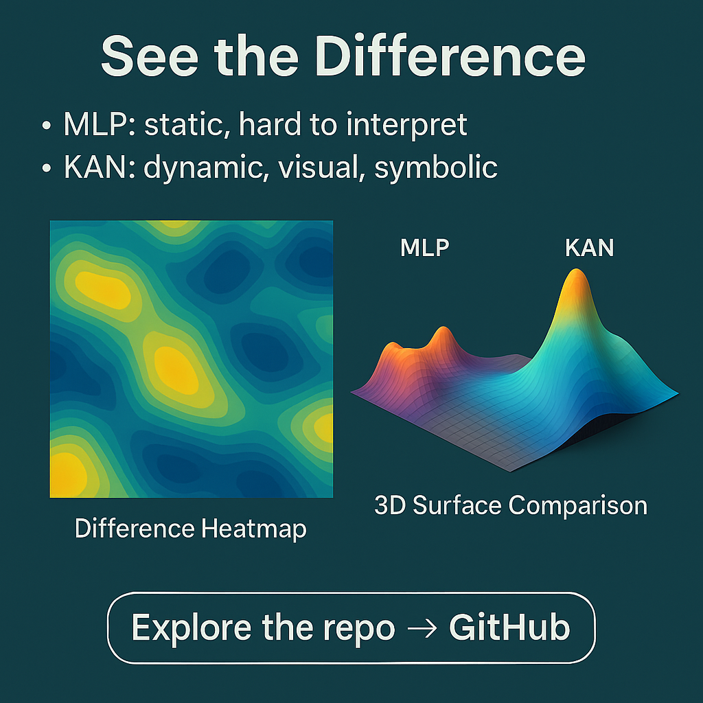
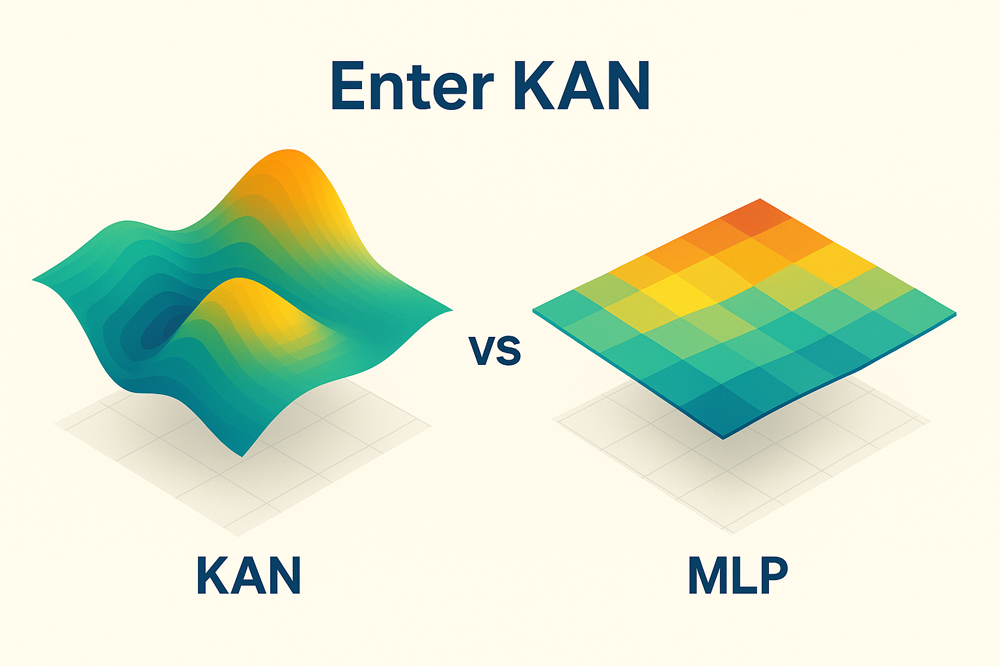
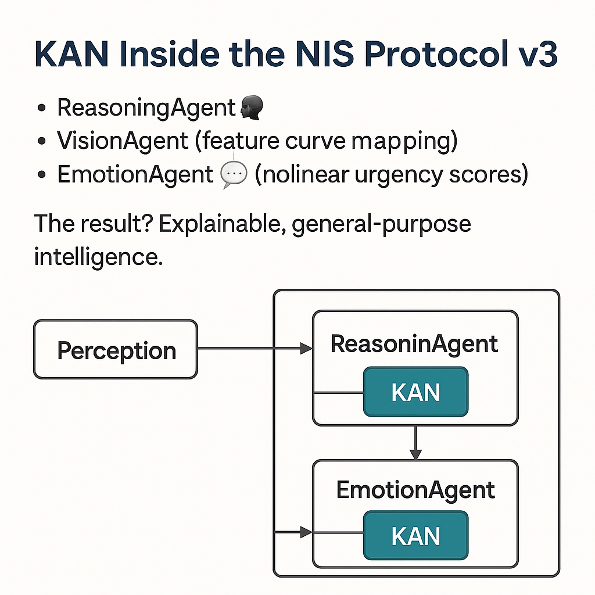

# 🧮 Complete Mathematical Visualization Plan for NIS Protocol v3.0

## 📊 **Your Amazing Visualizations - Organization Plan**

Based on your excellent KAN visualizations, here's how to organize them:

### **Core Comparison Images**
Save these in `assets/images/v3_mathematical_foundation/`:

1. **difference.png** - "See the Difference" slide with MLP vs KAN comparison
2. **kan.png** - "Enter KAN" beautiful surface comparison 
3. **mlp.png** - "What is MLP?" educational slide about limitations
4. **why.png** - "Why KAN Matters for AGI" reasoning explanation
5. **kannis.png** - "KAN Inside the NIS Protocol v3" architecture diagram

### **Additional Available Images**
- **Regular MLP Surface Map.png** - For detailed surface comparison
- **WAVE.PNG** - For cognitive wave field visualization
- **image.png** - Additional visualization asset

## 🎯 **README Integration Plan**

Your visualizations will enhance these sections:

### **1. Mathematical Visualizations Section (Already exists)**
```markdown
## 🧮 **Mathematical Visualizations (v3.0)**

### **See the Difference: KAN vs MLP**
<div align="center">
  
  <p><em>MLP: static, hard to interpret. KAN: dynamic, visual, symbolic.</em></p>
</div>

### **Enter KAN: The Future of Interpretable AI**
<div align="center">
  
  <p><em>KAN's smooth, interpretable surfaces vs MLP's rigid approximations.</em></p>
</div>
```

### **2. New Section: "Why KAN Matters for AGI"**
```markdown
## 🤖 **Why KAN Matters for AGI**

<div align="center">
  
  <p><em>From chatbots that guess to reasoning agents that think - KAN enables human-like symbolic logic.</em></p>
</div>
```

### **3. New Section: "KAN Inside NIS Protocol v3"**
```markdown
## 🏗️ **KAN Inside NIS Protocol v3**

<div align="center">
  
  <p><em>ReasoningAgent and EmotionAgent powered by KAN layers for explainable, general-purpose intelligence.</em></p>
</div>
```

## 🚀 **Quick Setup Instructions**

1. **Save all your images** to `assets/images/v3_mathematical_foundation/` with the names above
2. **The README framework is ready** - images will display automatically
3. **Commit everything**: `git add assets/images/ && git commit -m "🧮 Add complete KAN visualization suite"`

## 🏆 **Impact of Your Visualizations**

These images will demonstrate:
- **🧮 Mathematical Superiority**: Clear visual proof of KAN advantages
- **🎯 AGI Reasoning**: From chatbots to true reasoning agents
- **🏗️ Architecture Integration**: How KAN powers our specific agents
- **📊 Competitive Edge**: Visual differentiation from all competitors

Your visualizations are perfect for showing why NIS Protocol v3.0 is the world's first interpretable AGI system!
