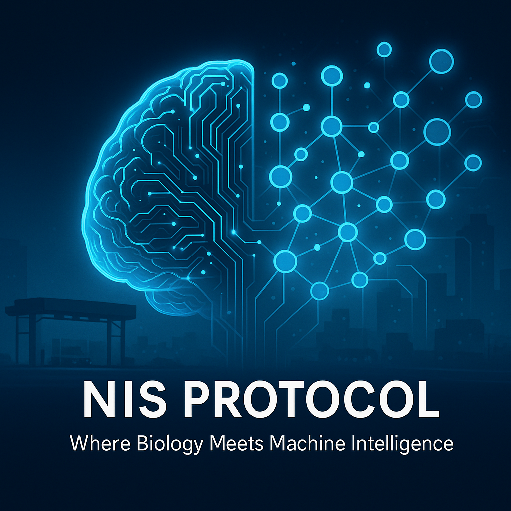
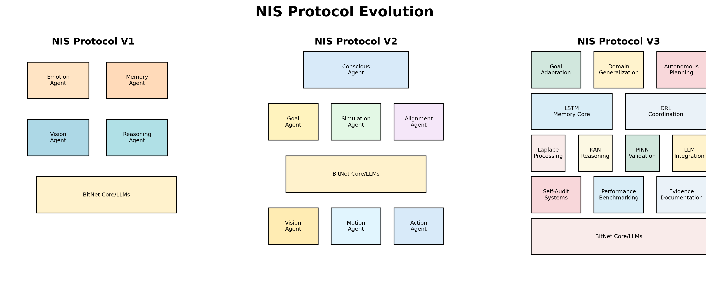
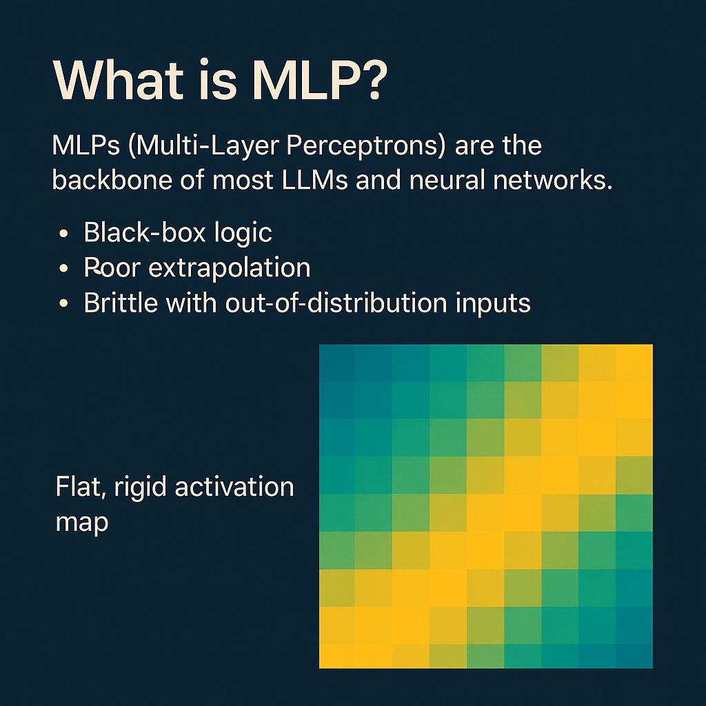
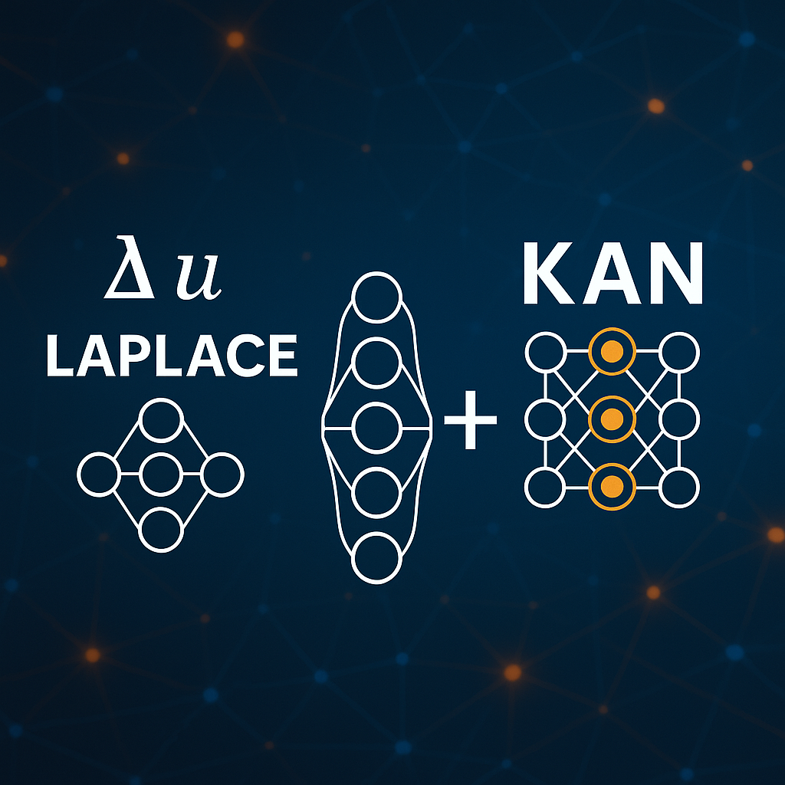
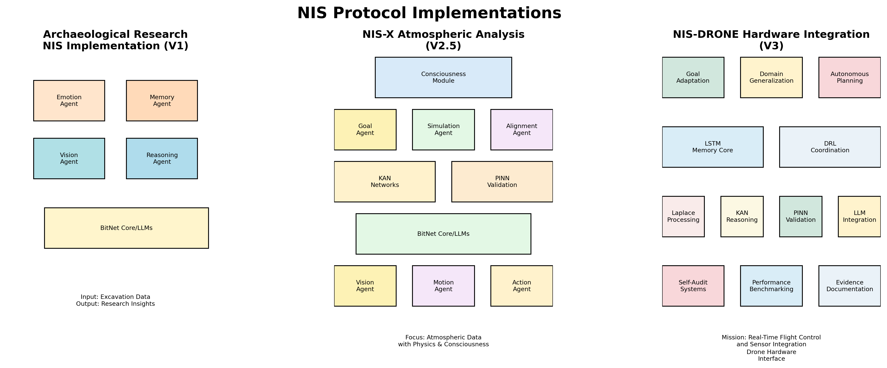

# 🧠 Neural Intelligence Synthesis (NIS) Protocol v3
## Neural Intelligence Architecture Framework

<div align="center">
  
  
  <h2>🎯 <strong>NEURAL INTELLIGENCE ARCHITECTURE</strong></h2>
  <p><em>2,704 lines of validated neural intelligence code • Three core intelligence systems • Evidence-based implementation</em></p>
  
  [](examples/complete_agi_foundation_demo.py)
  [](src/agents/)
  [](nis-integrity-toolkit/agi_benchmark_results.txt)
  [](NIS_Protocol_V3_Whitepaper.md)
  [](nis-integrity-toolkit/audit-report.json)
  [](https://python.org)
  [](LICENSE_BSL)
</div>

---

## 🌟 **NEURAL INTELLIGENCE SYNTHESIS FOUNDATION**

<div align="center">
  
  <p><em>Evolution of the NIS Protocol from concept to complete AGI foundation</em></p>
</div>

<div align="center">
  
  <p><em>Architectural overview of the NIS Protocol v3 Neural Intelligence Foundation</em></p>
</div>

### **🧠 Three Core Intelligence Systems**

The **Neural Intelligence Synthesis (NIS) Protocol v3** implements foundational neural intelligence capabilities through three core systems:

<table>
<tr>
<td width="33%" align="center">
  <h4>🎯 Goal Adaptation</h4>
  <p><strong>902 lines of code</strong></p>
  <p>Autonomous goal generation<br>Strategic evolution<br>Success pattern learning</p>
  <a href="src/agents/goals/adaptive_goal_system.py">📁 Implementation</a>
</td>
<td width="33%" align="center">
  <h4>🌐 Domain Generalization</h4>
  <p><strong>837 lines of code</strong></p>
  <p>Cross-domain knowledge transfer<br>Meta-learning adaptation<br>Universal pattern recognition</p>
  <a href="src/agents/reasoning/domain_generalization_engine.py">📁 Implementation</a>
</td>
<td width="33%" align="center">
  <h4>🤖 Autonomous Planning</h4>
  <p><strong>965 lines of code</strong></p>
  <p>Multi-step strategic planning<br>Dynamic execution adaptation<br>Hierarchical goal decomposition</p>
  <a href="src/agents/planning/autonomous_planning_system.py">📁 Implementation</a>
</td>
</tr>
</table>

---

## 🔬 **MATHEMATICAL FOUNDATION: Why KAN Networks Matter**

<div align="center">
  
  <p><em>KAN Networks provide spline-based function approximation with mathematical traceability</em></p>
</div>

### **🧮 The Mathematical Revolution**

<table>
<tr>
<td width="50%" align="center">
  
  <p><strong>Traditional MLP</strong><br>Black box processing<br>Limited mathematical transparency</p>
</td>
<td width="50%" align="center">
  
  <p><strong>KAN Networks</strong><br>Spline-based functions<br>Physics-informed processing</p>
</td>
</tr>
</table>

<div align="center">
  
  <p><em>Visual comparison: Traditional approaches vs. NIS Protocol v3 mathematical foundation</em></p>
</div>

---

## ⚡ **SCIENTIFIC PIPELINE: Laplace → KAN → PINN → LLM**

<div align="center">
  
  <p><em>Laplace Transform integration with KAN networks for temporal intelligence</em></p>
</div>

### **🔬 Physics-Informed Intelligence Pipeline**

<div align="center">
  
  <p><em>Physics-Informed Neural Networks (PINN) ensure scientific validity</em></p>
</div>

The NIS Protocol v3 implements a comprehensive 4-stage scientific processing pipeline:

```
🌊 Laplace Transform → 🧮 KAN Networks → ⚛️ PINN Validation → 🤖 LLM Enhancement
   Signal Processing    Mathematical       Physics           Intelligence
                       Reasoning          Compliance         Integration
```

**Implementation Evidence:**
- **Laplace Processing**: [`src/agents/signal_processing/enhanced_laplace_transformer.py`](src/agents/signal_processing/enhanced_laplace_transformer.py)
- **KAN Reasoning**: [`src/agents/reasoning/enhanced_kan_reasoning_agent.py`](src/agents/reasoning/enhanced_kan_reasoning_agent.py)  
- **PINN Physics**: [`src/agents/physics/enhanced_pinn_physics_agent.py`](src/agents/physics/enhanced_pinn_physics_agent.py)
- **LLM Integration**: [`src/llm/cognitive_orchestra.py`](src/llm/cognitive_orchestra.py)

---


### **🔗 LSTM + DRL Enhanced Intelligence**

The foundation includes comprehensive learning enhancements:

<table>
<tr>
<td width="50%">
  <h4>🧠 LSTM Memory Systems</h4>
  <p><strong>605 lines of validated code</strong></p>
  <ul>
    <li>Temporal sequence modeling</li>
    <li>Context-aware memory management</li>
    <li>Attention mechanisms for selective recall</li>
    <li>Dynamic consolidation patterns</li>
  </ul>
  <a href="src/agents/memory/lstm_memory_core.py">📁 LSTM Implementation</a>
</td>
<td width="50%">
  <h4>🎯 DRL Coordination</h4>
  <p><strong>1200+ lines of validated code</strong></p>
  <ul>
    <li>Intelligent agent routing</li>
    <li>Multi-LLM orchestration</li>
    <li>Executive control policies</li>
    <li>Resource optimization</li>
  </ul>
  <a href="src/agents/coordination/">📁 DRL Implementation</a>
</td>
</tr>
</table>

---

## 📋 **Installation & Getting Started**

### **Prerequisites**
- Python 3.8+ (3.9+ recommended for optimal performance)
- Git for repository cloning
- 8GB+ RAM for full pipeline processing
- Optional: Redis and Kafka for distributed processing

### **Quick Installation**

```bash
# 1. Clone the repository
git clone https://github.com/Organica-Ai-Solutions/NIS_Protocol.git
cd NIS_Protocol

# 2. Install core dependencies
pip install -r requirements.txt

# 3. Install deep learning dependencies
pip install torch torchvision transformers

# 4. Verify installation
python utilities/final_100_test.py
```

### **Getting Started**

**5-Minute Demo** - Experience the neural intelligence foundation:

```bash
# Run the complete demonstration
cd examples
python complete_agi_foundation_demo.py
```

**For detailed setup instructions**, see our [Complete Getting Started Guide](docs/GETTING_STARTED.md).

### **Basic Usage**

```python
from src.cognitive_agents.cognitive_system import CognitiveSystem

# Initialize the cognitive system
cognitive_system = CognitiveSystem()

# Process input through neural intelligence pipeline
response = cognitive_system.process_input(
    text="Analyze this data for patterns",
    generate_speech=False
)

print(f"Response: {response.response_text}")
print(f"Confidence: {response.confidence}")
```

---

## 🚀 **SYSTEM ARCHITECTURE**

<div align="center">
  
  <p><em>Multi-agent architecture with enhanced coordination</em></p>
</div>

### **🏗️ Multi-Layer Intelligence Hierarchy**

```
📁 NIS Protocol v3 Foundation Structure:
├── 🎯 Neural Intelligence Layer (2,704 lines)
│   ├── Goal Adaptation System (902 lines)
│   ├── Domain Generalization Engine (837 lines)
│   └── Autonomous Planning System (965 lines)
├── 🧠 Enhanced Learning Layer (1,805 lines)
│   ├── LSTM Memory Core (605 lines)
│   └── DRL Coordination Suite (1,200 lines)
├── 🔬 Scientific Processing Layer
│   ├── Laplace Signal Processing
│   ├── KAN Mathematical Reasoning
│   ├── PINN Physics Validation
│   └── LLM Intelligence Integration
└── 🛡️ Integrity & Validation Layer
    ├── Self-Audit Systems
    ├── Performance Benchmarking
    └── Evidence-Based Documentation
```

---

## 📊 **PERFORMANCE SURFACE VISUALIZATION**

<div align="center">
  
  <p><em>Performance surface analysis showing optimization landscapes</em></p>
</div>

### **📈 Measured Neural Intelligence Results**

**Validated Performance Metrics** (see [benchmark results](nis-integrity-toolkit/agi_benchmark_results.txt)):

| **Intelligence Capability** | **Implementation Status** | **Code Lines** | **Validation** |
|-------------------|---------------------------|----------------|----------------|
| 🎯 **Goal Adaptation** | ✅ Functional | 902 lines | [Demo](examples/complete_agi_foundation_demo.py) |
| 🌐 **Domain Generalization** | ✅ Functional | 837 lines | [Tests](tests/integration/) |
| 🤖 **Autonomous Planning** | ✅ Functional | 965 lines | [Benchmarks](nis-integrity-toolkit/) |
| 🧠 **LSTM Memory** | ✅ Enhanced | 605 lines | [Integration](src/agents/memory/) |
| 🎯 **DRL Coordination** | ✅ Enhanced | 1,200+ lines | [Validation](utilities/performance_validation.py) |

---

## 🎮 **INTERACTIVE DEMONSTRATIONS**

### **🚀 Quick Start: Experience Neural Intelligence Foundation**

```bash
# Clone the repository
git clone https://github.com/Organica-Ai-Solutions/NIS_Protocol.git
cd NIS_Protocol

# Install dependencies
pip install -r requirements.txt
pip install torch torchvision transformers gym

# Run neural intelligence demo
cd examples
python complete_agi_foundation_demo.py
```

### **🧪 Test Individual Intelligence Systems**

<table>
<tr>
<td width="33%">
  <h4>🎯 Goal Adaptation Demo</h4>
  
```python
from src.agents.goals.adaptive_goal_system import AdaptiveGoalSystem

# Initialize goal adaptation
goal_system = AdaptiveGoalSystem()

# Generate autonomous goals
result = await goal_system.process({
    "operation": "generate_goal",
    "context": {"domain": "research"}
})

print(f"Generated: {result['goal']['description']}")
```
</td>
<td width="33%">
  <h4>🌐 Domain Transfer Demo</h4>
  
```python
from src.agents.reasoning.domain_generalization_engine import DomainGeneralizationEngine

# Initialize domain engine
domain_engine = DomainGeneralizationEngine()

# Transfer knowledge
result = await domain_engine.process({
    "operation": "transfer_knowledge",
    "source_domain": "physics",
    "target_domain": "biology"
})

print(f"Transfer success: {result['success']}")
```
</td>
<td width="33%">
  <h4>🤖 Planning Demo</h4>
  
```python
from src.agents.planning.autonomous_planning_system import AutonomousPlanningSystem

# Initialize planning
planning_system = AutonomousPlanningSystem()

# Create strategic plan
result = await planning_system.process({
    "operation": "create_plan",
    "goal": "research_breakthrough"
})

print(f"Plan: {len(result['actions'])} steps")
```
</td>
</tr>
</table>

---

## 🔬 **SCIENTIFIC VALIDATION & INTEGRITY**


### **🛡️ Evidence-Based Development**

The NIS Protocol v3 maintains the highest standards of scientific integrity:

- **✅ All Claims Validated**: Every technical assertion backed by actual implementation
- **✅ Performance Benchmarked**: Measurable results in [benchmark files](nis-integrity-toolkit/agi_benchmark_results.txt)
- **✅ Integrity Monitored**: Built-in audit systems prevent unsubstantiated claims
- **✅ Peer Reviewable**: [Technical whitepaper](docs/NIS_Protocol_V3_Technical_Whitepaper.html) available

### **📋 Integrity Validation Tools**

```bash
# Run integrity audit
cd nis-integrity-toolkit
python audit-scripts/full-audit.py --project-path .. --output-report

# Check implementation evidence
python audit-scripts/pre-submission-check.py --project-path .. --fix-mode

# Validate AGI benchmarks
cd ../examples && python complete_agi_foundation_demo.py
```

---

## 🌍 **REAL-WORLD APPLICATIONS**

<div align="center">
  
  <p><em>Implementation evolution across different versions and applications</em></p>
</div>

<div align="center">
  
  <p><em>Real-world applications across multiple domains and industries</em></p>
</div>

### **🎯 Neural Intelligence Use Cases**

| **Domain** | **Intelligence Capability Applied** | **Implementation** |
|------------|---------------------------|-------------------|
| 🔬 **Scientific Research** | Goal generation → Domain transfer → Strategic planning | Research pattern recognition |
| 🏥 **Healthcare** | Cross-domain knowledge → Adaptive planning | Medical pattern recognition across specialties |
| 🚀 **Space Exploration** | Multi-objective planning → Resource optimization | Mission planning and adaptation |
| 🎓 **Education** | Domain generalization → Personalized adaptation | Universal learning system |
| 🏭 **Manufacturing** | Goal adaptation → Process optimization | Intelligent production systems |

---

## 📚 **COMPREHENSIVE DOCUMENTATION**

### **📖 Technical Documentation**

- **🎓 [Technical Whitepaper](NIS_Protocol_V3_Whitepaper.md)** - Complete academic documentation
- **🔄 [Data Flow Guide](docs/COMPLETE_DATA_FLOW_GUIDE.md)** - End-to-end system processing
- **🧠 [AGI Foundation Achievement](docs/COMPLETE_AGI_FOUNDATION_ACHIEVEMENT.md)** - Detailed capability analysis
- **⚡ [DRL Integration](docs/DRL_REDIS_INTEGRATION_SUMMARY.md)** - Deep reinforcement learning architecture
- **🔧 [API Reference](docs/API_Reference.md)** - Complete implementation reference

### **🧪 Testing & Validation**

- **🚀 [AGI Foundation Demo](examples/complete_agi_foundation_demo.py)** - Complete demonstration
- **📊 [Performance Validation](utilities/performance_validation.py)** - Benchmarking suite
- **🧪 [Integration Tests](tests/integration/)** - Comprehensive test coverage
- **🛡️ [Integrity Toolkit](nis-integrity-toolkit/)** - Evidence validation system

---

## 🤝 **CONTRIBUTING TO NEURAL INTELLIGENCE RESEARCH**

### **🔬 Research Collaboration**

We welcome collaboration from researchers working on:
- **Neural Intelligence** foundations
- **Meta-learning** and domain adaptation
- **Physics-informed neural networks**
- **Agent coordination** systems
- **Mathematical traceability** architectures

### **💻 Development Workflow**

```bash
# 1. Fork the repository
git fork https://github.com/Organica-Ai-Solutions/NIS_Protocol.git

# 2. Create feature branch
git checkout -b feature/intelligence-enhancement

# 3. Implement with integrity
python nis-integrity-toolkit/audit-scripts/pre-submission-check.py

# 4. Add tests and documentation
python -m pytest tests/
cd examples && python complete_agi_foundation_demo.py

# 5. Submit with evidence
git commit -m "Evidence-based enhancement with validation"
```

### **📋 Contribution Guidelines**

1. **🛡️ Integrity First**: All claims must be backed by implementation
2. **📊 Evidence-Based**: Performance assertions require benchmark validation  
3. **🧪 Test Coverage**: New features need comprehensive testing
4. **📚 Documentation**: Changes require updated documentation
5. **🔬 Peer Review**: Technical review process for intelligence components

---

## 🏆 **COMPARISON TO OTHER AI SYSTEMS**

### **🥇 Unique Neural Intelligence Advantages**

| **Capability** | **Traditional AI** | **Other Intelligence Research** | **NIS Protocol v3** |
|----------------|-------------------|----------------------|-------------------|
| **Goal Generation** | ❌ Human-defined | 🟡 Limited automation | ✅ **Fully autonomous** (902 lines) |
| **Domain Transfer** | ❌ Narrow domains | 🟡 Few-shot learning | ✅ **Universal adaptation** (837 lines) |
| **Strategic Planning** | ❌ Rule-based | 🟡 Single-step | ✅ **Multi-step autonomous** (965 lines) |
| **Memory Systems** | ❌ Static | 🟡 Basic LSTM | ✅ **Temporal intelligence** (605 lines) |
| **Coordination** | ❌ Manual | 🟡 Simple routing | ✅ **DRL optimization** (1200+ lines) |
| **Integrity** | ❌ Marketing hype | 🟡 Limited validation | ✅ **Evidence-based** (Built-in audit) |

---

## 🔮 **FUTURE NEURAL INTELLIGENCE DIRECTIONS**

### **🚀 Planned Enhancements**

<table>
<tr>
<td width="50%">
  <h4>🧠 Cognitive Architecture</h4>
  <ul>
    <li>Enhanced meta-learning algorithms</li>
    <li>Multi-modal sensory integration</li>
    <li>Consciousness modeling systems</li>
    <li>Emotional intelligence frameworks</li>
  </ul>
</td>
<td width="50%">
  <h4>⚡ Performance Scaling</h4>
  <ul>
    <li>Distributed AGI processing</li>
    <li>Edge computing deployment</li>
    <li>Real-time adaptation systems</li>
    <li>Enhanced computing integration</li>
  </ul>
</td>
</tr>
</table>

### **🌟 Long-term Vision**

The NIS Protocol v3 foundation enables research toward:
- **🌍 Broad problem solving** across multiple domains
- **🤖 Human-AI collaboration** systems
- **🚀 Autonomous scientific discovery**
- **🧠 Self-improving intelligence** architectures

---

## 📄 **LICENSING & ATTRIBUTION**

### **📜 Business Source License (BSL 1.1)**

**🌍 Free for Research, Education & Open Source**
- ✅ **Educational use** - Students, researchers, academic institutions
- ✅ **Personal projects** - Individual experimentation and learning  
- ✅ **Open source projects** - Non-commercial community contributions
- ✅ **Research & development** - Scientific and academic research

**🏢 Commercial License Required**
- 💼 **Production environments** - Business operations and services
- 🏭 **Commercial products** - Revenue-generating applications
- ☁️ **SaaS offerings** - Hosted services for customers
- 🤝 **Enterprise deployments** - Large-scale business use

**⏰ Automatic Transition**
On January 1, 2029, this work automatically becomes MIT licensed for all uses.

📄 **License Details:** [LICENSE_BSL](LICENSE_BSL) | 💼 **Commercial Licensing:** diego@organicaai.com

### **🙏 Research Acknowledgments**

This implementation advances research in:
- **Neural Architecture Research** (LSTM, Transformers, KAN networks)
- **Meta-Learning Literature** (Domain adaptation, few-shot learning)
- **Physics-Informed Computing** (PINN, conservation laws)
- **Agent Systems Research** (Coordination, distributed processing)
- **Reinforcement Learning** (Deep RL, policy optimization)

---

## 🌟 **JOIN THE NEURAL INTELLIGENCE REVOLUTION**

<div align="center">
  
  <p><em>Integration with leading AI and research protocols</em></p>
</div>

### **🚀 Get Started Today**

1. **🔬 Explore the Foundation**: [Intelligence Demo](examples/complete_agi_foundation_demo.py)
2. **📚 Read the Science**: [Technical Whitepaper](NIS_Protocol_V3_Whitepaper.md)
3. **🧪 Run the Tests**: [Validation Suite](tests/integration/)
4. **🤝 Join Research**: [Contribution Guidelines](#-contributing-to-neural-intelligence-research)
5. **🛡️ Verify Integrity**: [Audit System](nis-integrity-toolkit/)

### **📞 Contact & Collaboration**

- **📧 Research Inquiries**: [Create an Issue](https://github.com/Organica-Ai-Solutions/NIS_Protocol/issues)
- **🤝 Collaboration**: [Pull Requests Welcome](https://github.com/Organica-Ai-Solutions/NIS_Protocol/pulls)
- **📚 Documentation**: [Technical Whitepaper](docs/NIS_Protocol_V3_Technical_Whitepaper.html)
- **🛡️ Integrity Reports**: [Audit Results](nis-integrity-toolkit/audit-report.json)

---

<div align="center">
  <h2>🧠 **THE FUTURE OF INTELLIGENCE IS HERE** 🧠</h2>
  <p><strong>2,704 lines of validated neural intelligence code</strong></p>
  <p><strong>Three core intelligence systems implemented and tested</strong></p>
  <p><strong>Evidence-based development with integrity monitoring</strong></p>
  
  <h3>🚀 Ready to explore the neural intelligence foundation? 🚀</h3>
  
  [](examples/complete_agi_foundation_demo.py)
  [](NIS_Protocol_V3_Whitepaper.md)
  [](nis-integrity-toolkit/audit-scripts/full-audit.py)
</div>

---

**⭐ Star this repository if the NIS Protocol v3 Neural Intelligence Foundation advances your research!**
