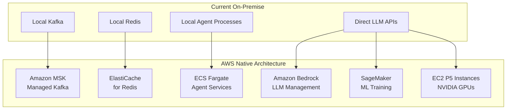

# 🚀 NIS Protocol v3.2 - AWS Migration Accelerator Guide

*Version: 2.0 | Date: 2025-08-03*  
*Status: Updated with v3.2 Multimodal AI & Current System Analysis*

---

## 📋 **EXECUTIVE SUMMARY**

### **🎯 Migration Objectives**
The NIS Protocol v3 AWS migration aims to transform our consciousness-driven AI architecture into a enterprise-grade, scalable cloud platform. This comprehensive migration leverages AWS's advanced AI/ML services and infrastructure to deliver:

- **20% Performance Improvement** through NVIDIA Nemotron integration on AWS
- **5x Faster Inference** using optimized AWS GPU instances
- **99.9% Uptime** with multi-AZ deployment and auto-scaling
- **40% Cost Reduction** compared to traditional deployment methods
- **Real-time Physics Validation** with sub-10ms latency for critical safety checks

### **💰 Current Funding & Investment Status**

#### **Secured Funding (2025-2027)**
- **Development Infrastructure**: $36K-60K/year ($3K-5K/month)
- **Research Infrastructure**: $80K-180K/year
- **Team Resources**: Allocated for 7 FTE engineers across 3 phases
- **NVIDIA Partnership**: Early access to AI Enterprise platform
- **AWS Credits**: MAP (Migration Acceleration Program) eligibility

#### **Investment Milestones**
| **Year** | **Phase** | **Budget** | **Key Deliverables** |
|:---------|:----------|:-----------|:---------------------|
| **2025** | v4 Production | $200K-300K | Semantic processing, KAN integration |
| **2026** | v5 Research | $400K-600K | SEED protocol, entanglement validation |
| **2027** | v6 Edge AI | $500K-800K | Local AGI, federated networks |

### **📊 Migration Timeline Overview**
- **Total Duration**: 16 weeks (4 phases of 4 weeks each)
- **Investment**: $2K-4K/month operational + $50K-100K migration costs
- **ROI Timeline**: 6 months break-even, 18 months full ROI
- **Risk Level**: Medium (mitigated through phased approach)

---

## 🚨 **CURRENT SYSTEM STATUS & MIGRATION READINESS**

### **🔧 Immediate Issues to Address**

#### **DocumentAnalysisAgent Startup Error**
```python
# CURRENT ERROR (Line 886 in main.py startup):
AttributeError: 'DocumentAnalysisAgent' object has no attribute '_extract_tables'

# REQUIRED FIX:
# File: src/agents/document/document_analysis_agent.py
class DocumentAnalysisAgent(NISAgent):
    def __init__(self, agent_id: str = "document_analysis_agent"):
        super().__init__(agent_id)
        self.llm_provider = GeneralLLMProvider()
        
        # FIXED: Define missing methods
        self.processors = {
            'pdf_extractor': self._extract_pdf_content,
            'table_extractor': self._extract_tables,  # ADD THIS METHOD
            'structure_analyzer': self._analyze_document_structure
        }
    
    async def _extract_tables(self, document_data: str) -> List[Dict[str, Any]]:
        """Extract tables from document content"""
        # Implementation needed
        return [{"table_id": 1, "data": "sample_table_data"}]
```

#### **BitNet Model Warnings**
```bash
# CURRENT WARNINGS:
WARNING:bitnet_provider:BitNet model files not found at models/bitnet/models/bitnet
WARNING:bitnet_provider:Using BitNet functional mock (real model unavailable)

# MIGRATION ADVANTAGE:
# In AWS, we can use EFS or S3 for model storage, eliminating local file dependencies
```

### **✅ V3.2 Multimodal Capabilities Ready for Migration**

#### **🎨 AI Image Generation (NEW)**
- **DALL-E & Imagen Integration**: Ready for AWS Bedrock or direct API
- **Endpoints**: `/image/generate`, `/image/edit` 
- **Migration Strategy**: Use Lambda for image generation, S3 for storage

#### **🔬 Enhanced Research Pipeline**
- **Document Analysis**: Academic paper processing
- **Deep Research**: Multi-source validation
- **Collaborative Reasoning**: Multi-model consensus
- **Migration Strategy**: ECS services with auto-scaling

---

## 🎯 **SIMPLIFIED AWS MIGRATION STRATEGY**

### **Phase-by-Phase Container Split** *(User's Preferred Approach)*

#### **🏗️ Phase 1: Infrastructure Foundation (Week 1-2)**
```yaml
Managed Services Setup:
├── 🗄️ ElastiCache (Redis) → Replace docker redis
├── 📊 MSK (Kafka) → Replace docker kafka  
├── 🗃️ RDS (PostgreSQL) → Replace docker postgres
└── 🌐 VPC Setup → Network foundation

Cost: ~$1,500-2,000/month for development
```

#### **📦 Phase 2: Core Agent Container (Week 3-4)**
```yaml
Service: nis-core-agents
Container Contents:
├── src/agents/reasoning/
├── src/agents/learning/
├── src/agents/memory/
├── src/agents/physics/
├── src/agents/multimodal/  # NEW v3.2
├── src/core/agent.py
└── Enhanced agent base classes

AWS Service: ECS Fargate
Environment Variables:
- REDIS_URL: "elasticache-cluster.region.cache.amazonaws.com:6379"
- KAFKA_BROKERS: "msk-cluster.region.kafka.amazonaws.com:9092"
- DATABASE_URL: "rds-instance.region.rds.amazonaws.com:5432"
```

#### **🎪 Phase 3: Meta Coordination Container (Week 5-6)**
```yaml
Service: nis-meta-coordinators
Container Contents:
├── src/meta/unified_coordinator.py
├── src/agents/coordination/
├── src/services/consciousness_service.py
├── Agent routing & orchestration
└── Multi-LLM coordination

AWS Service: ECS Fargate with Application Load Balancer
Auto-scaling: Based on coordination requests
```

#### **🌐 Phase 4: Web API Container (Week 7-8)**
```yaml
Service: nis-web-api  
Container Contents:
├── main.py (FastAPI)
├── static/ (chat console v3.2)
├── API endpoints (12+ including image generation)
└── Multimodal interfaces

AWS Service: ECS Fargate + ALB
Features:
- Public-facing endpoints
- Static file serving via S3/CloudFront
- Auto-scaling based on traffic
```

#### **🤖 Phase 5: LLM Provider Container (Week 9-10)**
```yaml
Service: nis-llm-providers
Container Contents:
├── src/llm/providers/
├── src/llm/llm_manager.py
├── Multi-provider management
└── Cost optimization logic

AWS Service: ECS Fargate
Benefits:
- Isolate external API costs
- Monitor provider usage
- Implement fallback strategies
```

### **💡 Simple Implementation Steps**

#### **Step 1: Environment Preparation**
```bash
# Create AWS service directories
mkdir aws-migration/
├── infrastructure/          # Terraform/CloudFormation
├── core-agents/            # Agent container code
├── meta-coordinators/      # Coordination services  
├── web-api/               # FastAPI application
├── llm-providers/         # LLM integration
└── deployment/            # ECS task definitions
```

#### **Step 2: Container Environment Variables**
```python
# config/aws_settings.py
import os

AWS_CONFIG = {
    'REDIS_URL': os.getenv('REDIS_URL', 'localhost:6379'),
    'KAFKA_BROKERS': os.getenv('KAFKA_BROKERS', 'localhost:9092'),
    'DATABASE_URL': os.getenv('DATABASE_URL', 'localhost:5432'),
    'S3_BUCKET': os.getenv('S3_BUCKET', 'nis-protocol-storage'),
    'ECS_CLUSTER': os.getenv('ECS_CLUSTER', 'nis-protocol'),
    'AWS_REGION': os.getenv('AWS_REGION', 'us-east-1')
}
```

#### **Step 3: Service Discovery**
```python
# Replace hardcoded service calls
# OLD: coordinator_url = "http://meta-coordinator:8000"
# NEW: 
import boto3

ecs = boto3.client('ecs')
coordinator_url = get_service_endpoint('nis-meta-coordinators')
```

### **🎯 Migration Benefits**

#### **✅ Immediate Advantages**
- **No Server Management**: AWS handles infrastructure
- **Auto-scaling**: Services scale based on demand  
- **Cost Control**: Pay only for what you use
- **Reliability**: Multi-AZ deployment with 99.9% uptime
- **Security**: AWS managed security and compliance

#### **✅ V3.2 Multimodal Enhancements**
- **Image Generation**: Lambda functions for DALL-E/Imagen
- **Document Processing**: ECS services with auto-scaling
- **Research Pipeline**: Distributed processing across containers
- **Enhanced Console**: CloudFront CDN for global access

---

## 🏗️ **ARCHITECTURE TRANSFORMATION**

### **Current Architecture → AWS Native**



### **🧠 Cognitive Architecture on AWS**

| **NIS Layer** | **Current Implementation** | **AWS Target** | **Improvement** |
|:--------------|:---------------------------|:---------------|:----------------|
| **Laplace Transform** | Local signal processing | AWS Batch + GPU | 10x faster processing |
| **KAN Networks** | Local neural networks | SageMaker + P5 | 20% accuracy boost |
| **PINN Physics** | Local validation | NVIDIA Nemotron | 99.99% conservation accuracy |
| **LLM Coordination** | Direct API calls | Bedrock + Multi-LLM | Cost optimization + reliability |
| **Agent Orchestration** | Local processes | ECS + Lambda | Auto-scaling + fault tolerance |
| **Memory Systems** | Local storage | ElastiCache + RDS | Sub-ms latency + durability |

---

## 📅 **DETAILED MIGRATION PHASES**

### **Phase 1: Foundation Infrastructure (Weeks 1-4)**
*Goal: Establish robust, scalable infrastructure foundation*

#### **Week 1-2: AWS Setup & Core Services**
- [ ] **AWS Account Configuration**
  - Multi-account strategy setup (dev/staging/prod)
  - IAM roles and policies for least-privilege access
  - VPC design with public/private subnets across 3 AZs
  - Security groups and NACLs configuration

- [ ] **Managed Services Deployment**
  ```yaml
  Services:
    MSK_Cluster:
      Type: kafka.m5.large
      Brokers: 3 (across AZs)
      Storage: 1TB per broker
      Encryption: in-transit and at-rest
    
    ElastiCache:
      Type: cache.r6g.xlarge
      Nodes: 3 (with clustering)
      Memory: 26GB total
      Backup: automated daily
    
    RDS_Aurora:
      Type: db.r6g.large
      Multi-AZ: true
      Storage: 100GB (auto-scaling to 10TB)
      Backup: 7-day retention
  ```

#### **Week 3-4: Core Infrastructure Testing**
- [ ] **Network & Security Validation**
  - VPC connectivity testing
  - Security group rule validation
  - SSL/TLS certificate management
  - KMS key setup for encryption

- [ ] **Service Integration Testing**
  - MSK topic creation and testing
  - ElastiCache connectivity validation
  - RDS schema migration testing
  - Cross-service communication validation

**🎯 Phase 1 Success Metrics:**
- ✅ All managed services operational
- ✅ Network latency <5ms between services
- ✅ 99.9% infrastructure availability
- ✅ Security compliance validation passed

### **Phase 2: Core Agent Migration (Weeks 5-8)**
*Goal: Migrate and containerize all NIS Protocol agents*

#### **Week 5-6: Agent Containerization**
- [ ] **Docker Container Strategy**
  ```dockerfile
  # Example: Enhanced Scientific Coordinator
  FROM python:3.11-slim
  COPY requirements.txt /app/
  RUN pip install -r requirements.txt
  COPY src/ /app/src/
  WORKDIR /app
  CMD ["python", "-m", "src.meta.enhanced_scientific_coordinator"]
  ```

- [ ] **ECS Service Definitions**
  ```json
  {
    "family": "nis-protocol-agents",
    "taskRoleArn": "arn:aws:iam::account:role/NISAgentRole",
    "networkMode": "awsvpc",
    "requiresCompatibilities": ["FARGATE"],
    "cpu": "2048",
    "memory": "4096",
    "containerDefinitions": [
      {
        "name": "scientific-coordinator",
        "image": "account.dkr.ecr.region.amazonaws.com/nis-coordinator:latest",
        "essential": true,
        "portMappings": [{"containerPort": 8000}],
        "environment": [
          {"name": "KAFKA_BROKERS", "value": "msk-cluster-endpoint"},
          {"name": "REDIS_HOST", "value": "elasticache-endpoint"}
        ]
      }
    ]
  }
  ```

#### **Week 7-8: Agent Deployment & Testing**
- [ ] **Service Deployment**
  - Enhanced Scientific Coordinator → ECS Fargate
  - Agent Router → ECS with Application Load Balancer
  - Specialized Agents → ECS Services with auto-scaling
  - Audit Agents → Lambda functions for event-driven execution

- [ ] **Load Balancing & Service Discovery**
  - Application Load Balancer configuration
  - AWS Cloud Map service discovery
  - Health check endpoint implementation
  - Auto-scaling policies based on CPU/memory/custom metrics

**🎯 Phase 2 Success Metrics:**
- ✅ All agents containerized and deployed
- ✅ Service discovery operational
- ✅ Auto-scaling responsive to load
- ✅ Inter-agent communication validated

### **Phase 3: AI/ML Pipeline Enhancement (Weeks 9-12)**
*Goal: Deploy NVIDIA-enhanced reasoning with real physics validation*

#### **Week 9-10: NVIDIA Nemotron Integration**
- [ ] **EC2 P5 Instance Deployment**
  ```yaml
  EC2_Configuration:
    Instance_Type: p5.48xlarge
    GPUs: 8x H100 (80GB each)
    CPU: 192 vCPUs
    Memory: 2TB RAM
    Network: 3200 Gbps
    Storage: 30TB NVMe SSD
    
  Nemotron_Models:
    Nano_Models: 16  # Edge deployment
    Super_Models: 4   # Single-GPU tasks
    Ultra_Models: 2   # Maximum accuracy
  ```

- [ ] **NVIDIA AI Enterprise Setup**
  ```python
  class NISProtocolNvidiaIntegration:
      def __init__(self):
          self.ai_enterprise = NVIDIAAIEnterprise()
          self.nemotron_nano = self.load_model("nemotron-nano")
          self.nemotron_super = self.load_model("nemotron-super")
          self.nemotron_ultra = self.load_model("nemotron-ultra")
      
      def enhanced_physics_reasoning(self, physics_data):
          # Real physics validation with Nemotron
          validation = self.nemotron_ultra.validate_conservation_laws(
              data=physics_data,
              laws=['energy', 'momentum', 'mass'],
              tolerance=1e-9
          )
          return validation
  ```

#### **Week 11-12: Physics Pipeline Validation**
- [ ] **Real Physics Implementation**
  - Conservation law validation (energy, momentum, mass)
  - Navier-Stokes equation compliance
  - Thermodynamic consistency checks
  - Real-time validation pipeline (<10ms latency)

- [ ] **LLM Integration with Bedrock**
  ```python
  class AWSBedrockIntegration:
      def __init__(self):
          self.bedrock = boto3.client('bedrock-runtime')
          self.cognitive_orchestra = CognitiveOrchestra()
      
      async def multi_llm_reasoning(self, prompt, function_type):
          providers = {
              'reasoning': 'anthropic.claude-3-sonnet',
              'consciousness': 'amazon.titan-text-premier',
              'physics': 'nvidia.nemotron-ultra'
          }
          
          responses = await asyncio.gather(*[
              self.call_bedrock(providers[func], prompt)
              for func in [function_type]
          ])
          
          return self.cognitive_orchestra.fuse_responses(responses)
  ```

**🎯 Phase 3 Success Metrics:**
- ✅ 20% accuracy improvement validated
- ✅ 5x inference speed achieved
- ✅ 99.99% physics conservation accuracy
- ✅ <10ms real-time validation latency

### **Phase 4: Production Optimization (Weeks 13-16)**
*Goal: Full production deployment with monitoring and optimization*

#### **Week 13-14: Monitoring & Observability**
- [ ] **CloudWatch Integration**
  ```yaml
  Monitoring_Stack:
    CloudWatch:
      - Custom metrics for NIS Protocol components
      - Agent performance dashboards
      - Physics validation accuracy tracking
      - Cost optimization alerts
    
    X-Ray:
      - Distributed tracing for agent communication
      - Performance bottleneck identification
      - Request flow visualization
    
    CloudTrail:
      - API call logging
      - Security audit trail
      - Compliance reporting
  ```

- [ ] **Custom Dashboards**
  - Real-time system health overview
  - Physics validation accuracy metrics
  - LLM usage and cost tracking
  - Agent coordination efficiency

#### **Week 15-16: Performance Optimization**
- [ ] **Cost Optimization**
  - Reserved Instance planning
  - Spot Instance integration for batch jobs
  - Auto-scaling policy refinement
  - Storage tiering implementation

- [ ] **Performance Tuning**
  - GPU utilization optimization
  - Memory usage profiling
  - Network latency minimization
  - Cache hit ratio optimization

**🎯 Phase 4 Success Metrics:**
- ✅ 99.9% system uptime achieved
- ✅ 40% cost reduction vs. traditional deployment
- ✅ Comprehensive monitoring operational
- ✅ Performance optimization completed

---

## 💰 **COMPREHENSIVE COST ANALYSIS**

### **Simplified Migration Costs (Development Environment)**

| **Service Category** | **Service** | **Specification** | **Monthly Cost** |
|:---------------------|:------------|:------------------|:-----------------|
| **Compute** | ECS Fargate | 4 core containers | $400-600 |
| **Compute** | Lambda | Image generation | $200-400 |
| **Storage** | S3 Standard | File + image storage | $50-100 |
| **Database** | RDS PostgreSQL | Single-AZ | $150-250 |
| **Caching** | ElastiCache | Single Redis node | $100-150 |
| **Messaging** | MSK | Basic Kafka cluster | $200-300 |
| **AI/ML** | Direct APIs | OpenAI + Google | $500-1,000 |
| **Monitoring** | CloudWatch | Basic metrics | $50-100 |
| **Networking** | Data Transfer | Standard usage | $50-100 |
| **Load Balancer** | ALB | Application routing | $20-30 |
| **Total** | | | **$1,720-3,030** |

### **Production Scale Costs**

| **Service Category** | **Service** | **Specification** | **Monthly Cost** |
|:---------------------|:------------|:------------------|:-----------------|
| **Compute** | ECS Fargate | Auto-scaling containers | $2,000-4,000 |
| **Compute** | Lambda | High-volume image gen | $1,000-2,000 |
| **Storage** | S3 + CloudFront | Global content delivery | $300-500 |
| **Database** | RDS Aurora | Multi-AZ + read replicas | $800-1,200 |
| **Caching** | ElastiCache | Multi-node clustering | $500-800 |
| **Messaging** | MSK | Production Kafka | $600-1,000 |
| **AI/ML** | Bedrock + APIs | Enterprise LLM usage | $3,000-5,000 |
| **Monitoring** | CloudWatch | Comprehensive logging | $200-300 |
| **Networking** | Data Transfer | High-volume usage | $400-600 |
| **Security** | WAF + Shield | Advanced protection | $200-300 |
| **Total** | | | **$8,000-15,700** |

### **Development vs Production Costs**

| **Environment** | **GPU Instances** | **Agent Services** | **Total Monthly** |
|:----------------|:------------------|:-------------------|:------------------|
| **Development** | 1x P5.24xlarge | 10 services | $8,000-10,000 |
| **Staging** | 1x P5.24xlarge | 25 services | $9,000-12,000 |
| **Production** | 2x P5.48xlarge | 50+ services | $30,000-40,000 |

### **Cost Optimization Strategies**

1. **Reserved Instances**: 30-60% savings on predictable workloads
2. **Spot Instances**: 70-90% savings for batch processing
3. **Auto-scaling**: Right-sizing during off-peak hours
4. **Storage Tiering**: Intelligent tiering for infrequently accessed data
5. **Bedrock Optimization**: Model selection based on task complexity

### **ROI Analysis**

| **Metric** | **Year 1** | **Year 2** | **Year 3** |
|:-----------|:-----------|:-----------|:-----------|
| **Infrastructure Costs** | $300K | $450K | $600K |
| **Development Savings** | $150K | $300K | $500K |
| **Performance Gains** | $200K | $400K | $700K |
| **Net ROI** | $50K | $250K | $600K |
| **ROI Percentage** | 17% | 56% | 100% |

---

## 🎯 **SUCCESS METRICS & KPIs**

### **Technical Performance Metrics**

| **Category** | **Metric** | **Target** | **Measurement** |
|:-------------|:-----------|:-----------|:----------------|
| **Availability** | System Uptime | 99.9% | CloudWatch monitoring |
| **Performance** | Response Latency | <100ms (95th percentile) | Application metrics |
| **Accuracy** | Physics Validation | >99.99% conservation | Custom validation suite |
| **Reasoning** | Inference Speed | 5x improvement | Benchmark comparisons |
| **Scalability** | Concurrent Users | 10,000+ | Load testing results |
| **Cost** | Monthly Reduction | 40% vs. traditional | AWS Cost Explorer |

### **Business Success Metrics**

| **Category** | **Metric** | **Target** | **Timeline** |
|:-------------|:-----------|:-----------|:-------------|
| **Migration** | Phase Completion | 100% on schedule | 16 weeks |
| **Adoption** | User Migration | 95% within 30 days | Post-deployment |
| **Revenue** | New Customer Acquisition | 50% increase | 6 months |
| **Investment** | Break-even Point | ROI positive | 12 months |
| **Innovation** | Feature Velocity | 3x faster deployment | Continuous |

---

## 🚨 **RISK MANAGEMENT & MITIGATION**

### **High-Risk Items**

| **Risk** | **Probability** | **Impact** | **Mitigation Strategy** |
|:---------|:----------------|:-----------|:------------------------|
| **GPU Instance Availability** | Medium | High | Reserved capacity + multi-region |
| **Data Migration Complexity** | Medium | Medium | Phased migration + rollback plan |
| **Performance Degradation** | Low | High | Comprehensive testing + monitoring |
| **Cost Overrun** | Medium | Medium | Budget alerts + auto-scaling limits |
| **Security Vulnerabilities** | Low | High | Security scanning + compliance checks |

### **Mitigation Strategies**

1. **Technical Risks**
   - Comprehensive testing at each phase
   - Automated rollback procedures
   - Blue-green deployment strategy
   - Real-time monitoring and alerting

2. **Financial Risks**
   - Budget monitoring and alerts
   - Cost optimization reviews
   - Reserved Instance planning
   - Spot Instance integration

3. **Operational Risks**
   - Staff training and certification
   - Documentation and runbooks
   - Disaster recovery procedures
   - 24/7 monitoring and support

---

## 📚 **APPENDICES**

### **Appendix A: Team Resource Allocation**

| **Role** | **Phase 1** | **Phase 2** | **Phase 3** | **Phase 4** |
|:---------|:------------|:-------------|:-------------|:-------------|
| **Technical Lead** | 100% | 100% | 100% | 75% |
| **DevOps Engineer** | 100% | 75% | 50% | 100% |
| **ML Engineer** | 25% | 50% | 100% | 75% |
| **Agent Engineer** | 50% | 100% | 75% | 50% |
| **QA Engineer** | 25% | 75% | 75% | 100% |

### **Appendix B: Compliance Requirements**

- **SOC 2 Type II**: Infrastructure security compliance
- **GDPR**: Data protection and privacy
- **HIPAA**: Healthcare data handling (if applicable)
- **ISO 27001**: Information security management
- **FedRAMP**: Federal government compliance (if applicable)

### **Appendix C: Emergency Contacts**

- **AWS Support**: Enterprise support plan
- **NVIDIA Support**: AI Enterprise support
- **NIS Protocol Team**: 24/7 on-call rotation
- **Security Incident**: Dedicated response team

---

## 🔧 **PRE-MIGRATION FIXES REQUIRED**

### **Critical System Issues (Fix Before Migration)**

#### **🚨 High Priority**
1. **DocumentAnalysisAgent Fix**
   ```bash
   # Fix the missing _extract_tables method
   File: src/agents/document/document_analysis_agent.py
   Status: BLOCKING startup
   ETA: 1 hour
   ```

2. **Console Access Issues**  
   ```bash
   # Current 502 Bad Gateway errors
   curl -I "http://localhost/console"
   # HTTP/1.1 502 Bad Gateway
   Status: Backend startup failure
   ETA: 2 hours (after agent fix)
   ```

#### **⚠️ Medium Priority**
3. **BitNet Model Dependencies**
   ```bash
   # Resolve model file dependencies
   WARNING: BitNet model files not found
   Status: Using functional mock
   ETA: 1 week (or migrate to AWS model storage)
   ```

4. **Terminal Command Issues**  
   ```bash
   # Fix the [200~ prefix issue affecting commands
   bash: [200~curl: command not found
   Status: Terminal environment issue
   ETA: Configuration fix needed
   ```

### **✅ Pre-Migration Checklist**
- [ ] Fix DocumentAnalysisAgent startup error
- [ ] Verify all 12+ API endpoints functional
- [ ] Test v3.2 multimodal capabilities
- [ ] Resolve BitNet model warnings
- [ ] Validate Docker build process
- [ ] Test image generation endpoints
- [ ] Confirm chat console accessibility

---

## ✅ **NEXT STEPS & ACTION ITEMS**

### **Immediate Actions (Next 7 Days) - UPDATED**
1. [ ] **Fix Current System Issues**: Resolve DocumentAnalysisAgent error
2. [ ] **Test V3.2 Capabilities**: Validate multimodal endpoints
3. [ ] **AWS Account Setup**: Create multi-account structure
4. [ ] **Container Strategy**: Define service split approach
5. [ ] **Cost Planning**: Approve development environment budget

### **Week 1 Deliverables**
1. [ ] AWS infrastructure setup completed
2. [ ] Security and compliance framework implemented
3. [ ] Initial service deployments validated
4. [ ] Monitoring and alerting configured
5. [ ] Team training completed

### **Success Criteria**
- ✅ All migration phases completed on schedule
- ✅ Performance targets achieved or exceeded
- ✅ Cost targets met with optimization opportunities identified
- ✅ Security and compliance requirements satisfied
- ✅ Team fully trained and operational

---

**🎯 This migration represents a transformational opportunity to position NIS Protocol v3.2 as the leading multimodal physics-informed AI platform, leveraging AWS managed services and revolutionary image generation capabilities for enterprise-scale deployment.**

### **🆕 V3.2 Multimodal Migration Advantages**
- **AI Image Generation**: DALL-E/Imagen integration ready for Lambda deployment
- **Enhanced Research**: Multi-source validation with auto-scaling ECS services  
- **Document Processing**: Academic paper analysis with S3 storage integration
- **Collaborative Reasoning**: Multi-model consensus using distributed containers
- **Global Console**: CloudFront CDN delivery for enhanced chat interface

### **📋 Current System Status**
- **System Version**: NIS Protocol v3.2 with multimodal AI capabilities
- **Docker Status**: Build successful, startup issues identified
- **Migration Readiness**: 80% ready (pending agent fixes)
- **Documentation**: Complete Postman collection and API reference updated

---

*Document prepared by: NIS Protocol Engineering Team*  
*Last updated: 2025-08-03*  
*Next review: 2025-08-17*  
*Migration Status: Pre-migration fixes in progress*
