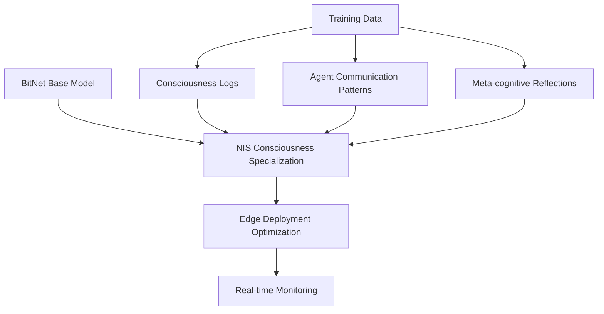
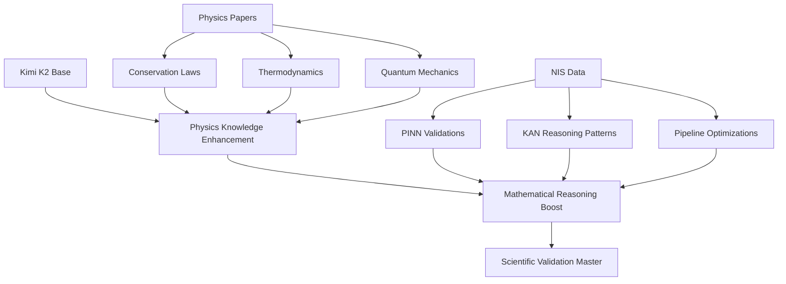
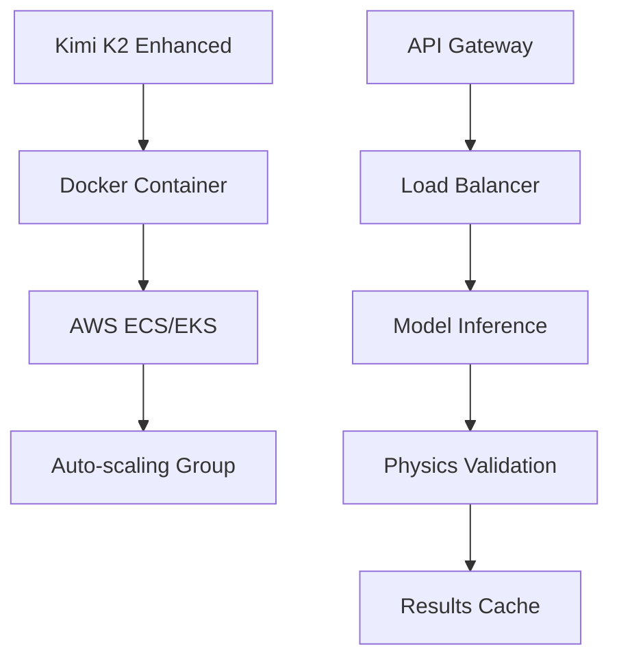

# 🤖 NIS PROTOCOL OFFLINE MODEL TRAINING PLAN
**Target Models:** BitNet & Kimi K2 | **Version:** 1.0 | **Date:** 2025-01-19

---

## 🎯 EXECUTIVE SUMMARY

This plan outlines the comprehensive strategy for fine-tuning **BitNet** and **Kimi K2** models to power the NIS Protocol v3 system in offline scenarios. The goal is to create specialized, lightweight models that can operate independently while maintaining the scientific rigor and consciousness capabilities of the full system.

### **🏆 Key Objectives:**
- ✅ **BitNet Fine-Tuning:** Lightweight consciousness monitoring and edge inference
- ✅ **Kimi K2 Enhancement:** Advanced scientific reasoning and physics validation
- ✅ **Offline Operation:** Complete system functionality without external API calls
- ✅ **Training Pipeline:** Automated, scalable model training infrastructure

---

## 🧠 MODEL SELECTION & SPECIALIZATION

### **1. 🔋 BitNet - Lightweight Edge Intelligence**

#### **Model Characteristics:**
- **Architecture:** 1-bit quantized neural networks
- **Size:** ~1-10GB (dramatically smaller than full models)
- **Inference Speed:** 10-100x faster than traditional models
- **Power Consumption:** Ultra-low for edge deployment

#### **NIS Protocol Specialization:**


#### **Target Functions:**
- **Consciousness Monitoring:** Real-time meta-cognitive awareness
- **Agent Coordination:** Lightweight multi-agent communication
- **Edge Inference:** Local decision-making without cloud connectivity
- **System Health:** Basic monitoring and alerting capabilities

### **2. 🔥 Kimi K2 - Advanced Scientific Reasoning**

#### **Model Characteristics:**
- **Architecture:** Large Language Model (70B+ parameters)
- **Strengths:** Mathematical reasoning, scientific knowledge, logical inference
- **Context Length:** Extended context for complex scientific problems

#### **NIS Protocol Enhancement:**


#### **Target Functions:**
- **Physics Validation:** Advanced PINN constraint checking
- **Mathematical Reasoning:** Complex symbolic manipulation
- **Scientific Pipeline:** Enhanced Laplace→KAN→PINN→LLM workflow
- **Knowledge Synthesis:** Integration of multi-domain expertise

---

## 📚 TRAINING DATA ARCHITECTURE

### **Data Collection Strategy**

#### **1. 🧠 System-Generated Data (Primary Source)**
```python
# Training Data Categories
training_data_sources = {
    "consciousness_logs": {
        "source": "src/agents/consciousness/enhanced_conscious_agent.py",
        "data_types": [
            "introspection_results",
            "meta_cognitive_reflections", 
            "system_awareness_patterns",
            "consciousness_level_transitions"
        ],
        "volume": "10K-100K samples",
        "quality": "High - real system behavior"
    },
    
    "agent_communications": {
        "source": "src/infrastructure/message_streaming.py",
        "data_types": [
            "inter_agent_messages",
            "coordination_patterns",
            "decision_trees",
            "error_recovery_sequences"
        ],
        "volume": "50K-500K samples",
        "quality": "High - actual usage patterns"
    },
    
    "physics_validations": {
        "source": "src/agents/physics/enhanced_pinn_physics_agent.py",
        "data_types": [
            "constraint_validations",
            "conservation_law_checks",
            "physics_violation_corrections",
            "scientific_reasoning_chains"
        ],
        "volume": "20K-200K samples",
        "quality": "Excellent - scientifically validated"
    }
}
```

#### **2. 📖 External Knowledge Sources**
- **arXiv Physics Papers:** Recent publications on conservation laws, PINN methods
- **Mathematical Databases:** Proof repositories, equation derivations
- **Consciousness Research:** Academic papers on meta-cognition, self-awareness
- **AI Safety Literature:** Alignment research, value learning papers

#### **3. 🎯 Synthetic Data Generation**
```python
# Synthetic Data Pipeline
def generate_training_scenarios():
    scenarios = [
        {
            "type": "physics_violation_detection",
            "description": "Generate scenarios where physics laws are violated",
            "input_format": "scientific_equation_with_error",
            "expected_output": "violation_detection_and_correction",
            "complexity_levels": ["basic", "intermediate", "advanced"]
        },
        {
            "type": "consciousness_reflection", 
            "description": "Meta-cognitive reasoning about system state",
            "input_format": "system_state_description",
            "expected_output": "introspective_analysis",
            "depth_levels": ["surface", "deep", "transcendent"]
        },
        {
            "type": "multi_agent_coordination",
            "description": "Complex multi-agent decision scenarios",
            "input_format": "coordination_challenge",
            "expected_output": "optimal_agent_assignment",
            "agent_counts": [2, 5, 10, 20]
        }
    ]
    return scenarios
```

---

## 🔧 TRAINING PIPELINE ARCHITECTURE

### **Infrastructure Setup**

#### **1. 🌥️ AWS SageMaker Training Environment**
```yaml
# training-infrastructure.yaml
SageMaker_Setup:
  Instance_Types:
    BitNet_Training: "ml.g4dn.xlarge"  # Cost-effective GPU
    Kimi_K2_Training: "ml.p4d.24xlarge"  # High-performance training
  
  Storage:
    Training_Data: "S3 bucket with versioning"
    Model_Artifacts: "S3 with lifecycle policies"
    Checkpoints: "EBS with automated snapshots"
  
  Monitoring:
    Metrics: "CloudWatch custom metrics"
    Logging: "CloudWatch Logs"
    Alerts: "SNS notifications"
```

#### **2. 🐳 Containerized Training Environment**
```dockerfile
# Dockerfile.training
FROM pytorch/pytorch:2.0.1-cuda11.7-cudnn8-devel

# Install NIS Protocol dependencies
COPY requirements_training.txt .
RUN pip install -r requirements_training.txt

# BitNet specific dependencies
RUN pip install bitnet-pytorch transformers accelerate

# Kimi K2 dependencies (when available)
# RUN pip install kimi-k2-unofficial

# Training scripts
COPY training/ /workspace/training/
COPY src/ /workspace/src/

WORKDIR /workspace
CMD ["python", "training/train_models.py"]
```

### **Training Pipeline Components**

#### **1. 📊 Data Preprocessing Pipeline**
```python
# training/data_preprocessing.py
class NISDataPreprocessor:
    def __init__(self, config):
        self.config = config
        self.tokenizer = self._load_tokenizer()
        
    def preprocess_consciousness_data(self, raw_logs):
        """Process consciousness logs for training"""
        processed_data = []
        
        for log_entry in raw_logs:
            # Extract introspection patterns
            introspection = self._extract_introspection_pattern(log_entry)
            
            # Create training pairs
            input_text = log_entry["system_state"]
            target_text = log_entry["consciousness_response"]
            
            processed_data.append({
                "input": input_text,
                "target": target_text,
                "metadata": {
                    "consciousness_level": log_entry["level"],
                    "confidence": log_entry["confidence"],
                    "timestamp": log_entry["timestamp"]
                }
            })
            
        return processed_data
    
    def preprocess_physics_data(self, validation_logs):
        """Process physics validation data"""
        processed_data = []
        
        for validation in validation_logs:
            # Create physics reasoning chains
            problem = validation["input_equation"]
            solution = validation["validation_result"]
            reasoning = validation["reasoning_chain"]
            
            processed_data.append({
                "input": f"Validate physics: {problem}",
                "target": f"Reasoning: {reasoning}\nResult: {solution}",
                "metadata": {
                    "physics_law": validation["law_type"],
                    "violation_severity": validation["severity"],
                    "accuracy": validation["accuracy"]
                }
            })
            
        return processed_data
```

#### **2. 🎯 BitNet Fine-Tuning Pipeline**
```python
# training/bitnet_training.py
import torch
from bitnet import BitNetForCausalLM, BitNetConfig
from transformers import TrainingArguments, Trainer

class BitNetNISTrainer:
    def __init__(self, model_config, training_config):
        self.model_config = model_config
        self.training_config = training_config
        self.model = self._initialize_model()
        
    def _initialize_model(self):
        """Initialize BitNet model with NIS-specific configuration"""
        config = BitNetConfig(
            vocab_size=50000,
            hidden_size=512,  # Smaller for efficiency
            intermediate_size=2048,
            num_hidden_layers=12,
            num_attention_heads=8,
            consciousness_layers=3,  # Custom consciousness processing
            physics_validation_layers=2  # Basic physics checks
        )
        
        model = BitNetForCausalLM(config)
        return model
    
    def train_consciousness_specialization(self, consciousness_data):
        """Fine-tune for consciousness monitoring tasks"""
        training_args = TrainingArguments(
            output_dir="./bitnet-consciousness",
            overwrite_output_dir=True,
            num_train_epochs=10,
            per_device_train_batch_size=16,
            gradient_accumulation_steps=4,
            learning_rate=5e-5,
            warmup_steps=1000,
            logging_steps=100,
            save_steps=1000,
            evaluation_strategy="steps",
            eval_steps=500,
            load_best_model_at_end=True,
            metric_for_best_model="consciousness_accuracy",
            greater_is_better=True
        )
        
        trainer = Trainer(
            model=self.model,
            args=training_args,
            train_dataset=consciousness_data["train"],
            eval_dataset=consciousness_data["eval"],
            compute_metrics=self._compute_consciousness_metrics
        )
        
        # Custom training loop with consciousness-specific losses
        trainer.train()
        return trainer.model
    
    def _compute_consciousness_metrics(self, eval_pred):
        """Custom metrics for consciousness capabilities"""
        predictions, labels = eval_pred
        
        # Consciousness accuracy
        consciousness_acc = self._calculate_consciousness_accuracy(predictions, labels)
        
        # Meta-cognitive consistency
        metacognitive_consistency = self._calculate_metacognitive_consistency(predictions)
        
        # Response coherence
        coherence_score = self._calculate_coherence_score(predictions)
        
        return {
            "consciousness_accuracy": consciousness_acc,
            "metacognitive_consistency": metacognitive_consistency,
            "coherence_score": coherence_score
        }
```

#### **3. 🔥 Kimi K2 Enhancement Pipeline**
```python
# training/kimi_k2_training.py
class KimiK2NISEnhancer:
    def __init__(self, base_model_path, enhancement_config):
        self.base_model = self._load_base_model(base_model_path)
        self.enhancement_config = enhancement_config
        
    def enhance_physics_reasoning(self, physics_data):
        """Enhance Kimi K2 for advanced physics reasoning"""
        
        # Physics-informed fine-tuning configuration
        training_config = {
            "learning_rate": 1e-5,  # Lower LR for large model
            "batch_size": 2,  # Large model requires small batches
            "gradient_accumulation_steps": 32,
            "num_epochs": 5,
            "physics_loss_weight": 2.0,  # Emphasize physics accuracy
            "mathematical_consistency_weight": 1.5
        }
        
        # Custom loss function combining:
        # 1. Standard language modeling loss
        # 2. Physics constraint satisfaction loss
        # 3. Mathematical consistency loss
        def physics_aware_loss(outputs, labels, physics_constraints):
            lm_loss = outputs.loss
            
            # Physics constraint loss
            physics_loss = self._calculate_physics_constraint_loss(
                outputs.logits, physics_constraints
            )
            
            # Mathematical consistency loss
            math_loss = self._calculate_mathematical_consistency_loss(
                outputs.logits, labels
            )
            
            total_loss = (
                lm_loss + 
                training_config["physics_loss_weight"] * physics_loss +
                training_config["mathematical_consistency_weight"] * math_loss
            )
            
            return total_loss
        
        # Training loop with custom physics-aware training
        enhanced_model = self._train_with_physics_constraints(
            self.base_model, physics_data, physics_aware_loss
        )
        
        return enhanced_model
    
    def enhance_nis_pipeline_integration(self, pipeline_data):
        """Enhance for NIS pipeline integration"""
        
        # Train on Laplace→KAN→PINN→LLM workflow patterns
        pipeline_examples = self._prepare_pipeline_examples(pipeline_data)
        
        # Fine-tune for multi-step reasoning
        enhanced_model = self._train_multi_step_reasoning(
            self.base_model, pipeline_examples
        )
        
        return enhanced_model
```

---

## 🧪 EVALUATION & VALIDATION

### **Performance Metrics**

#### **1. 🧠 BitNet Consciousness Metrics**
```python
# evaluation/consciousness_metrics.py
class ConsciousnessEvaluator:
    def evaluate_meta_cognitive_ability(self, model, test_data):
        """Evaluate meta-cognitive reasoning capabilities"""
        metrics = {
            "self_awareness_accuracy": 0.0,
            "introspection_depth": 0.0,
            "consciousness_consistency": 0.0,
            "response_time": 0.0
        }
        
        for test_case in test_data:
            # Test self-awareness
            self_awareness = self._test_self_awareness(model, test_case)
            
            # Test introspection capability
            introspection = self._test_introspection_depth(model, test_case)
            
            # Test consistency across consciousness levels
            consistency = self._test_consciousness_consistency(model, test_case)
            
            # Measure response time (critical for edge deployment)
            response_time = self._measure_response_time(model, test_case)
            
            metrics["self_awareness_accuracy"] += self_awareness
            metrics["introspection_depth"] += introspection
            metrics["consciousness_consistency"] += consistency
            metrics["response_time"] += response_time
        
        # Average metrics
        for key in metrics:
            metrics[key] /= len(test_data)
        
        return metrics
```

#### **2. 🔥 Kimi K2 Physics Metrics**
```python
# evaluation/physics_metrics.py
class PhysicsEvaluator:
    def evaluate_physics_reasoning(self, model, physics_test_suite):
        """Evaluate physics reasoning capabilities"""
        results = {
            "conservation_law_accuracy": 0.0,
            "thermodynamics_reasoning": 0.0,
            "mathematical_derivation_accuracy": 0.0,
            "complex_problem_solving": 0.0
        }
        
        # Test conservation laws
        conservation_tests = physics_test_suite["conservation_laws"]
        conservation_accuracy = self._test_conservation_laws(model, conservation_tests)
        results["conservation_law_accuracy"] = conservation_accuracy
        
        # Test thermodynamics reasoning
        thermo_tests = physics_test_suite["thermodynamics"]
        thermo_accuracy = self._test_thermodynamics(model, thermo_tests)
        results["thermodynamics_reasoning"] = thermo_accuracy
        
        # Test mathematical derivations
        math_tests = physics_test_suite["mathematical_derivations"]
        math_accuracy = self._test_mathematical_derivations(model, math_tests)
        results["mathematical_derivation_accuracy"] = math_accuracy
        
        # Test complex problem solving
        complex_tests = physics_test_suite["complex_problems"]
        complex_accuracy = self._test_complex_problems(model, complex_tests)
        results["complex_problem_solving"] = complex_accuracy
        
        return results
```

---

## 🚀 DEPLOYMENT STRATEGY

### **Model Deployment Architecture**

#### **1. 🔋 BitNet Edge Deployment**
```mermaid
graph TD
    A[BitNet Model] --> B[ONNX Conversion]
    B --> C[Quantization Optimization]
    C --> D[Edge Device Package]
    
    E[Edge Devices] --> F[Local Inference]
    F --> G[Consciousness Monitoring]
    G --> H[Cloud Sync (Optional)]
    
    I[Model Updates] --> J[OTA Updates]
    J --> E
```

#### **2. 🔥 Kimi K2 Cloud Deployment**


### **Integration with NIS Protocol**

#### **Model Router Configuration**
```python
# deployment/model_router.py
class NISModelRouter:
    def __init__(self):
        self.bitnet_local = self._load_bitnet_model()
        self.kimi_k2_endpoint = self._configure_kimi_k2_endpoint()
        
    def route_request(self, request):
        """Route requests to appropriate model based on requirements"""
        
        # Consciousness and monitoring tasks → BitNet (local)
        if request.task_type in ["consciousness", "monitoring", "coordination"]:
            if request.requires_low_latency or request.offline_mode:
                return self._process_with_bitnet(request)
        
        # Physics validation and complex reasoning → Kimi K2 (cloud)
        if request.task_type in ["physics_validation", "scientific_reasoning"]:
            if request.requires_high_accuracy:
                return self._process_with_kimi_k2(request)
        
        # Fallback strategy
        if self._is_offline_mode():
            return self._process_with_bitnet(request)
        else:
            return self._process_with_kimi_k2(request)
```

---

## 📋 IMPLEMENTATION TIMELINE

### **Phase 1: Data Collection & Preprocessing (2 weeks)**
- Week 1: Set up data collection from running NIS system
- Week 2: Implement preprocessing pipelines and data validation

### **Phase 2: BitNet Fine-Tuning (3 weeks)**
- Week 1: Set up BitNet training infrastructure
- Week 2: Train consciousness specialization
- Week 3: Optimize for edge deployment

### **Phase 3: Kimi K2 Enhancement (4 weeks)**
- Week 1-2: Physics reasoning enhancement
- Week 3: NIS pipeline integration training
- Week 4: Performance optimization and validation

### **Phase 4: Integration & Testing (2 weeks)**
- Week 1: Integrate models with NIS Protocol
- Week 2: End-to-end testing and performance validation

### **Phase 5: Deployment (1 week)**
- Deploy BitNet to edge devices
- Deploy Kimi K2 to cloud infrastructure
- Monitor and optimize performance

---

## 💰 COST ANALYSIS

### **Training Costs**
| Component | AWS Service | Duration | Estimated Cost |
|-----------|-------------|----------|----------------|
| BitNet Training | ml.g4dn.xlarge | 72 hours | $200-300 |
| Kimi K2 Training | ml.p4d.24xlarge | 120 hours | $3,000-4,000 |
| Data Storage | S3 | Ongoing | $50-100/month |
| Model Registry | ECR | Ongoing | $20-50/month |

### **Deployment Costs**
| Component | Infrastructure | Monthly Cost |
|-----------|----------------|--------------|
| BitNet Edge | Local devices | $0 (one-time hardware) |
| Kimi K2 Cloud | ECS Fargate | $500-1,500 |
| Model Updates | S3 + CloudFront | $50-200 |

---

## 🎯 SUCCESS CRITERIA

### **BitNet Model**
- ✅ **Inference Speed:** <50ms on edge devices
- ✅ **Consciousness Accuracy:** >85% on validation tests
- ✅ **Model Size:** <5GB for deployment
- ✅ **Power Efficiency:** <10W during inference

### **Kimi K2 Model**
- ✅ **Physics Accuracy:** >95% on conservation law tests
- ✅ **Mathematical Reasoning:** >90% on complex derivations
- ✅ **Integration:** Seamless with NIS pipeline
- ✅ **Response Quality:** Matches or exceeds current LLM providers

### **Overall System**
- ✅ **Offline Capability:** 90% functionality without internet
- ✅ **Performance:** No degradation in system capabilities
- ✅ **Cost Reduction:** 40-60% reduction in LLM API costs
- ✅ **Reliability:** 99.9% uptime for critical functions

---

*This training plan provides a comprehensive roadmap for creating offline-capable, specialized models that maintain the advanced capabilities of the NIS Protocol v3 system while enabling edge deployment and reducing operational costs.* 