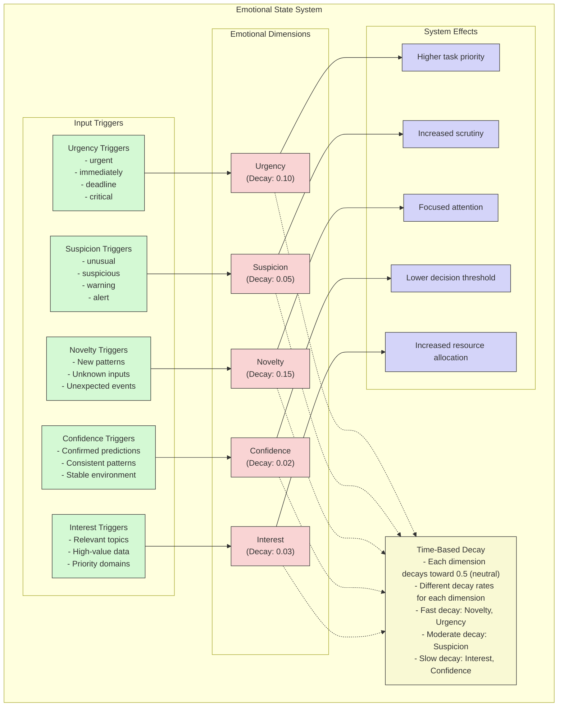

# Emotional State System Diagram

This diagram illustrates the NIS Protocol's biologically inspired emotional state system, which modulates decision-making and resource allocation.

## Key Components

### Emotional Dimensions

The system maintains five core emotional dimensions, each with a different decay rate:

1. **Suspicion** - Increases scrutiny of unusual patterns (medium decay)
2. **Urgency** - Prioritizes time-sensitive processing (fast decay)
3. **Confidence** - Influences threshold for decision-making (slow decay)
4. **Interest** - Directs attention to specific features (slow decay)
5. **Novelty** - Highlights deviation from expectations (very fast decay)

### Input Triggers

Different stimuli trigger changes in emotional dimensions:
- Urgency keywords in text ("immediately", "deadline")
- Suspicious patterns in data
- Novel or unexpected inputs
- Confirmed predictions that build confidence
- Relevant data that increases interest

### System Effects

Emotional states directly influence system behavior:
- Heightened urgency increases task priority
- Higher suspicion triggers more detailed analysis
- Novelty directs focus toward new information
- Confidence adjusts decision thresholds
- Interest allocates computational resources

### Decay Process

The emotional state naturally decays toward a neutral state (0.5) over time:
- Each dimension has a specific decay rate
- Novelty decays the fastest (0.15 per time unit)
- Confidence decays the slowest (0.02 per time unit)
- Decay creates a natural "forgetting" curve

This emotional modulation system enables the NIS Protocol to prioritize information and actions in a human-like manner, balancing attention, caution, and resource allocation. 