```mermaid
graph TD
    subgraph "NIS Protocol Architecture"
    
    %% Cognitive Layers
    subgraph "Perception Layer"
        VA[Vision Agent] --> IA[Input Agent]
    end
    
    subgraph "Interpretation Layer"
        PA[Parser Agent] --> ITA[Intent Agent]
    end
    
    subgraph "Reasoning Layer"
        CA[Cortex Agent] --> PLA[Planning Agent]
    end
    
    subgraph "Memory Layer"
        MA[Memory Agent] --> LA[Log Agent]
    end
    
    subgraph "Action Layer"
        BA[Builder Agent] --> DA[Deployer Agent]
    end
    
    subgraph "Learning Layer"
        LRA[Learning Agent] --> OA[Optimizer Agent] 
    end
    
    subgraph "Coordination Layer"
        COA[Coordinator Agent]
    end
    
    %% Emotional State
    subgraph "Emotional State"
        style ES fill:#f9d4d4,stroke:#333,stroke-width:1px
        ES["Emotional Dimensions
        - Suspicion
        - Urgency
        - Confidence
        - Interest
        - Novelty"]
    end
    
    %% Information Flow between layers
    VA --> PA
    IA --> PA
    
    PA --> CA
    ITA --> CA
    
    CA --> BA
    PLA --> BA
    
    MA --> CA
    MA --> PA
    
    BA --> LRA
    DA --> LRA
    
    COA --> VA
    COA --> IA
    COA --> CA
    COA --> BA
    
    %% Emotional State Influences
    ES -- Influences --> VA
    ES -- Influences --> IA
    ES -- Influences --> CA
    ES -- Influences --> BA
    
    %% Feedback loops
    BA -.-> MA
    LRA -.-> ES
    end
    
    classDef perception fill:#d4f9d4,stroke:#333,stroke-width:1px
    classDef interpretation fill:#d4d4f9,stroke:#333,stroke-width:1px
    classDef reasoning fill:#f9f9d4,stroke:#333,stroke-width:1px
    classDef memory fill:#f9d4f9,stroke:#333,stroke-width:1px
    classDef action fill:#d4f9f9,stroke:#333,stroke-width:1px
    classDef learning fill:#f9d4d4,stroke:#333,stroke-width:1px
    classDef coordination fill:#f9d9d4,stroke:#333,stroke-width:1px
    
    class VA,IA perception
    class PA,ITA interpretation
    class CA,PLA reasoning
    class MA,LA memory
    class BA,DA action
    class LRA,OA learning
    class COA coordination
```

# NIS Protocol Architecture Diagram

This diagram illustrates the complete NIS Protocol architecture, showing all cognitive layers and their interactions inspired by biological neural systems. The key components include:

## Cognitive Layers

1. **Perception Layer** - Processes raw sensory inputs
2. **Interpretation Layer** - Contextualizes and encodes information
3. **Reasoning Layer** - Plans, synthesizes, and makes decisions
4. **Memory Layer** - Stores short and long-term information
5. **Action Layer** - Generates and executes responses
6. **Learning Layer** - Adapts and improves system behavior
7. **Coordination Layer** - Orchestrates communication between agents

## Emotional State System

The emotional state system modulates all interactions between agents, influencing:
- Priority and urgency of tasks
- Confidence in decision-making
- Level of scrutiny for suspicious patterns
- Attention given to novel stimuli

## Information Flow

The diagram shows how information flows through the system:
1. Input is processed by perception agents
2. Parsed and contextualized by interpretation agents
3. Decisions are made by reasoning agents
4. Actions are executed by action agents
5. Results are stored by memory agents
6. The system improves through learning agents
7. All coordination is managed by the coordinator agent

The feedback loops enable continuous improvement and adaptation to changing conditions. 