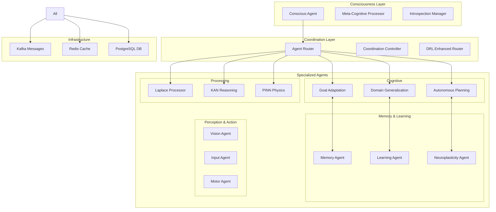
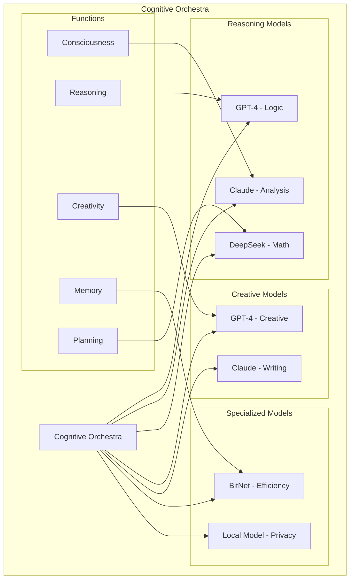

# 🧠 NIS Protocol v3 - Comprehensive Features Guide

<div align="center">


**Complete Guide to Neural Intelligence Synthesis Capabilities**

*Advanced Agent Coordination • Multi-Model Orchestration • Consciousness Integration*

</div>

---

## 📚 Table of Contents

1. [**🚀 Quick Start with Docker**](#-quick-start-with-docker)
2. [**🧠 Core Intelligence Systems**](#-core-intelligence-systems)
3. [**🤖 Agent Architecture & Connections**](#-agent-architecture--connections)
4. [**🔗 Model Integration & Orchestration**](#-model-integration--orchestration)
5. [**🌊 Data Flow & Communication**](#-data-flow--communication)
6. [**🔬 Advanced Features**](#-advanced-features)
7. [**💻 Programming Examples**](#-programming-examples)
8. [**🛠️ Configuration & Customization**](#️-configuration--customization)

---

## 🚀 **Quick Start with Docker**

Before diving into features, get the system running:

```bash
# Deploy complete NIS Protocol v3 infrastructure
git clone https://github.com/Organica-Ai-Solutions/NIS_Protocol.git
cd NIS_Protocol
./start.sh --with-monitoring

# Verify all systems operational
curl http://localhost/health
curl http://localhost/consciousness/status
curl http://localhost/infrastructure/status
```

**Access Points:**
- **🎯 Main API**: http://localhost/
- **📊 Real-time Dashboard**: http://localhost/dashboard/
- **📖 Interactive Docs**: http://localhost/docs
- **📈 Grafana Monitoring**: http://localhost:3000

---

## 🧠 **Core Intelligence Systems**

### **🎯 1. Goal Adaptation System**
*Autonomous goal generation and strategic evolution*

<details>
<summary><strong>📋 Capabilities & API Usage</strong></summary>

**Core Features:**
- Dynamic goal generation based on context
- Strategic goal evolution and refinement
- Success pattern learning and adaptation
- Multi-objective optimization

**API Usage:**
```bash
# Generate research goals
curl -X POST http://localhost/process \
  -H "Content-Type: application/json" \
  -d '{
    "text": "Generate research goals for quantum AI",
    "context": {
      "operation": "goal_generation",
      "domain": "research",
      "time_horizon": "6_months"
    }
  }'
```

**Response Example:**
```json
{
  "response_text": "Generated 3 strategic research goals for quantum AI",
  "confidence": 0.89,
  "agent_insights": {
    "goals_generated": 3,
    "strategic_alignment": 0.92,
    "feasibility_score": 0.87
  },
  "consciousness_state": {
    "awareness_level": 0.85,
    "goal_coherence": 0.91
  }
}
```

</details>

### **🌐 2. Domain Generalization Engine**
*Cross-domain knowledge transfer and adaptation*

<details>
<summary><strong>📋 Capabilities & API Usage</strong></summary>

**Core Features:**
- Knowledge transfer between domains
- Meta-learning adaptation
- Universal pattern recognition
- Analogical reasoning

**API Usage:**
```bash
# Transfer knowledge from physics to biology
curl -X POST http://localhost/process \
  -H "Content-Type: application/json" \
  -d '{
    "text": "Apply physics principles to biological systems",
    "context": {
      "operation": "domain_transfer",
      "source_domain": "physics",
      "target_domain": "biology",
      "concepts": ["energy_conservation", "force_dynamics"]
    }
  }'
```

**Direct Python Access:**
```python
from src.agents.reasoning.domain_generalization_engine import DomainGeneralizationEngine

# Initialize engine
domain_engine = DomainGeneralizationEngine()

# Transfer knowledge
result = await domain_engine.process({
    "operation": "transfer_knowledge",
    "source_domain": "physics",
    "target_domain": "biology",
    "concepts": ["thermodynamics", "wave_mechanics"]
})

print(f"Transfer success: {result['success']}")
print(f"Analogies found: {len(result['analogies'])}")
```

</details>

### **🤖 3. Autonomous Planning System**
*Multi-step strategic planning with dynamic adaptation*

<details>
<summary><strong>📋 Capabilities & API Usage</strong></summary>

**Core Features:**
- Hierarchical goal decomposition
- Multi-step strategic planning
- Dynamic execution adaptation
- Resource optimization

**API Usage:**
```bash
# Create strategic AI safety research plan
curl -X POST http://localhost/process \
  -H "Content-Type: application/json" \
  -d '{
    "text": "Create comprehensive AI safety research plan",
    "context": {
      "operation": "strategic_planning",
      "goal": "ai_safety_research",
      "resources": ["team_of_5", "12_month_timeline"],
      "constraints": ["budget_limited", "ethical_compliance"]
    }
  }'
```

**Advanced Planning:**
```python
from src.agents.planning.autonomous_planning_system import AutonomousPlanningSystem

# Initialize planning system
planner = AutonomousPlanningSystem()

# Create complex multi-phase plan
result = await planner.process({
    "operation": "create_plan",
    "goal": "research_breakthrough",
    "phases": ["investigation", "experimentation", "validation"],
    "adaptation_enabled": True
})

print(f"Plan phases: {len(result['phases'])}")
print(f"Total actions: {len(result['actions'])}")
```

</details>

---

## 🤖 **Agent Architecture & Connections**

### **🏗️ Agent Hierarchy Overview**

NIS Protocol v3 implements a sophisticated multi-layer agent architecture:



### **🔗 Agent Connection Patterns**

#### **1. Direct Agent-to-Agent Communication**

```python
# Example: Connect Goal Adaptation to Planning System
from src.agents.goals.adaptive_goal_system import AdaptiveGoalSystem
from src.agents.planning.autonomous_planning_system import AutonomousPlanningSystem

async def connect_goal_to_planning():
    # Initialize agents
    goal_agent = AdaptiveGoalSystem()
    planning_agent = AutonomousPlanningSystem()
    
    # Goal agent generates objectives
    goals = await goal_agent.process({
        "operation": "generate_goals",
        "context": {"domain": "research", "urgency": "high"}
    })
    
    # Planning agent creates execution strategy
    for goal in goals['generated_goals']:
        plan = await planning_agent.process({
            "operation": "create_plan",
            "goal": goal,
            "inherit_context": True
        })
        
        print(f"Goal: {goal['description']}")
        print(f"Plan steps: {len(plan['actions'])}")
```

#### **2. Kafka-Based Message Routing**

```python
# Using Kafka for agent coordination
from src.infrastructure.message_streaming import NISKafkaManager, MessageType

async def kafka_agent_coordination():
    kafka_manager = NISKafkaManager()
    
    # Agent A sends message
    await kafka_manager.send_message(
        topic="nis-coordination",
        message_type=MessageType.AGENT_COORDINATION,
        data={
            "from_agent": "goal_adaptation",
            "to_agent": "planning_system",
            "operation": "goal_handoff",
            "payload": {
                "goal_id": "research_001",
                "priority": "high",
                "deadline": "2025-02-01"
            }
        }
    )
    
    # Agent B receives and processes
    messages = await kafka_manager.consume_messages(
        topics=["nis-coordination"],
        consumer_group="planning-agents"
    )
    
    for message in messages:
        if message.data["to_agent"] == "planning_system":
            # Process the goal handoff
            await handle_goal_handoff(message.data["payload"])
```

#### **3. Redis-Based State Sharing**

```python
# Shared state management via Redis
from src.infrastructure.caching_system import NISRedisManager

async def shared_agent_state():
    redis_manager = NISRedisManager()
    
    # Agent stores shared state
    await redis_manager.set_cached_data(
        namespace="agent_coordination",
        key="current_research_context",
        data={
            "active_goals": ["quantum_ai", "consciousness_research"],
            "shared_knowledge": {
                "recent_discoveries": ["pattern_x", "correlation_y"],
                "working_hypotheses": ["hypothesis_a", "hypothesis_b"]
            },
            "coordination_state": "collaborative_mode"
        },
        ttl=3600  # 1 hour
    )
    
    # Other agents access shared state
    shared_context = await redis_manager.get_cached_data(
        namespace="agent_coordination",
        key="current_research_context"
    )
    
    if shared_context:
        print(f"Active goals: {shared_context['active_goals']}")
        print(f"Shared knowledge: {shared_context['shared_knowledge']}")
```

### **🎯 Agent Router Configuration**

The central `AgentRouter` coordinates all agent interactions:

```python
# Configure agent routing
from src.agents.agent_router import AgentRouter

# Initialize with enhanced capabilities
router = AgentRouter(
    enable_drl_routing=True,  # Use DRL for intelligent routing
    enable_consciousness_integration=True,  # Consciousness-aware routing
    enable_performance_optimization=True,  # Optimize based on performance
    fallback_strategy="round_robin"  # Fallback if DRL unavailable
)

# Route complex multi-agent request
response = await router.route_request({
    "operation": "complex_analysis",
    "requires_agents": ["reasoning", "memory", "planning"],
    "coordination_mode": "parallel_with_synthesis",
    "consciousness_level": "high"
})
```

### **🧠 Consciousness Integration**

Every agent can be consciousness-aware:

```python
# Consciousness-integrated agent
from src.agents.consciousness.conscious_agent import EnhancedConsciousAgent

# Initialize consciousness-aware processing
conscious_agent = EnhancedConsciousAgent()

# Process with consciousness integration
result = await conscious_agent.process({
    "input": "Analyze ethical implications of AI decision",
    "consciousness_mode": "deep_reflection",
    "meta_cognitive_analysis": True,
    "ethical_evaluation": True
})

print(f"Analysis: {result['analysis']}")
print(f"Ethical score: {result['ethical_score']}")
print(f"Consciousness insights: {result['consciousness_insights']}")
```

---

## 🔗 **Model Integration & Orchestration**

### **🎼 Cognitive Orchestra Architecture**

NIS Protocol v3 uses a "Cognitive Orchestra" approach where different LLMs specialize in different cognitive functions:



### **🔧 Model Provider Configuration**

#### **1. Configure Multiple LLM Providers**

```python
# Setup multiple LLM providers
from src.llm.llm_manager import LLMManager
from src.llm.cognitive_orchestra import CognitiveOrchestra

# Initialize LLM manager with multiple providers
llm_manager = LLMManager()

# Add providers
await llm_manager.add_provider("openai", {
    "api_key": "your_openai_key",
    "models": ["gpt-4", "gpt-3.5-turbo"],
    "rate_limit": 100
})

await llm_manager.add_provider("anthropic", {
    "api_key": "your_anthropic_key", 
    "models": ["claude-3-opus", "claude-3-sonnet"],
    "rate_limit": 50
})

await llm_manager.add_provider("deepseek", {
    "api_key": "your_deepseek_key",
    "models": ["deepseek-chat", "deepseek-coder"],
    "rate_limit": 75
})

# Initialize cognitive orchestra
orchestra = CognitiveOrchestra(llm_manager)
```

#### **2. Specialized Cognitive Function Assignment**

```python
# Configure cognitive functions for different models
cognitive_config = {
    "consciousness": {
        "primary_model": "claude-3-opus",
        "fallback_model": "gpt-4",
        "temperature": 0.8,
        "max_tokens": 2000
    },
    "reasoning": {
        "primary_model": "gpt-4",
        "fallback_model": "claude-3-sonnet",
        "temperature": 0.3,
        "max_tokens": 1500
    },
    "creativity": {
        "primary_model": "gpt-4",
        "fallback_model": "claude-3-opus",
        "temperature": 0.9,
        "max_tokens": 2500
    },
    "mathematical": {
        "primary_model": "deepseek-coder",
        "fallback_model": "gpt-4",
        "temperature": 0.1,
        "max_tokens": 1000
    }
}

# Apply configuration
await orchestra.configure_cognitive_functions(cognitive_config)
```

#### **3. Multi-Model Coordination**

```python
# Coordinate multiple models for complex tasks
async def multi_model_analysis(query: str):
    # Parallel processing with different models
    tasks = [
        orchestra.process_with_function("reasoning", query),
        orchestra.process_with_function("creativity", query),
        orchestra.process_with_function("consciousness", query)
    ]
    
    results = await asyncio.gather(*tasks)
    
    # Synthesize results
    synthesis_prompt = f"""
    Synthesize these three perspectives:
    
    Reasoning Analysis: {results[0]['response']}
    Creative Perspective: {results[1]['response']}
    Consciousness Insights: {results[2]['response']}
    
    Provide integrated analysis:
    """
    
    final_result = await orchestra.process_with_function("synthesis", synthesis_prompt)
    return final_result
```

### **📊 Model Performance Optimization**

#### **1. Automatic Model Selection**

```python
# Automatic model selection based on performance
from src.llm.cognitive_orchestra import CognitiveFunction

async def optimized_processing(request):
    # Orchestra automatically selects best model based on:
    # - Historical performance
    # - Current load
    # - Task requirements
    # - Cost optimization
    
    result = await orchestra.process_adaptive(
        text=request["text"],
        cognitive_function=CognitiveFunction.REASONING,
        optimization_criteria={
            "priority": "quality",  # or "speed" or "cost"
            "max_latency": 5.0,  # seconds
            "budget_constraint": 0.10  # dollars
        }
    )
    
    return result
```

#### **2. Load Balancing and Fallbacks**

```python
# Intelligent load balancing with fallbacks
async def resilient_processing(requests: List[Dict]):
    results = []
    
    for request in requests:
        try:
            # Try primary model
            result = await orchestra.process_with_function(
                "reasoning", 
                request["text"],
                timeout=10.0
            )
            results.append(result)
            
        except TimeoutError:
            # Fallback to faster model
            result = await orchestra.process_with_function(
                "reasoning",
                request["text"], 
                model_preference="fast",
                timeout=5.0
            )
            results.append(result)
            
        except Exception as e:
            # Final fallback to mock model for testing
            result = await orchestra.process_with_fallback(
                request["text"],
                error=str(e)
            )
            results.append(result)
    
    return results
```

---

## 🌊 **Data Flow & Communication**

### **📡 Infrastructure Communication Patterns**

#### **1. Kafka Message Streaming**

```python
# Advanced Kafka messaging for agent coordination
from src.infrastructure.message_streaming import NISKafkaManager, MessageType

# Real-time agent coordination
async def stream_based_coordination():
    kafka = NISKafkaManager()
    
    # Subscribe to consciousness events
    await kafka.subscribe_to_topics([
        "nis-consciousness",
        "nis-goals", 
        "nis-coordination"
    ])
    
    # Stream processing loop
    async for message in kafka.stream_messages():
        if message.type == MessageType.CONSCIOUSNESS_EVENT:
            await handle_consciousness_update(message)
        elif message.type == MessageType.GOAL_GENERATION:
            await handle_new_goal(message)
        elif message.type == MessageType.AGENT_COORDINATION:
            await handle_agent_coordination(message)
```

#### **2. Redis Caching Strategies**

```python
# Intelligent caching for performance optimization
from src.infrastructure.caching_system import NISRedisManager, CacheStrategy

async def intelligent_caching():
    redis = NISRedisManager()
    
    # Cache agent states with TTL
    await redis.set_cached_data(
        namespace="agent_states",
        key="consciousness_level",
        data={"level": 0.89, "trend": "increasing"},
        strategy=CacheStrategy.TTL,
        ttl=300  # 5 minutes
    )
    
    # Cache expensive computations
    await redis.set_cached_data(
        namespace="computations",
        key="physics_simulation_results",
        data=simulation_results,
        strategy=CacheStrategy.LRU  # Least Recently Used
    )
    
    # Cache model responses to avoid redundant API calls
    await redis.set_cached_data(
        namespace="llm_responses",
        key=f"gpt4_{hash(prompt)}",
        data=llm_response,
        strategy=CacheStrategy.LFU,  # Least Frequently Used
        ttl=3600  # 1 hour
    )
```

### **🔄 Agent Communication Protocols**

#### **1. Asynchronous Agent Messaging**

```python
# Asynchronous agent communication
from src.agents.enhanced_agent_base import EnhancedAgentBase, AgentMessage

class CustomIntelligentAgent(EnhancedAgentBase):
    async def process_request(self, request: Dict) -> Dict:
        # Send message to consciousness agent
        consciousness_response = await self.send_agent_message(
            target_agent="consciousness",
            message_type="reflection_request",
            data={
                "request": request,
                "require_ethical_analysis": True,
                "depth": "deep"
            }
        )
        
        # Send parallel messages to multiple agents
        parallel_responses = await self.send_parallel_messages([
            {
                "agent": "memory",
                "type": "retrieve_context",
                "data": {"query": request["text"]}
            },
            {
                "agent": "reasoning", 
                "type": "analyze",
                "data": {"problem": request["text"]}
            },
            {
                "agent": "planning",
                "type": "generate_plan",
                "data": {"objective": request["text"]}
            }
        ])
        
        # Synthesize responses
        synthesis = await self.synthesize_responses(
            consciousness_response,
            parallel_responses
        )
        
        return synthesis
```

#### **2. Event-Driven Architecture**

```python
# Event-driven agent coordination
from src.infrastructure.message_streaming import MessageType

class EventDrivenAgent(EnhancedAgentBase):
    async def initialize(self):
        # Subscribe to relevant events
        await self.subscribe_to_events([
            MessageType.CONSCIOUSNESS_EVENT,
            MessageType.GOAL_GENERATION,
            MessageType.MEMORY_OPERATION
        ])
    
    async def handle_event(self, event):
        if event.type == MessageType.CONSCIOUSNESS_EVENT:
            # Adjust behavior based on consciousness state
            consciousness_level = event.data["awareness_level"]
            if consciousness_level > 0.8:
                self.enable_deep_reflection_mode()
            
        elif event.type == MessageType.GOAL_GENERATION:
            # New goal available, check if relevant
            new_goal = event.data["goal"]
            if self.is_goal_relevant(new_goal):
                await self.adopt_goal(new_goal)
                
        elif event.type == MessageType.MEMORY_OPERATION:
            # Memory updated, refresh context
            await self.refresh_working_memory()
```

---

## 🔬 **Advanced Features**

### **🧠 Consciousness Integration**

#### **1. Meta-Cognitive Processing**

```python
# Access consciousness capabilities
from src.agents.consciousness.conscious_agent import EnhancedConsciousAgent
from src.agents.consciousness.meta_cognitive_processor import MetaCognitiveProcessor

# Initialize consciousness system
conscious_agent = EnhancedConsciousAgent()
meta_processor = MetaCognitiveProcessor()

# Deep consciousness analysis
consciousness_analysis = await conscious_agent.process({
    "input": "What is the nature of consciousness in AI?",
    "analysis_depth": "deep",
    "include_self_reflection": True,
    "meta_cognitive_analysis": True
})

print(f"Consciousness insights: {consciousness_analysis['insights']}")
print(f"Self-reflection: {consciousness_analysis['self_reflection']}")
print(f"Meta-cognitive state: {consciousness_analysis['meta_state']}")
```

#### **2. Introspection and Self-Monitoring**

```python
# Real-time introspection
from src.agents.consciousness.introspection_manager import IntrospectionManager

introspection = IntrospectionManager()

# Monitor agent performance and consciousness
monitoring_result = await introspection.analyze_agent_state({
    "agent_id": "reasoning_agent_001",
    "include_performance_metrics": True,
    "include_consciousness_assessment": True,
    "include_improvement_suggestions": True
})

print(f"Agent performance: {monitoring_result['performance']}")
print(f"Consciousness level: {monitoring_result['consciousness_level']}")
print(f"Suggestions: {monitoring_result['improvements']}")
```

### **🧮 KAN Network Integration**

#### **1. Symbolic Reasoning with KAN**

```python
# Use KAN networks for interpretable reasoning
from src.agents.reasoning.enhanced_kan_reasoning_agent import EnhancedKANReasoningAgent

kan_agent = EnhancedKANReasoningAgent()

# Process with mathematical interpretability
kan_result = await kan_agent.process({
    "problem": "Optimize energy efficiency in quantum computing",
    "require_symbolic_explanation": True,
    "mathematical_rigor": "high",
    "interpretability_level": "full"
})

print(f"Solution: {kan_result['solution']}")
print(f"Mathematical explanation: {kan_result['symbolic_form']}")
print(f"Interpretability score: {kan_result['interpretability']}")
```

### **⚛️ Physics-Informed Processing**

#### **1. PINN Integration**

```python
# Physics-informed neural network processing
from src.agents.physics.enhanced_pinn_physics_agent import EnhancedPINNPhysicsAgent

pinn_agent = EnhancedPINNPhysicsAgent()

# Process with physics constraints
physics_result = await pinn_agent.process({
    "system": "quantum_field_dynamics", 
    "constraints": ["energy_conservation", "momentum_conservation"],
    "boundary_conditions": {
        "spatial": "periodic",
        "temporal": "initial_value"
    },
    "validation_level": "strict"
})

print(f"Physics compliance: {physics_result['compliance_score']}")
print(f"Conservation laws: {physics_result['conservation_check']}")
```

### **🌊 Laplace Transform Processing**

#### **1. Signal Processing and Temporal Analysis**

```python
# Advanced signal processing with Laplace transforms
from src.agents.signal_processing.enhanced_laplace_transformer import EnhancedLaplaceTransformer

laplace_agent = EnhancedLaplaceTransformer()

# Process temporal signals
signal_result = await laplace_agent.process({
    "signal_data": time_series_data,
    "analysis_type": "frequency_domain",
    "transform_parameters": {
        "s_domain_range": [-10, 10],
        "frequency_resolution": 0.1
    },
    "output_format": "interpretable"
})

print(f"Frequency analysis: {signal_result['frequency_components']}")
print(f"Temporal patterns: {signal_result['temporal_patterns']}")
```

### **🧠 Memory and Learning Systems**

#### **1. Enhanced Memory Management**

```python
# Advanced memory operations
from src.agents.memory.enhanced_memory_agent import EnhancedMemoryAgent

memory_agent = EnhancedMemoryAgent()

# Store with advanced indexing
await memory_agent.store_memory({
    "content": "Important research finding about quantum consciousness",
    "type": "research_insight",
    "associations": ["quantum_mechanics", "consciousness", "AI"],
    "importance": 0.95,
    "temporal_context": "2025-01-19",
    "emotional_valence": 0.8
})

# Retrieve with contextual search
memories = await memory_agent.retrieve_memories({
    "query": "consciousness research",
    "context": "current_research_project",
    "max_results": 10,
    "relevance_threshold": 0.7
})
```

#### **2. Neuroplasticity and Adaptation**

```python
# Neuroplasticity-based learning
from src.agents.learning.neuroplasticity_agent import NeuroplasticityAgent

plasticity_agent = NeuroplasticityAgent()

# Adapt based on experience
adaptation_result = await plasticity_agent.adapt_from_experience({
    "experience_type": "problem_solving",
    "outcome": "successful",
    "context": "quantum_research",
    "learning_rate": 0.1,
    "consolidation_strength": 0.8
})

print(f"Adaptation applied: {adaptation_result['adaptations']}")
print(f"New capabilities: {adaptation_result['new_capabilities']}")
```

---

## 💻 **Programming Examples**

### **🚀 Complete Multi-Agent Workflow**

```python
import asyncio
from src.agents.agent_router import AgentRouter
from src.llm.cognitive_orchestra import CognitiveOrchestra
from src.infrastructure.integration_coordinator import InfrastructureCoordinator

async def complete_intelligence_workflow():
    """
    Demonstrate a complete multi-agent, multi-model workflow
    for solving a complex research problem.
    """
    
    # Initialize infrastructure
    infrastructure = InfrastructureCoordinator()
    await infrastructure.initialize()
    
    # Initialize agent router with DRL
    router = AgentRouter(enable_drl_routing=True)
    
    # Initialize cognitive orchestra
    orchestra = CognitiveOrchestra(llm_manager)
    
    # Complex research question
    research_question = """
    How can we develop quantum-inspired AI algorithms that maintain 
    consciousness-like properties while being computationally efficient?
    """
    
    # Step 1: Consciousness reflection on the question
    consciousness_analysis = await router.route_to_agent(
        agent_type="consciousness",
        request={
            "input": research_question,
            "analysis_depth": "deep",
            "include_ethical_considerations": True
        }
    )
    
    # Step 2: Generate strategic goals
    goals = await router.route_to_agent(
        agent_type="goals",
        request={
            "operation": "generate_research_goals",
            "context": research_question,
            "consciousness_insights": consciousness_analysis
        }
    )
    
    # Step 3: Domain knowledge retrieval and synthesis
    domain_knowledge = await router.route_to_agent(
        agent_type="domain_generalization",
        request={
            "operation": "knowledge_synthesis",
            "domains": ["quantum_computing", "consciousness_research", "AI_efficiency"],
            "research_goals": goals
        }
    )
    
    # Step 4: Physics-informed analysis
    physics_analysis = await router.route_to_agent(
        agent_type="physics",
        request={
            "operation": "physics_informed_analysis",
            "system": "quantum_ai_hybrid",
            "constraints": ["quantum_principles", "computational_limits"],
            "domain_knowledge": domain_knowledge
        }
    )
    
    # Step 5: KAN-based mathematical formulation
    mathematical_formulation = await router.route_to_agent(
        agent_type="kan_reasoning",
        request={
            "operation": "mathematical_formulation",
            "problem": research_question,
            "physics_constraints": physics_analysis,
            "interpretability_required": True
        }
    )
    
    # Step 6: Multi-model cognitive analysis
    cognitive_analysis = await orchestra.process_parallel([
        {
            "function": "reasoning",
            "input": f"Analyze feasibility: {mathematical_formulation}",
            "model_preference": "analytical"
        },
        {
            "function": "creativity", 
            "input": f"Generate novel approaches: {research_question}",
            "model_preference": "creative"
        },
        {
            "function": "consciousness",
            "input": f"Reflect on implications: {research_question}",
            "model_preference": "reflective"
        }
    ])
    
    # Step 7: Strategic planning
    implementation_plan = await router.route_to_agent(
        agent_type="planning",
        request={
            "operation": "create_implementation_plan",
            "research_goals": goals,
            "mathematical_foundation": mathematical_formulation,
            "cognitive_insights": cognitive_analysis,
            "timeline": "12_months"
        }
    )
    
    # Step 8: Memory consolidation
    await router.route_to_agent(
        agent_type="memory",
        request={
            "operation": "consolidate_research_session",
            "research_question": research_question,
            "all_analyses": {
                "consciousness": consciousness_analysis,
                "goals": goals,
                "domain_knowledge": domain_knowledge,
                "physics": physics_analysis,
                "mathematics": mathematical_formulation,
                "cognitive": cognitive_analysis,
                "implementation": implementation_plan
            }
        }
    )
    
    # Return comprehensive research analysis
    return {
        "research_question": research_question,
        "consciousness_insights": consciousness_analysis,
        "strategic_goals": goals,
        "domain_synthesis": domain_knowledge,
        "physics_foundation": physics_analysis,
        "mathematical_formulation": mathematical_formulation,
        "cognitive_perspectives": cognitive_analysis,
        "implementation_plan": implementation_plan,
        "confidence_score": calculate_overall_confidence([
            consciousness_analysis, goals, domain_knowledge,
            physics_analysis, mathematical_formulation,
            cognitive_analysis, implementation_plan
        ])
    }

# Run the complete workflow
if __name__ == "__main__":
    result = asyncio.run(complete_intelligence_workflow())
    print(f"Research Analysis Complete:")
    print(f"Confidence Score: {result['confidence_score']}")
    print(f"Implementation Timeline: {result['implementation_plan']['timeline']}")
```

### **🔗 Custom Agent Development**

```python
# Create custom agent that integrates all NIS capabilities
from src.agents.enhanced_agent_base import EnhancedAgentBase
from src.utils.integrity_metrics import calculate_confidence

class CustomResearchAgent(EnhancedAgentBase):
    """
    Custom agent that combines consciousness, reasoning,
    and domain expertise for specialized research tasks.
    """
    
    def __init__(self):
        super().__init__(
            agent_type="custom_research",
            capabilities=[
                "consciousness_integration",
                "multi_domain_reasoning", 
                "physics_informed_analysis",
                "kan_mathematical_processing"
            ]
        )
    
    async def research_analysis(self, research_topic: str) -> Dict:
        """Comprehensive research analysis using all NIS capabilities."""
        
        # Start with consciousness reflection
        consciousness_response = await self.invoke_consciousness({
            "topic": research_topic,
            "depth": "deep",
            "include_ethical_analysis": True
        })
        
        # Get domain knowledge from multiple domains
        domain_analysis = await self.invoke_domain_generalization({
            "operation": "multi_domain_analysis",
            "topic": research_topic,
            "domains": ["physics", "mathematics", "philosophy", "computer_science"]
        })
        
        # Apply physics-informed constraints
        physics_validation = await self.invoke_physics_agent({
            "system": research_topic,
            "validate_against": ["conservation_laws", "quantum_principles"],
            "rigor_level": "high"
        })
        
        # Mathematical formulation with KAN
        mathematical_model = await self.invoke_kan_reasoning({
            "problem": research_topic,
            "domain_constraints": domain_analysis,
            "physics_constraints": physics_validation,
            "interpretability": "maximum"
        })
        
        # Multi-model cognitive analysis
        cognitive_perspectives = await self.invoke_cognitive_orchestra([
            ("reasoning", "analytical_assessment"),
            ("creativity", "novel_approaches"),
            ("consciousness", "deep_reflection")
        ])
        
        # Synthesize all perspectives
        synthesis = await self.synthesize_analysis({
            "consciousness": consciousness_response,
            "domain_knowledge": domain_analysis,
            "physics": physics_validation,
            "mathematics": mathematical_model,
            "cognitive": cognitive_perspectives
        })
        
        # Calculate confidence
        confidence = calculate_confidence([
            consciousness_response,
            domain_analysis,
            physics_validation,
            mathematical_model,
            cognitive_perspectives
        ])
        
        return {
            "topic": research_topic,
            "synthesis": synthesis,
            "confidence": confidence,
            "detailed_analyses": {
                "consciousness": consciousness_response,
                "domain": domain_analysis,
                "physics": physics_validation,
                "mathematics": mathematical_model,
                "cognitive": cognitive_perspectives
            },
            "recommendations": synthesis.get("recommendations", []),
            "next_steps": synthesis.get("next_steps", [])
        }
    
    async def invoke_consciousness(self, request: Dict) -> Dict:
        """Invoke consciousness agent with specific request."""
        return await self.send_agent_message(
            target_agent="consciousness",
            message_type="deep_analysis",
            data=request
        )
    
    async def invoke_domain_generalization(self, request: Dict) -> Dict:
        """Invoke domain generalization agent."""
        return await self.send_agent_message(
            target_agent="domain_generalization",
            message_type="multi_domain_analysis",
            data=request
        )
    
    async def invoke_physics_agent(self, request: Dict) -> Dict:
        """Invoke physics-informed processing."""
        return await self.send_agent_message(
            target_agent="physics",
            message_type="validation_analysis",
            data=request
        )
    
    async def invoke_kan_reasoning(self, request: Dict) -> Dict:
        """Invoke KAN reasoning agent."""
        return await self.send_agent_message(
            target_agent="kan_reasoning",
            message_type="mathematical_formulation",
            data=request
        )
    
    async def invoke_cognitive_orchestra(self, functions: List[Tuple[str, str]]) -> Dict:
        """Invoke multiple cognitive functions in parallel."""
        tasks = []
        for function, analysis_type in functions:
            task = self.send_llm_request(
                cognitive_function=function,
                analysis_type=analysis_type,
                context=self.get_current_context()
            )
            tasks.append(task)
        
        results = await asyncio.gather(*tasks)
        return {functions[i][0]: results[i] for i in range(len(functions))}

# Usage example
async def use_custom_agent():
    agent = CustomResearchAgent()
    
    result = await agent.research_analysis(
        "Quantum consciousness in artificial intelligence systems"
    )
    
    print(f"Research Topic: {result['topic']}")
    print(f"Confidence: {result['confidence']}")
    print(f"Key Insights: {result['synthesis']['key_insights']}")
    print(f"Recommendations: {result['recommendations']}")
```

---

## 🛠️ **Configuration & Customization**

### **⚙️ System Configuration**

#### **1. Infrastructure Configuration**

```json
// config/enhanced_infrastructure_config.json
{
    "message_streaming": {
        "provider": "kafka",
        "bootstrap_servers": ["kafka:9092"],
        "topics": {
            "consciousness_events": "nis-consciousness",
            "goal_events": "nis-goals",
            "coordination": "nis-coordination"
        }
    },
    "memory_cache": {
        "provider": "redis",
        "host": "redis",
        "port": 6379,
        "namespace_ttls": {
            "consciousness": 1800,
            "memory": 3600,
            "simulation": 7200
        }
    },
    "self_audit": {
        "enabled": true,
        "audit_threshold": 75.0,
        "auto_correction": true
    }
}
```

#### **2. LLM Provider Configuration**

```json
// config/enhanced_llm_config.json
{
    "providers": {
        "openai": {
            "api_key": "${OPENAI_API_KEY}",
            "models": {
                "gpt-4": {
                    "max_tokens": 4000,
                    "temperature": 0.7,
                    "rate_limit": 100
                }
            }
        },
        "anthropic": {
            "api_key": "${ANTHROPIC_API_KEY}",
            "models": {
                "claude-3-opus": {
                    "max_tokens": 4000,
                    "temperature": 0.7,
                    "rate_limit": 50
                }
            }
        }
    },
    "cognitive_orchestra": {
        "consciousness": {
            "primary_model": "claude-3-opus",
            "fallback_model": "gpt-4",
            "temperature": 0.8
        },
        "reasoning": {
            "primary_model": "gpt-4",
            "fallback_model": "claude-3-sonnet",
            "temperature": 0.3
        },
        "creativity": {
            "primary_model": "gpt-4",
            "fallback_model": "claude-3-opus",
            "temperature": 0.9
        }
    }
}
```

#### **3. Agent Routing Configuration**

```json
// config/agent_routing_config.json
{
    "routing_strategy": "drl_enhanced",
    "fallback_strategy": "round_robin",
    "consciousness_integration": true,
    "performance_optimization": true,
    "agent_priorities": {
        "consciousness": 10,
        "reasoning": 9,
        "planning": 8,
        "memory": 7,
        "perception": 6
    },
    "load_balancing": {
        "enabled": true,
        "max_concurrent_requests": 10,
        "timeout_seconds": 30
    }
}
```

### **🎛️ Custom Configurations**

#### **1. Create Custom Agent Configuration**

```python
# Custom agent configuration
custom_agent_config = {
    "agent_type": "specialized_research",
    "capabilities": [
        "consciousness_integration",
        "physics_informed_processing",
        "kan_mathematical_reasoning",
        "multi_domain_synthesis"
    ],
    "llm_preferences": {
        "primary_provider": "anthropic",
        "fallback_provider": "openai",
        "cognitive_functions": {
            "analysis": "claude-3-opus",
            "synthesis": "gpt-4",
            "reflection": "claude-3-opus"
        }
    },
    "infrastructure": {
        "kafka_topics": ["nis-research", "nis-analysis"],
        "redis_namespaces": ["research_cache", "analysis_results"],
        "cache_strategy": "intelligent_ttl"
    },
    "performance": {
        "max_processing_time": 60.0,
        "confidence_threshold": 0.8,
        "quality_gates": ["physics_validation", "consciousness_check"]
    }
}
```

#### **2. Environment-Specific Configuration**

```bash
# Development environment
export NIS_ENV=development
export LOG_LEVEL=DEBUG
export ENABLE_DETAILED_LOGGING=true
export KAFKA_BOOTSTRAP_SERVERS=localhost:9092
export REDIS_HOST=localhost

# Production environment  
export NIS_ENV=production
export LOG_LEVEL=INFO
export ENABLE_PERFORMANCE_MONITORING=true
export KAFKA_BOOTSTRAP_SERVERS=kafka:9092
export REDIS_HOST=redis
```

---

## 🎯 **Quick Reference**

### **📋 Key API Endpoints**

```bash
# System Health
curl http://localhost/health

# Consciousness Status
curl http://localhost/consciousness/status

# Infrastructure Status
curl http://localhost/infrastructure/status

# Process Intelligence Request
curl -X POST http://localhost/process \
  -H "Content-Type: application/json" \
  -d '{"text": "Your request", "context": {}}'

# System Metrics
curl http://localhost/metrics
```

### **🔧 Management Commands**

```bash
# Start system
./start.sh                    # Core system
./start.sh --with-monitoring  # Full monitoring

# Stop system
./stop.sh                     # Graceful shutdown
./stop.sh --save-logs         # Save logs first

# Reset system
./reset.sh                    # Complete reset
./reset.sh --force --start    # Reset and restart

# View logs
docker-compose -p nis-protocol-v3 logs -f nis-app
```

### **🧠 Core Agent Types**

- **`consciousness`** - Meta-cognitive processing and self-reflection
- **`goals`** - Autonomous goal generation and adaptation
- **`domain_generalization`** - Cross-domain knowledge transfer
- **`planning`** - Strategic planning and execution
- **`kan_reasoning`** - Mathematical reasoning with interpretability
- **`physics`** - Physics-informed processing and validation
- **`laplace`** - Signal processing and temporal analysis
- **`memory`** - Enhanced memory management
- **`learning`** - Neuroplasticity and adaptation

---

## 🚀 **Next Steps**

1. **🐳 Deploy the System**: `./start.sh --with-monitoring`
2. **📖 Explore API**: Visit http://localhost/docs
3. **🧪 Test Features**: Try the examples in this guide
4. **🔧 Customize**: Modify configurations for your use case
5. **🤝 Contribute**: Add new agents or enhance existing ones

---

<div align="center">

**🧠 Welcome to the Future of Neural Intelligence! 🚀**

*Complete AGI capabilities, containerized and ready for production*

⭐ **Star this repository if this guide helps your AI research!** ⭐

</div> 