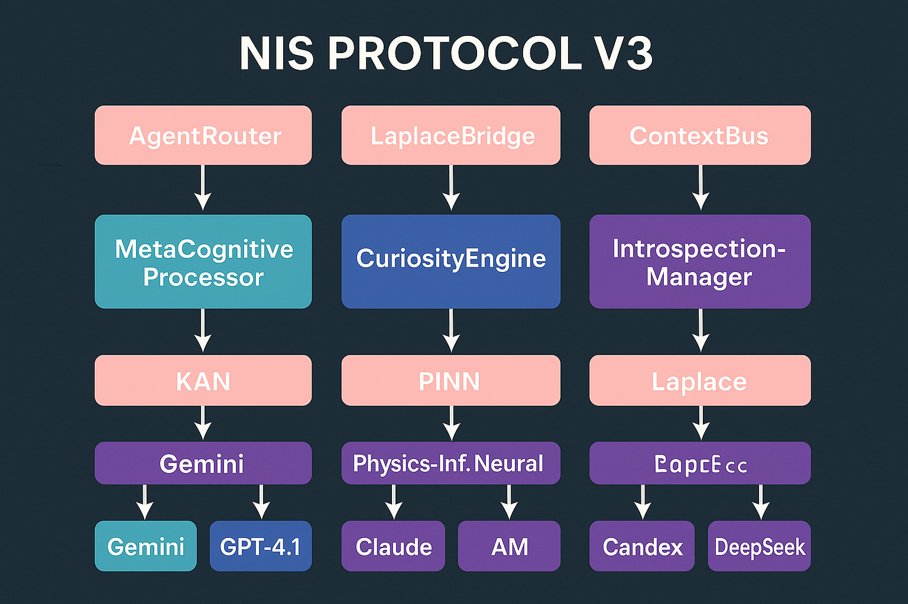

# NIS Protocol v3.1 - Comprehensive Features Guide

<div align="center">



**A Guide to the Grounded, Interpretable, and Self-Aware AI Framework**

*Scientific Pipeline • Meta-Control Architecture • Verifiable AI*

</div>

---

## 📚 Table of Contents

1. [**Core Philosophy: Grounded AI**](#1-core-philosophy-grounded-ai)
2. [**Quick Start with Docker**](#2-quick-start-with-docker)
3. [**The Scientific Pipeline in Action**](#3-the-scientific-pipeline-in-action)
4. [**The Meta-Control Layer**](#4-the-meta-control-layer)
5. [**Key API Endpoints & Usage**](#5-key-api-endpoints--usage)
6. [**Configuration & Customization**](#6-configuration--customization)
7. [**Agent Architecture**](#7-agent-architecture)

---

## 1. Core Philosophy: Grounded AI

The NIS Protocol v3.1 is engineered to solve a fundamental problem in modern AI: the lack of grounding in reality. Unlike traditional models that can "hallucinate" or produce nonsensical outputs, NIS v3.1 forces every piece of information through a rigorous scientific validation pipeline *before* it is presented to the user.

**The core principle is: an idea is only valid if it is mathematically interpretable and does not violate the fundamental laws of physics.**

This approach makes the protocol ideal for applications requiring high-levels of trust, safety, and reliability, such as scientific research, engineering design, and critical analysis.

---

## 2. Quick Start with Docker

The entire protocol, including all agents, services, and dependencies, is containerized for simple, one-command deployment.

**Prerequisites:**
*   Docker and Docker Compose installed.
*   Git installed.
*   API keys for your chosen LLM providers (OpenAI, Anthropic, etc.).

**Steps:**

```bash
# 1. Clone the repository
git clone https://github.com/your-repo/NIS_Protocol.git
cd NIS_Protocol

# 2. Create the environment file
# This copies the example file. You MUST edit it.
cp .env.example .env

# 3. Add your API keys to the .env file
# Use a text editor like nano, vim, or VS Code
nano .env

# 4. Start the entire system
# This will build the Docker images and launch all services.
./scripts/start.sh
```

**Verify the System is Running:**

```bash
# Check the health of the main application
curl http://localhost:8000/health

# See which agents have been successfully initialized
curl http://localhost:8000/agents
```

**Access Points:**
- **Main API**: `http://localhost:8000`
- **Interactive API Docs (Swagger UI)**: `http://localhost:8000/docs`

---

## 3. The Scientific Pipeline in Action

This is the heart of the NIS Protocol. Every query to the `/chat` or `/chat/stream` endpoint goes through this four-stage process.


### **Stage 1: Signal Processing (Laplace Transform)**
-   **Agent:** `EnhancedLaplaceTransformer`
-   **Purpose:** Converts unstructured input (like a text query) into a structured mathematical representation in the frequency domain. This strips away linguistic ambiguity and prepares the query for pure mathematical analysis.

### **Stage 2: Interpretable Reasoning (KAN)**
-   **Agent:** `EnhancedKANReasoningAgent`
-   **Purpose:** This agent uses a Kolmogorov-Arnold Network (KAN) to find the underlying mathematical function that describes the relationships in the data. Unlike a typical neural network that produces a matrix of weights, a KAN produces a **symbolic formula** (e.g., `f(x) = sin(πx) + x²`).
-   **Key Benefit: Interpretability.** You can see the exact equation the AI is using to reason, making its logic fully transparent.

### **Stage 3: Physics Validation (PINN)**
-   **Agent:** `EnhancedPINNPhysicsAgent`
-   **Purpose:** Acts as a "reality check." It takes the symbolic formula from the KAN and validates it against a set of fundamental physical laws (like conservation of energy, momentum, and thermodynamics).
-   **Key Benefit: Grounding.** Any hypothesis or solution that is physically impossible is automatically rejected. The system cannot produce nonsense.

### **Stage 4: Language Synthesis (LLM)**
-   **Service:** `CognitiveOrchestra`
-   **Purpose:** Only *after* the pipeline has validated a result does the system engage with Large Language Models. Their role is not to reason, but to translate the verified, mathematical output back into fluent, natural language for the user.
-   **Key Benefit: Safety.** The LLM is used as a communication tool, not a source of truth, dramatically reducing the risk of "hallucinations."

---

## 4. The Meta-Control Layer

Overseeing the pipeline is a trio of high-level agents that manage the system's strategy, resources, and "self-awareness."

### **1. `EnhancedConsciousAgent` (The Strategist)**
-   **Purpose:** Monitors the overall health, performance, and integrity of the entire system. It provides strategic oversight and performs introspective analysis on the system's own behavior. This is the closest the system comes to "self-awareness."
-   **Check its Status:** `curl http://localhost:8000/consciousness/status`

### **2. `EnhancedScientificCoordinator` (The Orchestrator)**
-   **Purpose:** The operational manager of the scientific pipeline. It receives incoming requests and routes them sequentially through the Laplace, KAN, and PINN agents, ensuring the validation process is followed correctly.

### **3. `DRLResourceManager` (The Efficiency Expert)**
-   **Purpose:** Uses Deep Reinforcement Learning to manage and allocate computational resources (like CPU, memory, and LLM API calls) efficiently. It works to optimize the system for performance, cost, or a balance of both based on its operational goals.

---

## 5. Key API Endpoints & Usage

All interactions are done via the FastAPI server running on port 8000.

### **`/chat` (Primary Interaction Endpoint)**
This endpoint runs your query through the full Scientific Pipeline.

**Usage:**
```bash
curl -X POST "http://localhost:8000/chat" \
-H "Content-Type: application/json" \
-d '{"message": "What is the relationship between energy and matter?"}'
```

**Example Response:**
```json
{
  "response": "Based on a physically validated model, the relationship is described by the equation E=mc^2, representing mass-energy equivalence.",
  "nis_pipeline_output": {
    "pipeline": {
      "is_valid": true,
      "confidence": 0.99,
      "symbolic_equation": "E = m*c**2",
      "validated_laws": ["conservation_of_energy", "special_relativity"]
    }
  },
  "llm_provider": "openai"
}
```

### **`/chat/stream` (Real-time Interaction)**
This endpoint provides a streaming response for more interactive, real-time conversations.

**Usage:**
```bash
curl -X POST "http://localhost:8000/chat/stream" \
-H "Content-Type: application/json" \
-d '{"message": "Simulate the trajectory of a projectile with air resistance."}'
```
*(The response will be a stream of server-sent events.)*

### **`/health` (System Health Check)**
Confirms that the main application server is running.

**Usage:**
```bash
curl http://localhost:8000/health
```
**Response:** `{"status": "ok"}`

### **`/agents` (View Active Agents)**
Shows a list of all agents that were successfully initialized at startup.

**Usage:**
```bash
curl http://localhost:8000/agents
```
**Example Response:**
```json
{
  "agents_registered": 4,
  "agent_details": {
    "laplace_transformer_01": { /* status */ },
    "kan_reasoning_01": { /* status */ },
    "pinn_physics_01": { /* status */ },
    "consciousness_01": { /* status */ }
  }
}
```

### **`/consciousness/status` (Check the "Mind")**
Provides a glimpse into the meta-cognitive state of the system.

**Usage:**
```bash
curl http://localhost:8000/consciousness/status
```

---

## 6. Configuration & Customization

The system's behavior is primarily controlled by environment variables.

### **`.env` File**
This is the most important configuration file. It is created from `.env.example` on the first run and is where you **must** place your API keys.

```env
# .env

# LLM Provider API Keys (Required)
OPENAI_API_KEY="sk-..."
ANTHROPIC_API_KEY="sk-..."
DEEPSEEK_API_KEY="..."
GOOGLE_API_KEY="..."

# Select which LLM provider the CognitiveOrchestra should use
# Options: "openai", "anthropic", "deepseek", "google"
LLM_PROVIDER="openai"
```

### **`config/*.json` Files**
For more advanced users, the JSON files in the `config/` directory offer finer control over aspects like agent parameters and infrastructure settings. *It is recommended to leave these as default unless you have a specific need to change them.*

---

## 7. Agent Architecture

The system's architecture is designed to be modular and extensible.


-   **Base Agent:** All agents inherit from `EnhancedAgentBase` (`src/agents/enhanced_agent_base.py`), which provides common functionality.
-   **Adding New Agents:** To extend the system, you can create a new agent class in the `src/agents/` directory and register it within the `main.py` startup sequence.

---

<div align="center">

**🚀 Welcome to the forefront of verifiable and safe AI! 🚀**

⭐ **Star this repository to support the development of grounded intelligence!** ⭐

</div> 