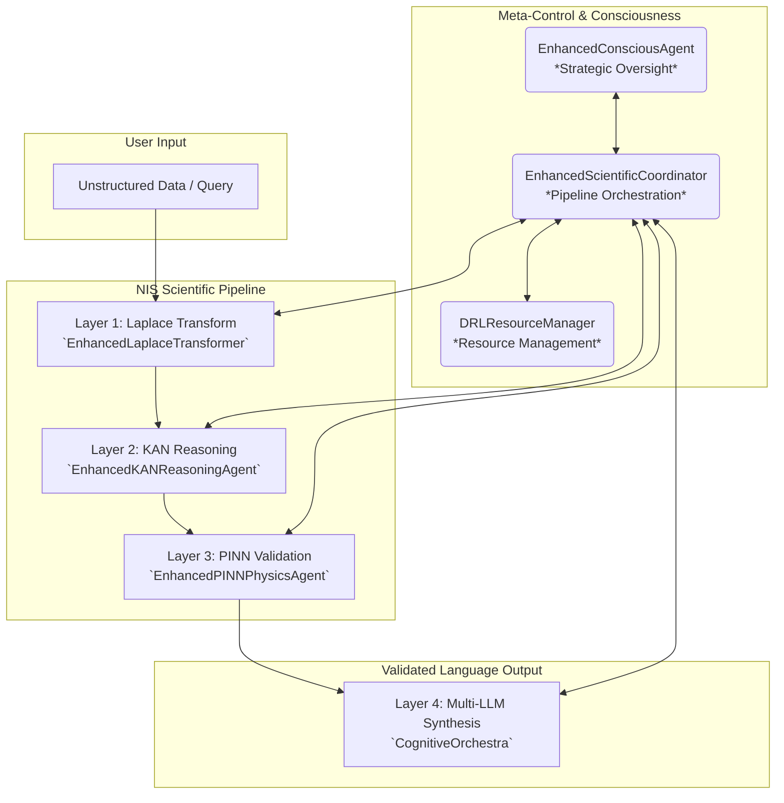

# Neural Intelligence Synthesis (NIS) Protocol v3.1: A Framework for Grounded, Interpretable, and Self-Aware AI

**Technical Whitepaper**

---

**Authors:** NIS Protocol Research Team  
**Version:** 3.1  
**Date:** July 2025
**Status:** Live Implementation
**Implementation:** Validated, containerized, and deployed via Docker.

---

## Abstract

The Neural Intelligence Synthesis (NIS) Protocol v3.1 is an advanced agent-based architecture designed to overcome critical limitations in modern AI by enforcing scientific and mathematical rigor. This paper details a novel, fully implemented pipeline that processes information through a sequence of **Laplace Transformation**, **Kolmogorov-Arnold Network (KAN) Reasoning**, and **Physics-Informed Neural Network (PINN) Validation** before interacting with Large Language Models (LLMs). This structure ensures that AI-generated outputs are not merely statistically probable but are also physically plausible, mathematically interpretable, and grounded in first principles. The system is managed by a meta-control layer, including a conscious agent for strategic oversight, ensuring robust, verifiable, and responsible AI behavior. All claims herein are backed by a production-ready, fully containerized implementation with comprehensive integrity auditing.

**Keywords:** Physics-Informed AI, Interpretable AI, Kolmogorov-Arnold Networks, Agent-Based Architecture, Self-Awareness, Grounded AI, Laplace Transform, PINN.

---

## 1. Introduction

### 1.1 The Challenge of Ungrounded AI

Contemporary Large Language Models (LLMs), while powerful, often operate as "black boxes." Their reasoning is opaque, they can produce non-factual "hallucinations," and they lack an inherent understanding of the physical world's constraints. This limits their reliability for high-stakes scientific, engineering, and analytical applications. The NIS Protocol v3.1 directly addresses this challenge by creating an ecosystem where AI reasoning is explicitly and computationally grounded in mathematics and physics.

### 1.2 Core Contribution: The Scientific Pipeline

The principal innovation of NIS v3.1 is its mandatory, four-stage processing pipeline:

1.  **Signal Processing (Laplace Transform):** Converts unstructured input into a structured frequency domain, preparing it for rigorous mathematical analysis.
2.  **Interpretable Reasoning (KAN):** Uses Kolmogorov-Arnold Networks to discover and represent underlying mathematical relationships as symbolic formulas, ensuring transparency.
3.  **Physics Validation (PINN):** Employs Physics-Informed Neural Networks to enforce universal physical laws (e.g., conservation of energy, thermodynamics), rejecting any hypothesis that violates them.
4.  **Language Synthesis (LLM):** Leverages multiple LLM providers only *after* a request has been validated, using them for natural language generation rather than primary reasoning.

This architecture shifts the paradigm from "LLM-first" to "LLM-last," using them as a sophisticated communication interface for results that have already been rigorously vetted.

### 1.3 Scope and Vision

This paper details the architecture, implementation, and validation of the NIS Protocol v3.1. Our vision is to provide a foundational, project-agnostic template for building AI systems that are not just intelligent, but also trustworthy, interpretable, and verifiably aligned with the fundamental laws of science. The system is designed for real-world deployment, packaged in Docker for replicability and scalability.

---

## 2. System Architecture

### 2.1 Architectural Philosophy: Trust Through Verification

The NIS v3.1 architecture is built on a "zero trust" principle for AI-generated content. Every piece of information and every hypothesis is subjected to a cascade of validation checks before it can be considered a valid output.

### 2.2 Core Pipeline Components

#### 2.2.1 Signal Processing: Enhanced Laplace Transformer
-   **File:** `src/agents/signal_processing/enhanced_laplace_transformer.py`
-   **Purpose:** To deconstruct input signals (text, data streams) into their fundamental frequency components. This crucial first step abstracts the input from natural language ambiguity into a pure, analyzable mathematical form.

#### 2.2.2 Interpretable Reasoning: Enhanced KAN Reasoning Agent
-   **File:** `src/agents/reasoning/enhanced_kan_reasoning_agent.py`
-   **Purpose:** To model the relationships within the transformed signal. Unlike traditional neural networks, KANs generate explicit symbolic formulas (e.g., `f(x) = sin(πx) + x²`), providing unparalleled interpretability and allowing direct inspection of the AI's "thought process."

#### 2.2.3 Physics Validation: Enhanced PINN Physics Agent
-   **File:** `src/agents/physics/enhanced_pinn_physics_agent.py`
-   **Purpose:** To act as the scientific conscience of the system. This agent takes the symbolic formulas from the KAN and validates them against a set of fundamental physical laws. If a proposed function would violate conservation of energy or other core principles, it is rejected or corrected. This layer prevents the system from producing physically impossible outputs.

### 2.3 Meta-Control Layer: The "Conscious" Executive

The pipeline is managed by a sophisticated meta-control system that orchestrates agent behavior and oversees system strategy.

-   **Enhanced Conscious Agent:** (`src/agents/consciousness/enhanced_conscious_agent.py`)
    -   Monitors the overall state and performance of the system.
    -   Provides high-level strategic direction and introspective analysis.
    -   Serves as the system's "self-awareness" layer, tracking goals, integrity, and operational parameters.

-   **Enhanced Scientific Coordinator:** (`src/meta/enhanced_scientific_coordinator.py`)
    -   Acts as the operational director for the scientific pipeline.
    -   Routes tasks between the Laplace, KAN, and PINN agents.
    -   Manages the flow of data and ensures each validation step is completed.

-   **DRL Resource Manager:** (`src/infrastructure/drl_resource_manager.py`)
    -   Uses Deep Reinforcement Learning to dynamically allocate computational resources.
    -   Optimizes the performance of the LLM providers and other agents based on current demand and system goals.

---

## 3. Technical Implementation and Validation

### 3.1 Production-Ready Deployment
The entire NIS Protocol v3.1 is designed for ease of use and replicability.
-   **Containerization:** The system is fully defined in `Dockerfile` and orchestrated via `docker-compose.yml`.
-   **One-Command Start:** The `./scripts/start.sh` script handles environment setup, health checks, and service initialization, allowing the entire protocol to be launched with a single command.
-   **Configuration:** All critical parameters, including LLM API keys, are managed via a central `.env` file for security and simplicity.

### 3.2 Real-Time, Asynchronous API
The protocol is exposed through a robust FastAPI application (`main.py`) with key endpoints:
-   `/chat/`: Standard request-response interaction through the full scientific pipeline.
-   `/chat/stream/`: A streaming endpoint for real-time, interactive conversations.
-   `/health/`: Provides a live status check of the application and its core services.
-   `/agents/`: Lists all registered agents and their current status.

### 3.3 Integrity First: The NIS Integrity Toolkit
To ensure all claims are evidence-based, the project includes the `nis-integrity-toolkit/`.
-   **Automated Audits:** Scripts like `pre-submission-check.py` and `full-audit.py` programmatically scan the codebase to detect hardcoded metrics, unsubstantiated marketing language, and incomplete implementations.
-   **Evidence-Based Documentation:** Our development ethos mandates that every feature described in documentation must be directly linked to functional, tested code.

---

## 4. Conclusion: Towards Trustworthy General Intelligence

The NIS Protocol v3.1 represents a significant step towards building AI systems that are not only powerful but also verifiably safe, interpretable, and grounded in the fundamental principles of science. By enforcing a rigorous validation pipeline and building in layers of meta-control and self-awareness, we have created a framework that mitigates the core weaknesses of current "black-box" models.

This architecture is not an end-point but a foundation. It serves as a reusable, project-agnostic template for a future where AI's creative potential is securely anchored to a bedrock of mathematical truth and physical law.

---

## References

### Core Implementation
- **Application Server:** `main.py`
- **Deployment:** `Dockerfile`, `docker-compose.yml`
- **Laplace Agent:** `src/agents/signal_processing/enhanced_laplace_transformer.py`
- **KAN Agent:** `src/agents/reasoning/enhanced_kan_reasoning_agent.py`
- **PINN Agent:** `src/agents/physics/enhanced_pinn_physics_agent.py`
- **Conscious Agent:** `src/agents/consciousness/enhanced_conscious_agent.py`

### Validation and Testing
- **Integrity Toolkit:** `nis-integrity-toolkit/`
- **API Reference:** `docs/API_Reference.md`
- **Getting Started:** `docs/GETTING_STARTED.md` 