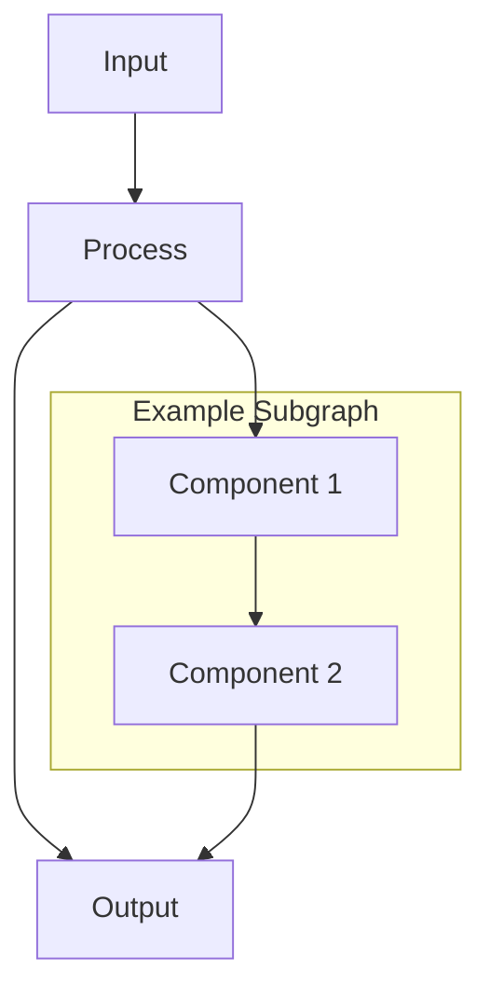

# 📊 NIS Protocol Interactive Diagrams Collection

## 🎯 **What Are These?**

**Interactive Mermaid Diagrams** - Code-based, version-controlled diagrams that render beautifully in GitHub, documentation sites, and development tools.

**Why Mermaid?** high-quality for technical documentation, version control, and collaborative development.

---

## 🎨 **Diagram Categories**

### **🌊 System Flow Diagrams**
| **Diagram** | **Purpose** | **Audience** | **Status** |
|:---|:---|:---|:---:|
| **[Complete System Architecture](system_flow/nis_complete_system_architecture.md)** | Full system migration assessment | Enterprise & Technical Leadership | ✅ READY |
| **[NIS Complete Dataflow](system_flow/nis_complete_dataflow.md)** | End-to-end data processing (implemented) (implemented) | Developers & Architects | ✅ READY |
| **[Memory System Architecture](system_flow/memory_system_architecture.md)** | Redis + Vector storage design | Infrastructure Teams | ✅ READY |
| **[LLM Provider Integration](system_flow/llm_provider_integration.md)** | Multi-LLM coordination | AI/ML Engineers | ✅ READY |
| **[Consciousness Monitoring (implemented in src/monitoring/) (see src/Monitoring (implemented in src/monitoring/)/) Flow](system_flow/consciousness_monitoring_flow.md)** | Self-awareness system | Research Teams | ✅ READY |
| **[Error Handling & Recovery](system_flow/error_handling_recovery.md)** | Crisis management system | DevOps & SRE Teams | ✅ READY |
| **[Droid Drone Applications](system_flow/droid_drone_applications.md)** | Hardware integration patterns | Robotics Teams | ✅ READY |
| **[Message Flow](system_flow/message_flow.md)** | Inter-agent communication | System Integrators | ✅ READY |
| **[Web Search Integration](system_flow/web_search_integration.md)** | External data integration | Product Teams | ✅ READY |

### **🔬 Pipeline Diagrams**
| **Diagram** | **Purpose** | **Audience** | **Status** |
|:---|:---|:---|:---:|
| **[Laplace→KAN→PINN Pipeline](pipelines/laplace_kan_pinn_pipeline.md)** | Scientific processing (implemented) (implemented) flow | Research Scientists | ✅ READY |

### **🏗️ Agent Hierarchy Diagrams**
| **Diagram** | **Purpose** | **Audience** | **Status** |
|:---|:---|:---|:---:|
| **[Communication Hierarchy](agent_hierarchy/communication_hierarchy.md)** | Agent coordination structure | System Architects | ✅ READY |

### **🚀 Evolution Diagrams**
| **Diagram** | **Purpose** | **Audience** | **Status** |
|:---|:---|:---|:---:|
| **[NIS Protocol V4-V6 Blueprint](evolution/NIS_PROTOCOL_V4_V5_V6_BLUEPRINT.md)** | Future development roadmap | Strategic Planning | ✅ READY |

---

## 🎯 **Diagram Usage Guide**

### **👀 Viewing Diagrams**
```markdown
# In GitHub - Click any .md file above for fast rendering
# In VS Code - Install "Mermaid Preview" extension
# In Documentation Sites - Automatic rendering with most static site generators
```

### **🔄 Modifying Diagrams**
```markdown
# 1. Edit the .md file directly
# 2. Mermaid syntax is human-readable
# 3. Changes are version-controlled with git
# 4. Live preview available in most modern editors
```

### **📤 Exporting Diagrams**
```markdown
# PNG/SVG Export:
# - Use Mermaid Live Editor (mermaid.live)
# - VS Code extensions with export features
# - Documentation build tools (automated)
```

---

## 🛠️ **Technical Implementation**

### **📋 Mermaid Syntax Examples**


### **🎨 Styling Guidelines**
- **Consistent Color Scheme**: Professional blue/green palette
- **Clear Labels**: Descriptive names with emojis for clarity
- **Logical Flow**: Left-to-right or top-to-bottom
- **Grouped Components**: Related items in subgraphs
- **Clean Connections**: Minimal crossing lines

---

## 🚀 **Integration with Documentation**

### **📚 Documentation Links**
- **[System Architecture Guide](../ARCHITECTURE.md)** - Technical deep-dive
- **[Integration Examples](../INTEGRATION_EXAMPLES.md)** - Code implementations  
- **[Troubleshooting Guide](../TROUBLESHOOTING_GUIDE.md)** - Operational support

### **🔗 Cross-References**
- **README.md** - Links to key diagrams for quick reference
- **Technical Docs** - Embedded diagrams in relevant sections
- **Examples** - Diagram-driven code walkthroughs

---

## 💡 **Creating New Diagrams**

### **📝 Template Structure**
```markdown
# 🎯 Diagram Title
## 📋 **Purpose & Scope**

**Purpose**: Clear objective
**Scope**: What's included/excluded  
**Target**: Intended audience

## 🎨 **Diagram**

```mermaid
graph TB
    %% Your diagram here
```

## 📊 **Components Explanation**
- Detailed breakdown of each component
- Dependencies and relationships
- Technical specifications
```

### **✅ Quality Checklist**
- [ ] Clear purpose and scope defined
- [ ] Diagram renders correctly
- [ ] All components labeled clearly  
- [ ] Consistent with existing style
- [ ] Added to this README index
- [ ] Cross-referenced in relevant docs

---

## 🎉 **Why These Diagrams Matter**

### **🎯 For Developers**
- **Visual Code Maps** - Understand system structure instantly
- **Integration Guidance** - See how components connect
- **Debugging Aid** - Trace data flow through system

### **🏢 For Enterprise**
- **Architecture Assessment** - Complete system overview
- **Migration Planning** - Infrastructure requirements
- **Stakeholder Communication** - Non-technical explanations

### **🔬 For Researchers**
- **Scientific Validation** - Physics and math pipeline clarity
- **Collaboration** - Shared understanding of complex systems
- **Innovation** - Building blocks for new capabilities

---

## 📞 **Contributing to Diagrams**

### **🎨 Design Guidelines**
1. **Clarity First** - Information over aesthetics
2. **Consistent Style** - Match existing diagram patterns
3. **Version Control** - All changes tracked in git
4. **Documentation** - Explain complex components

### **🔄 Update Process**
1. **Edit Existing** - Update .md files directly
2. **Add New** - Follow template structure
3. **Test Rendering** - Verify in GitHub/editor
4. **Update Index** - Add to this README
5. **Cross-Reference** - Link from relevant docs

---

**🚀 Start exploring with the [Complete System Architecture](system_flow/nis_complete_system_architecture.md) for a comprehensive overview!** 