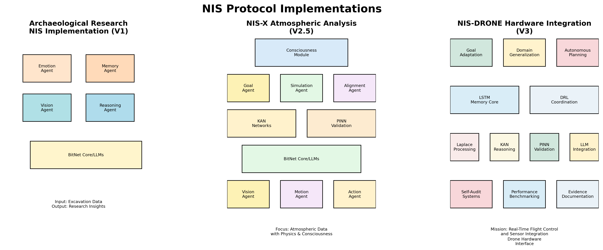

# NIS Protocol Diagrams Collection

This directory contains all visual diagrams and documentation for the NIS Protocol project, organized by category for easy navigation and reference.

## 📁 Directory Structure

### `system_architecture/`
Core system architecture and dataflow diagrams:

#### **Mermaid Diagrams (Interactive)**
- **`droid_drone_applications.md`** - NIS Protocol applications in autonomous droids and drones
- **`message_flow.md`** - Information flow between agents in the NIS Protocol
- **`web_search_integration.md`** - Multi-provider search integration architecture

#### **System Overview Images**
- **`nis_implementations_versions.png`** - Different NIS Protocol implementation versions
- **`usesExamples.png`** - Real-world use cases and applications

### `mathematical_foundation/`
Mathematical and algorithmic foundation diagrams:

#### **Core Mathematical Components**
- **`kan.png`** - Kolmogorov-Arnold Networks visualization
- **`laplace+kan.png`** - Laplace Transform + KAN integration
- **`laplace+pinn.png`** - Laplace Transform + PINN integration
- **`mlp.png`** - Multi-Layer Perceptron comparison
- **`Regular MLP Surface Map.png`** - Traditional MLP surface mapping
- **`difference.png`** - KAN vs MLP architectural differences
- **`whyKanMatters.png`** - Benefits and advantages of KAN approach
- **`v3map.png`** - Complete v3 mathematical architecture map

### `protocols/`
Communication and interaction protocol diagrams:

#### **First Contact Protocol**
- **`golden_circuit_spanish.png`** - Golden circuit design (Spanish)
- **`golden_monolith_english.png`** - Golden monolith protocol (English)
- **`externalprotocolslogos.png`** - External protocol integration logos

### `evolution/`
System evolution and version progression:

#### **Version Evolution**
- **`v1_v2_v3_evolution_fixed.png`** - NIS Protocol evolution from v1 to v3
- **`NIS_PROTOCOL_V4_V5_V6_BLUEPRINT.md`** - Future versions architecture (contains 3 Mermaid diagrams)

### `performance/`
Performance metrics and analysis:

#### **Performance Visualization**
- **`heatmap.png`** - System performance heatmap analysis

### `nis-protocol-logov1.png`
Main NIS Protocol logo

## 🔄 Diagram Types

### **Interactive Mermaid Diagrams** (.md files)
- **Advantages**: Interactive, version-controlled, easily editable
- **Best for**: System flows, architecture overviews, process diagrams
- **Rendering**: Automatically rendered in GitHub, documentation sites, and Markdown viewers

### **Static PNG Images** (.png files)
- **Advantages**: High-quality visuals, complex mathematical notation, detailed illustrations
- **Best for**: Mathematical formulas, detailed comparisons, marketing materials
- **Usage**: Direct embedding in documentation, presentations, and web content

## 📖 How to Use These Diagrams

### **For Documentation**
```markdown

```

### **For Presentations**
All PNG files are presentation-ready with high resolution and clear typography.

### **For Development**
Reference the Mermaid diagrams for understanding system dataflow and agent interactions.

### **For Mathematical Understanding**
The `mathematical_foundation/` folder contains visual explanations of core algorithms and their relationships.

## 🎯 Quick Reference

| **I want to understand...** | **Go to** |
|:---|:---|
| How agents communicate | `system_architecture/message_flow.md` |
| NIS Protocol evolution | `evolution/v1_v2_v3_evolution_fixed.png` |
| Mathematical foundations | `mathematical_foundation/` (entire folder) |
| Real-world applications | `system_architecture/droid_drone_applications.md` |
| Performance analysis | `performance/heatmap.png` |
| Future roadmap | `evolution/NIS_PROTOCOL_V4_V5_V6_BLUEPRINT.md` |

## 🔧 Maintenance Notes

- **Mermaid Diagrams**: Update the `.md` files when system architecture changes
- **Mathematical Diagrams**: Regenerate when core algorithms are modified
- **Performance Diagrams**: Update with latest benchmarking results
- **Version Control**: All diagrams are version-controlled for change tracking

## 📋 Contributing New Diagrams

1. **Choose the appropriate category folder**
2. **For Mermaid diagrams**: Create `.md` files with embedded Mermaid syntax
3. **For static images**: Use high-resolution PNG format
4. **Update this README** with descriptions of new diagrams
5. **Follow naming conventions**: Use descriptive, lowercase names with underscores

---

*This collection provides comprehensive visual documentation for the entire NIS Protocol ecosystem, from mathematical foundations to real-world applications.* 