# NIS Protocol Agent Communication Hierarchy

```mermaid
graph TD
    subgraph "Executive Level"
        CA[Coordination Agent<br/>🎯 Master Orchestrator]
        CON[Consciousness Agent<br/>💭 Self-Awareness Monitor]
        META[Meta-Cognitive Processor<br/>🧠 System Reflection]
    end
    
    subgraph "Cognitive Level"
        RA[Reasoning Agent<br/>🤔 Logic & Analysis]
        MA[Memory Agent<br/>💾 Knowledge Management]
        LA[Learning Agent<br/>📚 Adaptation & Growth]
    end
    
    subgraph "Processing Level"
        LT[Laplace Transformer<br/>🌊 Signal Processing]
        KAN[KAN Reasoning<br/>🔣 Symbolic Extraction]
        PINN[PINN Physics<br/>⚛️ Constraint Validation]
    end
    
    subgraph "Perception Level"
        IA[Input Agent<br/>📥 Data Ingestion]
        VA[Vision Agent<br/>👁️ Visual Processing]
        SA[Sensory Agent<br/>🔬 Multi-modal Input]
    end
    
    subgraph "Action Level"
        AA[Action Agent<br/>🎬 Execution]
        COM[Communication Agent<br/>📡 Message Routing]
        OUT[Output Agent<br/>📤 Response Generation]
    end
    
    subgraph "Infrastructure Level"
        KAFKA[Kafka Broker<br/>📨 Message Streaming]
        REDIS[Redis Cache<br/>⚡ State Management]
        MON[Monitoring Agent<br/>📊 Health Tracking]
    end
    
    %% Executive command flow
    CA --> RA
    CA --> MA
    CA --> LA
    CON --> CA
    META --> CON
    
    %% Cognitive to processing
    RA --> LT
    RA --> KAN
    RA --> PINN
    MA --> RA
    LA --> MA
    
    %% Processing pipeline
    LT --> KAN
    KAN --> PINN
    
    %% Perception to cognitive
    IA --> RA
    VA --> RA
    SA --> RA
    
    %% Processing to action
    PINN --> AA
    AA --> COM
    COM --> OUT
    
    %% Infrastructure connections
    CA <--> KAFKA
    MA <--> REDIS
    CON <--> MON
    COM <--> KAFKA
    
    %% Feedback loops
    OUT --> MA
    AA --> CON
    MON --> META
    
    %% Cross-level communication
    META -.-> RA
    CON -.-> LA
    MON -.-> CA
    
    %% Styling
    classDef executive fill:#ffebee,stroke:#c62828,stroke-width:3px
    classDef cognitive fill:#e8f5e8,stroke:#2e7d32,stroke-width:2px
    classDef processing fill:#e3f2fd,stroke:#1565c0,stroke-width:2px
    classDef perception fill:#fff3e0,stroke:#ef6c00,stroke-width:2px
    classDef action fill:#f3e5f5,stroke:#7b1fa2,stroke-width:2px
    classDef infrastructure fill:#fafafa,stroke:#424242,stroke-width:1px
    
    class CA,CON,META executive
    class RA,MA,LA cognitive
    class LT,KAN,PINN processing
    class IA,VA,SA perception
    class AA,COM,OUT action
    class KAFKA,REDIS,MON infrastructure
```

## Hierarchy Levels

### 🏛️ **Executive Level** (Strategic Command)
- **Coordination Agent**: Master orchestrator controlling overall system behavior
- **Consciousness Agent**: Self-awareness monitor tracking system confidence and state
- **Meta-Cognitive Processor**: Highest-level reflection on system thinking processes

### 🧠 **Cognitive Level** (Intelligence Core)
- **Reasoning Agent**: Central logic and analysis hub
- **Memory Agent**: Knowledge storage and retrieval management
- **Learning Agent**: Adaptation, pattern recognition, and skill development

### ⚙️ **Processing Level** (Mathematical Core)
- **Laplace Transformer**: Signal processing and frequency domain analysis
- **KAN Reasoning**: Symbolic function extraction and mathematical interpretability
- **PINN Physics**: Physics constraint validation and scientific accuracy

### 👁️ **Perception Level** (Input Processing)
- **Input Agent**: General data ingestion and preprocessing
- **Vision Agent**: Specialized visual input processing
- **Sensory Agent**: Multi-modal sensor data integration

### 🎬 **Action Level** (Output Execution)
- **Action Agent**: Decision execution and real-world interaction
- **Communication Agent**: Message routing and agent coordination
- **Output Agent**: Response generation and formatting

### 🏗️ **Infrastructure Level** (System Support)
- **Kafka Broker**: Asynchronous message streaming and event handling
- **Redis Cache**: High-performance state management and caching
- **Monitoring Agent**: System health, performance, and diagnostics

## Communication Patterns

### **Command Flow** (Top-Down)
1. **Executive** → **Cognitive**: Strategic directives and high-level goals
2. **Cognitive** → **Processing**: Analysis requests and computational tasks
3. **Processing** → **Action**: Validated results and execution commands

### **Feedback Flow** (Bottom-Up)
1. **Action** → **Cognitive**: Execution results and environmental feedback
2. **Cognitive** → **Executive**: Analysis outcomes and strategic insights
3. **Infrastructure** → **Executive**: System health and performance metrics

### **Lateral Communication**
- **Cognitive agents** coordinate through shared memory and reasoning
- **Processing agents** form the Laplace→KAN→PINN pipeline
- **Infrastructure agents** support all levels with messaging and caching

### **Cross-Level Interactions**
- **Meta-Cognitive** directly influences **Reasoning** for system optimization
- **Consciousness** monitors **Learning** for confidence tracking
- **Monitoring** reports directly to **Coordination** for immediate responses

## Key Features

### 🎯 **Hierarchical Decision Making**
- Strategic decisions at executive level
- Tactical decisions at cognitive level
- Operational decisions at processing level

### 🔄 **Bi-Directional Communication**
- Commands flow down the hierarchy
- Feedback and results flow up
- Lateral coordination within levels

### 💭 **Consciousness Integration**
- Self-awareness monitoring at every level
- Confidence tracking across all agents
- Meta-cognitive reflection on system state

### ⚛️ **Physics-Informed Processing**
- All decisions validated against physical constraints
- Scientific accuracy maintained throughout
- Mathematical interpretability preserved

This hierarchy ensures:
- ✅ **Clear Command Structure**: Organized decision-making authority
- ✅ **Efficient Communication**: Optimized message routing
- ✅ **Self-Awareness**: Consciousness monitoring at all levels
- ✅ **Scientific Validity**: Physics validation throughout 