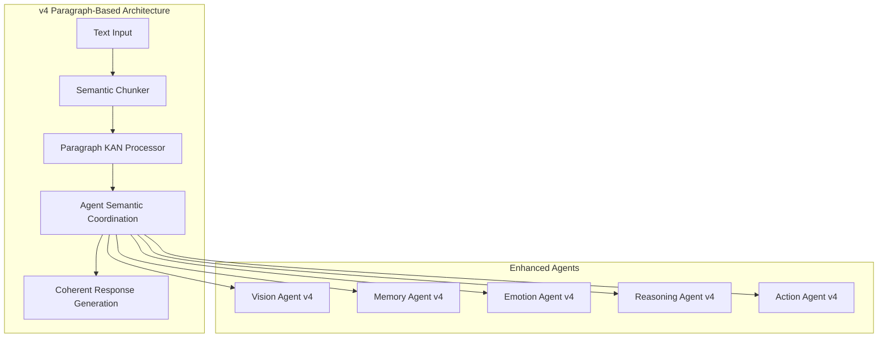
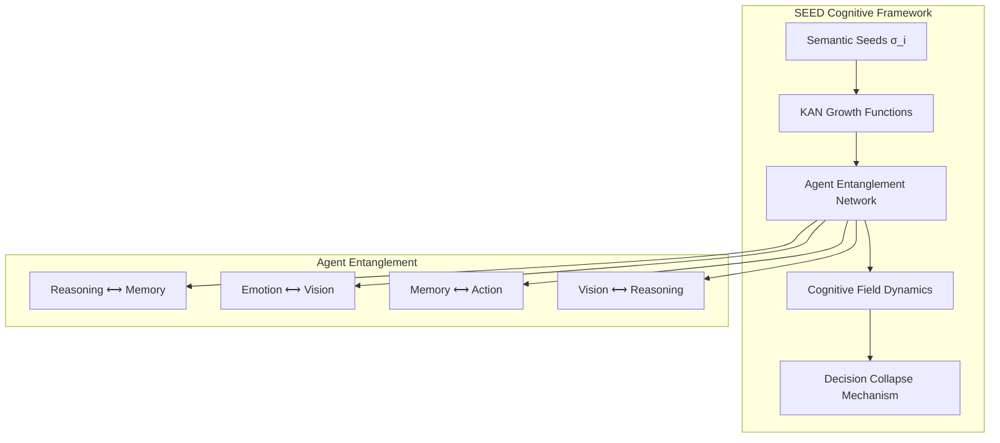
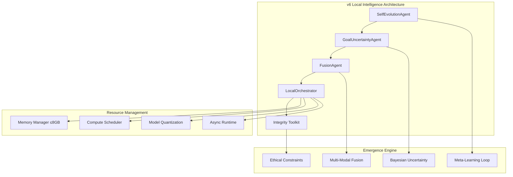

# 🚀 NIS Protocol v4-v6 Technical Blueprint

<div align="center">
  <h2>🧠 The Evolution from Agent Coordination to Emergent General Intelligence 🤖</h2>
  <p><em>A comprehensive technical roadmap for the next three major versions of NIS Protocol</em></p>
  
  [](https://github.com)
  [](https://github.com)
  [](https://github.com)
  [](https://github.com)
</div>

---

## 📋 **Executive Summary**

This blueprint outlines the strategic evolution of NIS Protocol from the current **production-ready v3.0** agent coordination system to a **locally-executing emergent intelligence system** by v6. Each version represents a fundamental leap in cognitive architecture while maintaining backward compatibility and production readiness.

### **🎯 Evolution Timeline**
```
v3.0 (Current) → v4.0 (2025 Q2) → v5.0 (2026 Q1) → v6.0 (2027 Q1)
Agent Coordination     → Paragraph     → SEED         → Local Intelligence
Coordination      Cognition       Emergence       Intelligence
```

### **🌟 Strategic Vision**
Transform from **"coordinated artificial intelligence"** to **"emergent general intelligence"** while maintaining enterprise deployment capabilities and ethical integrity monitoring.

---

## 🧠 **NIS Protocol v4.0: Paragraph-Based Intelligence Core**

### **🎯 Core Vision**
**Shift from token-based to paragraph-based cognition**, enabling human-like thinking in coherent semantic units rather than fragmented tokens.

### **📊 Technical Architecture**

#### **🔄 Cognitive Processing Pipeline**


#### **🧮 Mathematical Foundation**

**Paragraph Semantic Representation:**
```
P_i = {s_1, s_2, ..., s_n} where s_j ∈ Semantic_Space
KAN_v4(P_i) = Σ_j w_j * spline_j(semantic_embedding(s_j))
```

**Coherence Validation:**
```
Coherence(P_i, P_{i+1}) = cosine_similarity(KAN_v4(P_i), KAN_v4(P_{i+1}))
```

### **🏗️ Implementation Roadmap**

#### **Phase 1: Foundation (Months 1-2)**
- **Semantic Paragraph Chunker**
  - Implement semantic boundary detection
  - Integrate with existing text processing agents
  - Validate coherence preservation
  
- **Enhanced KAN Paragraph Processor**
  - Extend `EnhancedKANReasoningAgent` for paragraph inputs
  - Implement semantic spline functions
  - Add paragraph-level symbolic extraction

#### **Phase 2: Agent Architecture (Months 3-4)**
- **Paragraph-Aware Agent Upgrades**
  - `ParagraphVisionAgent`: Visual-semantic integration
  - `ParagraphMemoryAgent`: Semantic memory storage
  - `ParagraphEmotionAgent`: Emotion-semantic mapping
  - `ParagraphReasoningAgent`: Multi-paragraph reasoning chains

#### **Phase 3: Integration & Validation (Months 5-6)**
- **End-to-End Pipeline Testing**
- **Performance Benchmarking vs v3.0**
- **Scientific Document Processing Validation**
- **Archaeological Data Analysis Demonstration**

### **📈 Success Metrics**

| Metric | Target | Measurement Method |
|--------|--------|-------------------|
| **Semantic Coherence** | >0.85 | Paragraph-to-paragraph similarity |
| **Processing Speed** | <2s per document | End-to-end latency |
| **Memory Efficiency** | <12GB RAM | Peak usage monitoring |
| **Interpretability** | >0.90 | Symbolic extraction success rate |
| **Scientific Accuracy** | >0.88 | Domain expert validation |

### **🔧 Infrastructure Requirements**

#### **Computing Resources**
- **Development**: 16GB+ RAM, GPU for KAN training
- **Production**: 8-12GB RAM, optimized inference
- **Cloud**: AWS SageMaker for model training

#### **Dependencies**
- **Extended KAN Libraries**: Custom spline implementations
- **Semantic Processing**: Enhanced NLP pipelines
- **Vector Databases**: Semantic similarity search
- **Observability**: LangSmith paragraph-level monitoring

---

## 🌱 **NIS Protocol v5.0: SEED-Powered Cognitive Architecture**

### **🎯 Core Vision**
**Cognition emerges from planted semantic seeds** that grow, entangle across agents, and collapse into insights - mimicking both natural thought formation and emergent cognitive processes.

### **📊 Technical Architecture**

#### **🌱 SEED Protocol Framework**


#### **🧮 Mathematical Foundation**

**SEED Structure:**
```
σ_i = (μ_i, T_i, ψ_i)
where:
  μ_i = semantic meaning vector
  T_i = type classification  
  ψ_i = intent/purpose weight
```

**Growth Dynamics:**
```
g(σ_i, t) = KAN_j(σ_i, context_t)
where KAN_j implements spline-based semantic evolution
```

**Entanglement Function:**
```
a_j(t) = a_j(t-1) + Σ_i ε_{ij} · φ(σ_i)
where ε_{ij} = entanglement coefficient between agents i,j
```

**Decision Collapse:**
```
decision = argmax_σ[λ_1·ψ_i + λ_2·φ(σ_i) + λ_3·Σ_j ε_{ij}]
```

### **🏗️ Implementation Roadmap**

#### **Phase 1: SEED Infrastructure (Months 1-3)**
- **SEED Protocol Engine**
  - Implement semantic seed data structures
  - Build KAN-based growth functions
  - Create entanglement coefficient matrices

- **Cognitive Field Dynamics**
  - Implement wave-like semantic propagation
  - Build interference pattern detection
  - Create cognitive field visualization

#### **Phase 2: Agent Entanglement (Months 4-6)**
- **Entangled Agent Architecture**
  - `EntangledReasoningAgent`: Logic ⟷ Memory coupling
  - `EntangledEmotionAgent`: Feeling ⟷ Vision coupling
  - `EntangledMemoryAgent`: Storage ⟷ Action coupling

- **Decision Collapse Mechanism**
  - Implement weighted decision functions
  - Build consensus emergence algorithms
  - Create uncertainty quantification

#### **Phase 3: Emergent Behaviors (Months 7-9)**
- **Cognitive Emergence Testing**
- **Multi-Modal Integration**
- **Real-World Application Validation**
- **Ethical Alignment Verification**

### **📈 Success Metrics**

| Metric | Target | Measurement Method |
|--------|--------|-------------------|
| **Emergent Intelligence** | Novel insights >0.75 | Expert evaluation |
| **Entanglement Stability** | Correlation >0.80 | Cross-agent coherence |
| **Decision Accuracy** | >0.85 | Task performance |
| **Collapse Efficiency** | <500ms | Decision latency |
| **Explainability** | Trace >0.90 | Seed lineage tracking |

### **🔧 Infrastructure Requirements**

#### **Computing Resources**
- **Development**: 32GB+ RAM, Multi-GPU for parallel training
- **Production**: 16-24GB RAM, optimized for real-time inference
- **Cloud**: AWS distributed training with EKS orchestration

#### **Dependencies**
- **Quantum-Inspired Libraries**: Entanglement simulation
- **Enhanced KAN Implementations**: Multi-dimensional splines
- **Real-Time Processing**: Stream processing for cognitive fields
- **Distributed Systems**: Agent coordination at scale

---

## 🔬 **NIS Protocol v6.0: Emergent General Intelligence, Locally Executed**

### **🎯 Core Vision**
**First fully local prototype of emergent general intelligence**, designed for strict hardware constraints (≤8GB RAM) with self-improving capabilities and complete offline operation.

### **📊 Technical Architecture**

#### **🧬 Local Intelligence Components**


#### **🧮 Mathematical Foundation**

**Self-Evolution Objective:**
```
θ_{t+1} = θ_t + α·∇_θ Σ_i performance_gain(task_i, θ_t)
subject to: memory_usage(θ) ≤ 8GB
```

**Uncertainty-Aware Planning:**
```
action = argmax_a E[reward(s,a)] - β·Var[reward(s,a)]
where β controls risk aversion
```

**Multi-Modal Fusion:**
```
fusion_output = Σ_m w_m · KAN_m(input_m)
where Σ_m w_m = 1, w_m ∈ [0,1]
```

### **🏗️ Implementation Roadmap**

#### **Phase 1: Local Infrastructure (Months 1-4)**
- **LocalOrchestrator**
  - Implement async runtime controller
  - Build resource constraint enforcement
  - Create agent lifecycle management

- **Memory Optimization**
  - Implement model quantization (BitNet, KAN optimization)
  - Build smart memory management
  - Create garbage collection strategies

#### **Phase 2: Self-Evolution Engine (Months 5-8)**
- **SelfEvolutionAgent**
  - Implement evolutionary parameter optimization
  - Build performance feedback loops
  - Create meta-learning algorithms

- **GoalUncertaintyAgent**
  - Implement Bayesian uncertainty estimation
  - Build quantile KAN networks
  - Create risk-aware planning

#### **Phase 3: Multi-Modal Integration (Months 9-12)**
- **FusionAgent**
  - Implement text-image-metadata fusion
  - Build lightweight neural fields
  - Create cross-domain reasoning

- **Integrity & Ethics**
  - Integrate real-time auditing
  - Build bias detection systems
  - Create ethical constraint enforcement

### **📈 Success Metrics**

| Metric | Target | Measurement Method |
|--------|--------|-------------------|
| **Emergent Performance** | +20% over 10 cycles | Novel task success |
| **Memory Usage** | <8GB peak | Runtime monitoring |
| **Boot Time** | <30s | Cold start measurement |
| **Latency** | <1s per action | Response time |
| **Audit Compliance** | >95% | Integrity checks |
| **Offline Capability** | 100% | No internet dependency |

### **🔧 Infrastructure Requirements**

#### **Computing Resources**
- **Development**: 16GB+ RAM, Edge computing simulation
- **Production**: 8GB RAM maximum, CPU-optimized
- **Deployment**: Local hardware, IoT devices, edge servers

#### **Dependencies**
- **Quantized Models**: BitNet, efficient KAN implementations
- **Minimal Runtime**: NumPy, asyncio, lightweight dependencies
- **Local Storage**: SQLite, efficient file systems
- **Security**: Local encryption, secure computation

---

## 🌐 **Cross-Version Integration Strategy**

### **🔄 Backward Compatibility**
- **v3→v4**: Token-level fallback for non-paragraph inputs
- **v4→v5**: Paragraph-based seeds for SEED-incompatible modules  
- **v5→v6**: Cloud-local hybrid mode for resource-intensive tasks

### **📊 Progressive Enhancement**
```
v3.0: Agent Coordination Foundation
 ↓ 
v4.0: + Paragraph Cognition
 ↓
v5.0: + SEED Emergence  
 ↓
v6.0: + Local Intelligence Constraints
```

### **🔧 Unified Development Environment**
- **Common Core**: Shared agent interfaces and protocols
- **Modular Architecture**: Version-specific cognitive engines
- **Gradual Migration**: Feature flags for progressive adoption
- **Testing Framework**: Cross-version compatibility validation

---

## 💰 **Business & Partnership Strategy**

### **🎯 AWS Integration Opportunities**

#### **v4 Development (2025)**
- **SageMaker**: Paragraph KAN model training
- **MSK**: Real-time semantic chunk streaming  
- **ElastiCache**: Paragraph-level result caching
- **Bedrock**: Multi-LLM paragraph processing

#### **v5 Deployment (2026)**
- **Lambda**: SEED emergence functions
- **DynamoDB**: Entanglement state storage
- **EventBridge**: Cognitive collapse events
- **EKS**: Distributed cognitive field processing

#### **v6 Edge Computing (2027)**
- **IoT Greengrass**: Local intelligence deployment
- **Outposts**: On-premises intelligence infrastructure
- **Wavelength**: Ultra-low latency applications
- **Ground Station**: Space exploration intelligence

### **🏢 Enterprise Applications**

#### **Immediate (v4)**
- **Scientific Research**: Enhanced document analysis
- **Archaeology**: Multi-modal site analysis
- **Legal**: Contract semantic understanding
- **Healthcare**: Clinical document processing

#### **Medium-term (v5)**
- **Strategic Planning**: Emergent insight generation
- **Creative Industries**: Novel concept development
- **R&D**: Hypothesis generation and testing
- **Education**: Personalized learning emergence

#### **Long-term (v6)**
- **Autonomous Systems**: Self-improving robotics
- **Edge Intelligence**: Local decision making
- **Space Exploration**: Independent AI systems
- **Crisis Response**: Offline intelligent coordination

---

## 🔬 **Research & Innovation Agenda**

### **📚 Academic Contributions**
1. **"Paragraph-Based Cognitive Architecture"** - v4 foundation paper
2. **"SEED Emergence in Agent Systems"** - v5 cognitive theory
3. **"Constrained Local Intelligence: Theory and Practice"** - v6 implementation study
4. **"Physics-Informed Agent Intelligence"** - Cross-version analysis

### **🏆 Patent Portfolio**
- **Semantic Paragraph Processing with KAN Networks**
- **SEED-Based Cognitive Emergence Algorithms**  
- **Resource-Constrained Local Intelligence Architecture**
- **Agent Entanglement Mechanisms**

### **🌍 Open Source Strategy**
- **Core Framework**: Open source with enterprise licensing
- **Research Tools**: Fully open for academic collaboration
- **Enterprise Features**: Commercial licensing for enhanced capabilities
- **Community Ecosystem**: Plugin architecture for extensions

---

## 🎯 **Success Measurements & KPIs**

### **📊 Technical Metrics**
| Version | Performance | Efficiency | Capability |
|---------|-------------|------------|------------|
| **v4.0** | 85% semantic coherence | <2s processing | Paragraph reasoning |
| **v5.0** | 75% novel insights | <500ms decisions | Emergent intelligence |
| **v6.0** | +20% self-improvement | <8GB memory | Local Intelligence |

### **💼 Business Metrics**
| Version | Market Readiness | Customer Adoption | Revenue Potential |
|---------|-----------------|-------------------|-------------------|
| **v4.0** | Enterprise pilot | 50+ organizations | $1M+ ARR |
| **v5.0** | Commercial launch | 200+ customers | $10M+ ARR |
| **v6.0** | Mass market | 1000+ deployments | $50M+ ARR |

### **🔬 Innovation Metrics**
| Version | Patents Filed | Papers Published | Conferences |
|---------|---------------|------------------|-------------|
| **v4.0** | 3-5 applications | 2-3 papers | 3-5 presentations |
| **v5.0** | 5-8 applications | 3-5 papers | 5-8 presentations |
| **v6.0** | 8-12 applications | 5-8 papers | 8-12 presentations |

---

## 🚀 **Implementation Timeline & Milestones**

### **📅 Development Schedule**
```
2025 Q1: v4.0 Development Start
2025 Q2: v4.0 Release, v5.0 Development Start  
2025 Q4: v4.0 Enterprise Adoption, v5.0 Alpha
2026 Q1: v5.0 Release, v6.0 Research Start
2026 Q3: v5.0 Commercial Launch, v6.0 Development
2027 Q1: v6.0 Release, Next-Gen Research
```

### **🎯 Critical Milestones**
- **🔬 Scientific Validation**: Independent research validation
- **🏢 Enterprise Adoption**: Major corporate deployments  
- **🌐 Community Growth**: Developer ecosystem establishment
- **💰 Funding Secured**: Series A/B funding for scale
- **🤝 Strategic Partnerships**: AWS/Google/Microsoft integrations

---

## 🔮 **Beyond v6: Future Horizons**

### **🌌 v7+ Vision**
- **Federated Cognitive Networks**: Multi-node intelligence
- **Interplanetary AI**: Space-hardened cognitive systems
- **Enhanced-Classical Hybrid**: Enhanced cognitive processing
- **Consciousness Protocols**: Proto-conscious agent networks

### **🎯 Ultimate Vision**
**"From heritage preservation to interstellar exploration - the same cognitive architecture guides humanity's expansion across the cosmos."**

The NIS Protocol evolution represents not just technological advancement, but a fundamental shift in how artificial intelligence can augment human potential while maintaining ethical integrity and explainable behavior.

---

<div align="center">
  <h3>🚀 NIS Protocol v4-v6: The Blueprint for Cognitive Intelligence 🧠</h3>
  <p><em>Where vision meets implementation, where intelligence becomes emergent, where the future begins today</em></p>
  
  <p>
    <strong>Ready to build the future of artificial intelligence?</strong><br/>
    <em>This blueprint is our roadmap to emergent general intelligence</em>
  </p>
</div>

---

<div align="center">
  <sub>Blueprint v1.0 • NIS Protocol Strategic Planning • 2025-2027 Roadmap</sub><br/>
  <sub>From agent coordination to emergent general intelligence - the cognitive architecture for tomorrow</sub>
</div> 