# Laplace→KAN→PINN→LLM Pipeline Architecture

```mermaid
graph LR
    subgraph "Input processing (implemented) (implemented)"
        TD[Time Domain Signal<br/>📊 Raw Data]
        ST[Signal Types<br/>🎵 Audio, 📈 Sensor, 🔬 Scientific]
    end
    
    subgraph "Stage 1: Laplace Transform"
        LT[Laplace Transformer<br/>🌊 s-domain Conversion]
        FD[Frequency Domain<br/>📐 Complex Analysis]
        CF[Characteristic Functions<br/>🔍 Pattern Extraction]
    end
    
    subgraph "Stage 2: KAN Reasoning"
        KAN[KAN Networks<br/>🧠 Symbolic Intelligence]
        SF[Spline Functions<br/>📈 B-spline Basis]
        SE[Symbolic Extraction<br/>🔣 Mathematical Forms]
    end
    
    subgraph "Stage 3: PINN Physics"
        PINN[Physics-Informed NN<br/>⚛️ Constraint Validation]
        PL[Physics Laws<br/>⚖️ Conservation Rules]
        VC[Validity Check<br/>✅ Scientific Accuracy]
    end
    
    subgraph "Stage 4: LLM Integration"
        LLM[Language Model<br/>💬 Natural Language]
        NL[Natural Language<br/>📝 Human-Readable]
        EX[Explanation<br/>💡 Interpretable Results]
    end
    
    %% Main pipeline flow
    TD --> LT
    ST --> LT
    LT --> FD
    FD --> CF
    
    CF --> KAN
    KAN --> SF
    SF --> SE
    
    SE --> PINN
    PINN --> PL
    PL --> VC
    
    VC --> LLM
    LLM --> NL
    NL --> EX
    
    %% Cross-stage interactions
    LT -.-> KAN
    KAN -.-> PINN
    PINN -.-> LLM
    
    %% Feedback loops
    PINN -.-> KAN
    KAN -.-> LT
    
    %% Styling
    classDef input fill:#e3f2fd,stroke:#0d47a1,stroke-width:2px
    classDef laplace fill:#f1f8e9,stroke:#33691e,stroke-width:2px
    classDef kan fill:#fce4ec,stroke:#880e4f,stroke-width:2px
    classDef pinn fill:#fff3e0,stroke:#e65100,stroke-width:2px
    classDef llm fill:#e8eaf6,stroke:#283593,stroke-width:2px
    
    class TD,ST input
    class LT,FD,CF laplace
    class KAN,SF,SE kan
    class PINN,PL,VC pinn
    class LLM,NL,EX llm
```



## Pipeline Breakdown

### 🌊 **Stage 1: Laplace Transform**
**Purpose**: Convert time-domain signals to frequency domain for analysis
- **Input**: Raw time-series data (audio, sensor readings, scientific measurements)
- **Process**: Apply Laplace transform L{f(t)} = F(s)
- **Output**: Complex frequency domain representation
- **Key Benefit**: Reveals hidden patterns and periodicities

### 🧠 **Stage 2: KAN Reasoning** 
**Purpose**: Extract symbolic mathematical functions from frequency data
- **Input**: Frequency domain characteristics
- **Process**: B-spline based function approximation with symbolic extraction
- **Output**: Interpretable mathematical expressions
- **Key Benefit**: Mathematical transparency and interpretability

### ⚛️ **Stage 3: PINN Physics**
**Purpose**: Validate results against fundamental physics laws
- **Input**: Symbolic functions from KAN
- **Process**: Check conservation laws, thermodynamics, causality
- **Output**: Physics-validated mathematical models
- **Key Benefit**: Ensures scientific accuracy and real-world applicability

### 💬 **Stage 4: LLM Integration**
**Purpose**: Generate human-readable explanations and insights
- **Input**: Physics-validated mathematical models
- **Process**: Natural language generation with scientific context
- **Output**: Interpretable explanations and recommendations
- **Key Benefit**: Makes complex analysis accessible to humans

## Key Interactions

### **Cross-Stage Communication**
- **Laplace ↔ KAN**: Frequency characteristics inform symbolic extraction
- **KAN ↔ PINN**: Mathematical functions validated against physics
- **PINN ↔ LLM**: Validated models become natural language insights

### **Feedback Mechanisms**
- **PINN → KAN**: Physics violations trigger symbolic re-extraction
- **KAN → Laplace**: Poor symbolic fits trigger frequency re-analysis
- **LLM → All**: Natural language generation informs all prior stages

## Real-World Example

```
Time Signal: sin(2πf*t) → Laplace: F/(s²+4π²f²) → KAN: "Periodic oscillation" → PINN: "Valid harmonic motion" → LLM: "System exhibits stable 5Hz oscillation consistent with mechanical resonance"
```

This pipeline ensures every output is:
- ✅ **Mathematically Sound**: Laplace transform rigor
- ✅ **Interpretable**: KAN symbolic extraction  
- ✅ **Physically Valid**: PINN constraint checking
- ✅ **Human Understandable**: LLM natural language 