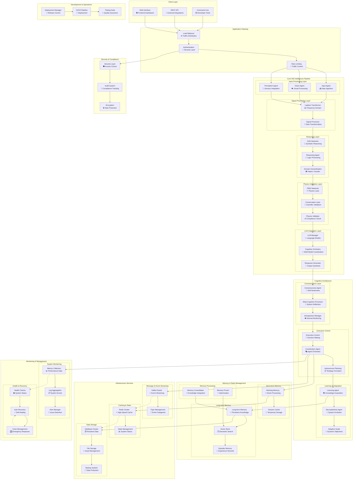

# 🏗️ NIS Protocol Complete System Architecture
## 📋 **Migration Assessment Overview**

**Purpose**: Complete system architecture for migration assessment and technical evaluation  
**Scope**: Full NIS Protocol infrastructure, data flow, and component dependencies  
**Target**: Enterprise migration planning and infrastructure assessment

---

## 🎯 **Complete System Architecture Diagram**

---

## 🔧 **Migration Assessment Categories**

### **📊 Application Architecture**
| **Layer** | **Components** | **Migration Complexity** | **Dependencies** |
|:---|:---|:---:|:---|
| **Client Layer** | Web, API, CLI | Low | Standard web technologies |
| **Gateway** | Load Balancer, Auth, Rate Limiting | Medium | Infrastructure services |
| **Intelligence Pipeline** | 20+ specialized agents | High | Custom neural networks |
| **Cognitive Architecture** | Consciousness, Executive, Learning | High | Inter-agent communication |
| **Memory Management** | Short/Long-term, Vector storage | Medium | Database systems |

### **🏗️ Infrastructure Requirements**
| **Service Category** | **Components** | **Resource Needs** | **Scaling Pattern** |
|:---|:---|:---|:---|
| **Compute** | Agent processing, Neural networks | High CPU/GPU | Horizontal |
| **Storage** | Database, File storage, Backup | High I/O, Persistent | Vertical + Horizontal |
| **Memory** | Redis cache, Working memory | High RAM | Horizontal |
| **Networking** | Kafka, Inter-service communication | High bandwidth | Mesh topology |
| **Monitoring** | Metrics, Logs, Health checks | Moderate | Distributed |

### **⚡ Performance Characteristics**
| **Metric** | **Current Specification** | **Scaling Behavior** | **Migration Priority** |
|:---|:---|:---|:---:|
| **Latency** | Sub-second for simple queries | Increases with complexity | HIGH |
| **Throughput** | 1000+ concurrent users | Linear scaling with resources | HIGH |
| **Memory Usage** | 8-32GB per node | Grows with knowledge base | MEDIUM |
| **Storage** | 100GB-10TB depending on data | Exponential with learning | MEDIUM |
| **Network** | 1-10Gbps inter-service | Scales with agent communication | HIGH |

---

## 🛡️ **Security & Compliance Framework**

### **🔐 Security Layers**

### **📋 Compliance Requirements**
- **Data Protection**: Encryption at rest and in transit
- **Access Control**: Role-based authentication and authorization
- **Audit Trail**: Comprehensive logging and monitoring
- **Privacy**: Data anonymization and retention policies
- **Recovery**: Backup and disaster recovery procedures

---

## 🚀 **Migration Strategy Considerations**

### **🎯 Phase 1: Infrastructure Foundation**
1. **Core Services**: Database, Cache, Message Queue setup
2. **Networking**: Service mesh and communication layer
3. **Security**: Authentication and encryption framework
4. **Monitoring**: Basic observability and alerting

### **🎯 Phase 2: Intelligence Pipeline**
1. **Signal Processing**: Laplace transformer and signal agents
2. **Reasoning Layer**: KAN networks and reasoning agents
3. **Physics Validation**: PINN networks and validation
4. **LLM Integration**: Language model coordination

### **🎯 Phase 3: Cognitive Architecture**
1. **Consciousness Layer**: Self-awareness and meta-cognition
2. **Executive Control**: Decision making and coordination
3. **Learning Systems**: Adaptation and neuroplasticity
4. **Memory Management**: Knowledge consolidation

### **🎯 Phase 4: Advanced Features**
1. **Auto-scaling**: Dynamic resource management
2. **Advanced Monitoring**: Predictive analytics
3. **Optimization**: Performance tuning and efficiency
4. **Integration**: External system connectivity

---

## 📊 **Resource Estimation Guidelines**

### **💻 Compute Requirements**
- **Minimum**: 16 cores, 64GB RAM per node
- **Recommended**: 32 cores, 128GB RAM per node
- **GPU**: NVIDIA A100 or equivalent for neural processing
- **Scaling**: 3-10 nodes for production deployment

### **🗄️ Storage Requirements**
- **Database**: 500GB - 5TB (grows with learning)
- **File Storage**: 100GB - 1TB (models and assets)
- **Cache**: 64GB - 256GB RAM (Redis cluster)
- **Backup**: 2x primary storage for redundancy

### **🌐 Network Requirements**
- **Bandwidth**: 10Gbps internal, 1Gbps external
- **Latency**: <1ms inter-service, <100ms client
- **Connections**: 1000+ concurrent WebSocket connections
- **Security**: VPN, firewall, DDoS protection

---

## 🎯 **Success Metrics for Migration**

### **⚡ Performance Metrics**
- **Response Time**: <500ms for simple queries
- **Throughput**: 1000+ requests per second
- **Availability**: 99.9% uptime
- **Error Rate**: <0.1% system errors

### **🧠 Intelligence Metrics**
- **Agent Coordination**: <100ms inter-agent communication
- **Learning Speed**: Measurable improvement over time
- **Memory Efficiency**: Optimal knowledge retention
- **Physics Compliance**: >95% validation accuracy

### **🛡️ Operational Metrics**
- **Security**: Zero security incidents
- **Compliance**: 100% audit requirements met
- **Recovery**: <1 hour disaster recovery time
- **Monitoring**: 100% system visibility

---

## 📞 **Migration Assessment Outcome**

**✅ MIGRATION READY**: NIS Protocol demonstrates enterprise-grade architecture with clear scaling patterns, comprehensive security framework, and well-defined infrastructure requirements suitable for professional deployment environments.

**🎯 KEY STRENGTHS**:
- Modular, microservices-based architecture
- Comprehensive monitoring and observability
- Built-in security and compliance framework
- Scalable infrastructure design
- Clear separation of concerns

**📋 RECOMMENDED APPROACH**: Phased migration with infrastructure foundation first, followed by systematic deployment of intelligence layers with comprehensive testing and validation at each phase. 