# NIS Protocol Memory System Architecture

```mermaid
graph TB
    subgraph "Input Sources"
        UI[User Input]
        SA[Sensor Data]
        AI[Agent Interactions]
        EX[External APIs]
    end
    
    subgraph "Memory Processing Layer"
        MA[Memory Agent<br/>🧠 Central Coordinator]
        EMB[Embedding Generator<br/>🔤 Vector Conversion]
        IDX[Memory Indexer<br/>📋 Organization]
    end
    
    subgraph "Redis Cache Layer"
        RC[Redis Cluster<br/>⚡ High-Speed Cache]
        STM[Short-Term Memory<br/>🔄 Active Sessions]
        WM[Working Memory<br/>⚙️ Current Context]
        SM[Session Memory<br/>📝 User State]
    end
    
    subgraph "Vector Storage Layer"
        VS[Vector Store<br/>📊 FAISS/Chroma]
        LTM[Long-Term Memory<br/>📚 Knowledge Base]
        EM[Episodic Memory<br/>📖 Experience Records]
        SM2[Semantic Memory<br/>🔍 Concept Network]
    end
    
    subgraph "Memory Types"
        subgraph "Working Memory"
            CC[Current Context<br/>💭 Active Thoughts]
            AG[Agent Goals<br/>🎯 Objectives]
            TS[Task State<br/>⚙️ Progress]
        end
        
        subgraph "Long-Term Storage"
            KB[Knowledge Base<br/>📖 Facts & Rules]
            EXP[Experiences<br/>🎬 Past Events]
            PAT[Patterns<br/>🔄 Learned Behaviors]
        end
        
        subgraph "Meta-Memory"
            CF[Confidence Scores<br/>📊 Reliability]
            TS2[Timestamps<br/>⏰ Temporal Info]
            SRC[Sources<br/>📍 Provenance]
        end
    end
    
    subgraph "Memory Operations"
        STR[Store<br/>💾 Save Memory]
        RET[Retrieve<br/>🔍 Find Memory]
        UPD[Update<br/>✏️ Modify Memory]
        FGT[Forget<br/>🗑️ Remove Memory]
        CON[Consolidate<br/>🔄 Transfer STM→LTM]
    end
    
    subgraph "Output Consumers"
        RA[Reasoning Agent]
        CA[Consciousness Agent]
        LA[Learning Agent]
        COORD[Coordination Agent]
    end
    
    %% Input flow
    UI --> MA
    SA --> MA
    AI --> MA
    EX --> MA
    
    %% Processing flow
    MA --> EMB
    EMB --> IDX
    IDX --> RC
    IDX --> VS
    
    %% Redis operations
    RC --> STM
    RC --> WM
    RC --> SM
    
    %% Vector storage
    VS --> LTM
    VS --> EM
    VS --> SM2
    
    %% Memory type connections
    STM --> CC
    WM --> AG
    SM --> TS
    
    LTM --> KB
    EM --> EXP
    SM2 --> PAT
    
    %% Meta-memory connections
    VS --> CF
    RC --> TS2
    MA --> SRC
    
    %% Operations
    MA --> STR
    MA --> RET
    MA --> UPD
    MA --> FGT
    MA --> CON
    
    %% Output flow
    RET --> RA
    RET --> CA
    RET --> LA
    RET --> COORD
    
    %% Feedback loops
    RA -.-> STR
    CA -.-> UPD
    LA -.-> CON
    COORD -.-> RET
    
    %% Styling
    classDef input fill:#e3f2fd,stroke:#0d47a1,stroke-width:2px
    classDef processing fill:#f1f8e9,stroke:#33691e,stroke-width:2px
    classDef redis fill:#ffebee,stroke:#c62828,stroke-width:2px
    classDef vector fill:#e8f5e8,stroke:#2e7d32,stroke-width:2px
    classDef memory fill:#fff3e0,stroke:#ef6c00,stroke-width:2px
    classDef operations fill:#f3e5f5,stroke:#7b1fa2,stroke-width:2px
    classDef output fill:#e8eaf6,stroke:#283593,stroke-width:2px
    
    class UI,SA,AI,EX input
    class MA,EMB,IDX processing
    class RC,STM,WM,SM redis
    class VS,LTM,EM,SM2 vector
    class CC,AG,TS,KB,EXP,PAT,CF,TS2,SRC memory
    class STR,RET,UPD,FGT,CON operations
    class RA,CA,LA,COORD output
```



## Memory System Components

### 🧠 **Memory Processing Layer**
- **Memory Agent**: Central coordinator managing all memory operations
- **Embedding Generator**: Converts text/data into vector representations
- **Memory Indexer**: Organizes and categorizes memories for efficient retrieval

### ⚡ **Redis Cache Layer** (High-Speed Access)
- **Short-Term Memory**: Temporary storage for active processing (TTL: minutes)
- **Working Memory**: Current context and active task state (TTL: hours)
- **Session Memory**: User-specific state and conversation history (TTL: days)

### 📊 **Vector Storage Layer** (Permanent Knowledge)
- **Long-Term Memory**: Persistent knowledge base using FAISS/Chroma
- **Episodic Memory**: Specific experiences and event sequences
- **Semantic Memory**: Conceptual knowledge and relationship networks

## Memory Types & Organization

### **Working Memory** (Redis-based, Fast Access)
```python
working_memory = {
    "current_context": "Analyzing scientific data",
    "active_goals": ["pattern_detection", "physics_validation"],
    "task_progress": {"step": 3, "total": 5, "confidence": 0.87}
}
```

### **Long-Term Memory** (Vector-based, Rich Search)
```python
knowledge_entry = {
    "content": "KAN networks use B-spline activation functions",
    "embedding": [0.1, 0.3, -0.2, ...],  # 384-dim vector
    "confidence": 0.92,
    "source": "scientific_paper",
    "timestamp": "2024-01-15T10:30:00Z"
}
```

### **Meta-Memory** (Memory About Memory)
- **Confidence Scores**: How reliable is this memory?
- **Timestamps**: When was this learned/updated?
- **Sources**: Where did this knowledge come from?

## Memory Operations

### **Storage Pipeline**
1. **Input Processing**: Normalize and clean incoming data
2. **Embedding Generation**: Convert to vector representation
3. **Similarity Check**: Avoid duplicates, merge similar memories
4. **Indexing**: Add to appropriate memory store with metadata
5. **Caching**: Store frequently accessed items in Redis

### **Retrieval Pipeline**
1. **Query Processing**: Parse retrieval request
2. **Vector Search**: Find semantically similar memories
3. **Ranking**: Score by relevance, confidence, recency
4. **Cache Check**: First check Redis for hot memories
5. **Response Assembly**: Combine and format results

### **Consolidation Process**
```python
def consolidate_memories():
    """Transfer important short-term memories to long-term storage"""
    for memory in short_term_memory:
        if memory.importance_score > 0.7:
            # Convert to long-term format
            embed_and_store_long_term(memory)
            # Keep reference in working memory
            create_memory_pointer(memory)
```

## Integration with NIS Components

### **Reasoning Agent Integration**
- **Context Retrieval**: Pull relevant knowledge for current reasoning task
- **Experience Lookup**: Find similar past problem-solving experiences
- **Pattern Matching**: Identify recurring patterns and solutions

### **Consciousness Agent Integration**
- **Self-Awareness**: Track system's own performance and capabilities
- **Confidence Monitoring**: Store and retrieve confidence assessments
- **Meta-Cognitive Memory**: Remember how the system thinks and learns

### **Learning Agent Integration**
- **Experience Storage**: Save learning episodes and outcomes
- **Pattern Recognition**: Store identified patterns for future use
- **Adaptation Memory**: Track what adaptations worked in which contexts

## Performance Characteristics

### **Redis Layer Performance**
- **Latency**: Sub-millisecond access for cached items
- **Throughput**: 100K+ operations/second
- **Capacity**: Limited by RAM, typically 1-10GB active memory

### **Vector Storage Performance**
- **Search Speed**: ~10ms for similarity search in 1M vectors
- **Accuracy**: >95% recall for relevant memories
- **Scalability**: Handles millions of memory entries

## Real-World Example

```python
# Scientist asks: "What patterns did we find in the sensor data?"
query = "sensor data patterns"

# 1. Memory Agent processes request
memory_request = MemoryRequest(
    query=query,
    context="scientific_analysis",
    types=["episodic", "semantic"]
)

# 2. Check Redis cache first
cached_results = redis_client.get(f"query:{hash(query)}")
if cached_results:
    return cached_results

# 3. Vector search in long-term memory
similar_memories = vector_store.similarity_search(
    query_embedding=embed(query),
    top_k=10,
    filters={"domain": "sensor_analysis"}
)

# 4. Rank and return results
ranked_memories = rank_by_relevance_and_confidence(similar_memories)
redis_client.setex(f"query:{hash(query)}", 300, ranked_memories)  # Cache 5min

return ranked_memories
```

This memory architecture ensures:
- ✅ **Fast Access**: Redis for immediate needs
- ✅ **Rich Search**: Vector similarity for semantic retrieval  
- ✅ **Scalability**: Distributed storage for growth
- ✅ **Intelligence**: Learning and adaptation over time 