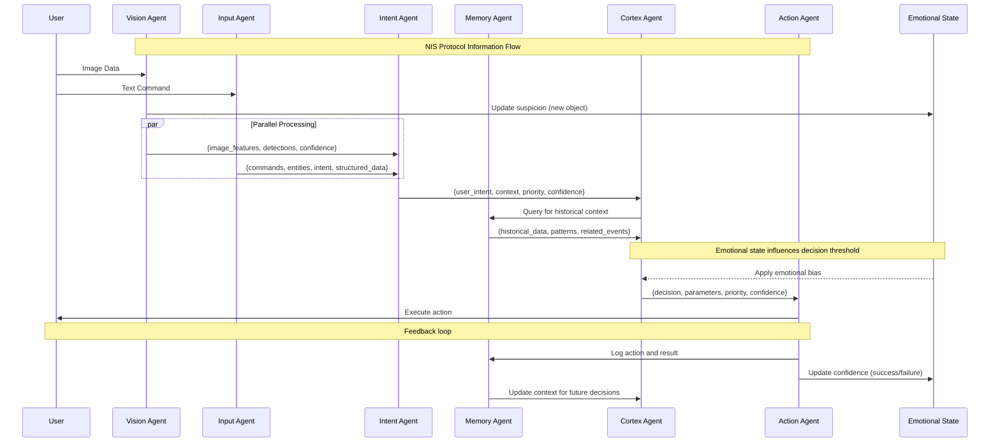

# NIS Protocol Message Flow

This diagram illustrates the flow of information between agents in the NIS Protocol, showing how data is transformed and enriched as it passes through the cognitive layers.

## Core Information Flow

1. **User Input** enters the system through perception agents:
   - Visual data through the Vision Agent
   - Text commands through the Input Agent

2. **Perception Processing** extracts features and structure:
   - Vision Agent detects objects, patterns, and anomalies
   - Input Agent parses commands, extracts entities, and determines intent
   - Both update the Emotional State based on their findings

3. **Interpretation** by the Intent Agent:
   - Combines visual and textual information
   - Contextualizes raw data into meaningful intent
   - Assigns confidence scores to interpretations

4. **Memory Integration** provides historical context:
   - The Memory Agent retrieves relevant past experiences
   - Identifies patterns and previous outcomes
   - Supplies contextual information to enhance decision-making

5. **Decision Making** by the Cortex Agent:
   - Synthesizes intent, memory, and emotional state
   - Applies reasoning based on complete context
   - Generates decisions with confidence scores
   - Emotional state modulates decision thresholds

6. **Action Execution**:
   - The Action Agent implements the decision
   - Monitors execution and success/failure
   - Provides feedback to Memory and Emotional State

7. **Feedback Loop**:
   - Actions are logged in Memory for future reference
   - Success/failure updates Confidence in the Emotional State
   - System continuously improves through experience

## Message Formats

Messages between agents follow a consistent format that includes:
- Primary data payload (command, detection, decision)
- Metadata (timestamps, agent IDs)
- Confidence scores
- Emotional state influence
- Priority levels

This structured flow enables NIS Protocol systems to process information in a manner similar to biological cognition, with parallel processing, emotional modulation, and continuous learning through feedback loops. 