# NIS Protocol Agent Architecture

This document provides a comprehensive overview of the agent-based architecture of the NIS Protocol. It details the various specialized agents, their roles, and how they communicate and coordinate to achieve complex tasks.

## Full Agent Architecture Diagram

The following diagram illustrates the complete agent architecture, organized by functional layers.

```mermaid
graph TD
    subgraph "NIS Protocol Agent Architecture"
        direction TB

        subgraph "Coordination & Control"
            direction LR
            EnhancedCoordinatorAgent
            BrainLikeCoordinator
            DRLEnhancedRouter
            EnhancedMultiLLMAgent
            DRLEnhancedMultiLLM
        end

        subgraph "Cognitive & Reasoning Layer"
            direction TB
            subgraph "Reasoning"
                direction LR
                ReasoningAgent
                EnhancedReasoningAgent
                KANReasoningAgent
                EnhancedKANReasoningAgent
                DomainGeneralizationEngine
            end
            subgraph "Planning"
                direction LR
                AutonomousPlanningSystem
                HierarchicalPlanner
            end
            subgraph "Learning"
                direction LR
                LearningAgent
                NeuroplasticityAgent
                OptimizerAgent
                DRLCoordinationAgent
            end
        end

        subgraph "Core Functions"
            direction TB
            subgraph "Perception"
                InputAgent
                VisionAgent
            end
            subgraph "Memory"
                MemoryAgent
                LogAgent
            end
            subgraph "Goals"
                GoalGenerationAgent
                CuriosityEngine
                GoalPriorityManager
            end
        end
        
        subgraph "Specialized & Scientific Layer"
            direction TB
            subgraph "Signal Processing"
                SignalProcessingAgent
                LaplaceSignalProcessor
                SciPySignalAgent
                TimeSeriesAnalyzer
            end
            subgraph "Physics"
                PhysicsInformedAgent
                PINNAgent
                ConservationLaws
                ConservationLawValidator
                MaxwellEquationsValidator
                ThermodynamicsValidator
                QuantumMechanicsValidator
            end
            subgraph "Engineering & Simulation"
                DesignAgent
                GenerativeAgent
                SimulationCoordinator
                ScenarioSimulator
                OutcomePredictor
                RiskAssessor
            end
        end
        
        subgraph "External Interaction & Safety"
            direction TB
            subgraph "Research"
                WebSearchAgent
            end
            subgraph "Interpretation"
                InterpretationAgent
            end
            subgraph "Alignment"
                EthicalReasoner
                ValueAlignment
                SafetyMonitor
            end
        end
    end
```

## Agent Communication and Concurrency Model

The agents in the NIS Protocol are designed to work **simultaneously and asynchronously**. This is achieved through a comprehensive, event-driven architecture that uses a message bus for communication, rather than direct, blocking calls between agents. This design ensures that the system is scalable, resilient, and capable of handling complex, parallel tasks.

### Key Components:

*   **`InfrastructureCoordinator`**: At the core of the inter-agent communication system is the `InfrastructureCoordinator`. It leverages **Apache Kafka** for robust, real-time message streaming. When one agent needs to communicate with another, it sends a message to a specific Kafka topic. Other agents subscribe to these topics and process messages as they arrive. This decouples the agents, allowing them to operate independently and in parallel.

*   **`BrainLikeCoordinator`**: This coordinator implements a massively parallel processing model. It treats the agents like neurons in a brain, distributing tasks to all relevant agents simultaneously and then fusing their responses. This is a powerful model for complex problem-solving where multiple perspectives are needed at once. It uses an asynchronous message bus (built on top of the Kafka infrastructure) to manage this real-time coordination.

*   **`EnhancedCoordinatorAgent`**: This agent uses **LangGraph** to manage complex, multi-step workflows. LangGraph creates stateful, graph-based structures that can execute long-running processes, also in an asynchronous manner. This is ideal for orchestrating sequences of tasks that involve multiple agents over time.

In summary, the NIS Protocol is not a simple, linear pipeline. It's a dynamic, distributed network of specialized agents that can work together in parallel to solve complex problems.

## The Role of Multiple Coordinators

While having multiple coordinators in a system can sometimes lead to conflicts, the NIS Protocol avoids this by assigning **specialized roles** to each coordinator. This creates a hierarchical and efficient system where each coordinator is responsible for a different aspect of the system's operation.

*   **`InfrastructureCoordinator`**: This is not a decision-making agent, but rather the underlying **communication fabric** for all other agents. It's the "nervous system" of the architecture.

*   **`BrainLikeCoordinator`**: This is a **low-level, tactical coordinator** that excels at massively parallel, short-term task execution. It can be thought of as the system's "reflexes."

*   **`EnhancedCoordinatorAgent`**: This is a **high-level, strategic coordinator** that uses LangGraph to manage long-running, multi-step workflows. It's the "executive function" of the system, responsible for orchestrating complex plans.

*   **`DRLEnhancedRouter` & `DRLEnhancedMultiLLM`**: These are **intelligent, self-optimizing coordinators** for very specific tasks: routing requests to the recommended agent and selecting the recommended LLM provider. They are specialized "managers" that make real-time decisions to improve the efficiency of the system.

*   **`SimulationCoordinator`**: This is a **domain-specific coordinator** that is only responsible for orchestrating the design-simulation-analysis loop within the engineering domain.

This specialized and hierarchical approach to coordination makes the NIS Protocol a robust and scalable platform for building comprehensive AI systems.
