# 🏗️ Agent Communication Hierarchy

## 📋 **Purpose & Scope**

**Purpose**: Visualize the hierarchical communication structure between different agent layers and coordination patterns in the NIS Protocol v3.1  
**Scope**: Complete agent hierarchy from unified coordination down to specialized processing agents  
**Target**: System architects, developers, integration teams

## 🎨 **Agent Communication Hierarchy Diagram**

```mermaid
graph TD
    subgraph "🎯 Executive Coordination Layer"
        UC[🎪 UnifiedCoordinator]
        UC1[🧪 Scientific Pipeline Controller]
        UC2[🤖 Agent Management]
        UC3[🏗️ Infrastructure Controller]
        UC4[🧠 Meta Protocol Bridge]
    end

    subgraph "🧠 Cognitive Control Layer"
        LLM[🎛️ LLM Manager]
        CO[🎪 Cognitive Orchestra]
        AR[🗂️ Agent Router]
        MM[🧠 Memory Manager]
        SB[🔗 Symbolic Bridge]
    end

    subgraph "🧪 Mathematical Processing Layer"
        USA[📡 Unified Signal Agent]
        URA[🧮 Unified Reasoning Agent]
        UPA[⚗️ Unified Physics Agent]
    end

    subgraph "🤖 Specialized Agent Layer"
        EA[😊 Emotion Agent]
        GA[🎯 Goals Agent]
        CA[🧪 Curiosity Agent]
        ETA[⚖️ Ethics Agent]
        MA[💭 Memory Agent]
        VA[👁️ Vision Agent]
        ENG[🔧 Engineering Agents]
    end

    subgraph "🏗️ Infrastructure Layer"
        KAF[📨 Kafka Messaging]
        RED[💾 Redis Cache]
        PG[🗄️ PostgreSQL]
        MON[📊 Monitoring]
    end

    %% Executive Control Flow
    UC --> UC1
    UC --> UC2
    UC --> UC3
    UC --> UC4
    
    %% Cognitive Layer Communication
    UC1 --> LLM
    UC1 --> SB
    UC2 --> AR
    UC2 --> MM
    UC3 --> MON
    UC4 --> CO
    
    %% Mathematical Pipeline Coordination
    UC1 --> USA
    USA --> URA
    URA --> UPA
    UPA --> UC1
    
    %% Agent Router Distribution
    AR --> EA
    AR --> GA
    AR --> CA
    AR --> ETA
    AR --> MA
    AR --> VA
    AR --> ENG
    
    %% Specialized Agent Communication
    EA --> AR
    GA --> AR
    CA --> AR
    ETA --> AR
    MA --> MM
    VA --> AR
    ENG --> AR
    
    %% Infrastructure Communication
    UC3 --> KAF
    MM --> RED
    MM --> PG
    AR --> KAF
    UC --> MON
    
    %% Cross-Layer Communication
    SB --> URA
    SB --> UPA
    CO --> LLM
    LLM --> AR
    
    %% Feedback Loops
    UPA --> SB
    URA --> SB
    USA --> SB
    MON --> UC
    
    %% Memory Integration
    MA --> RED
    MA --> PG
    MM --> MA

    %% Styling for hierarchy levels
    classDef executive fill:#ff6b6b,stroke:#333,stroke-width:3px,color:#fff
    classDef cognitive fill:#4ecdc4,stroke:#333,stroke-width:2px,color:#fff
    classDef mathematical fill:#45b7d1,stroke:#333,stroke-width:2px,color:#fff
    classDef specialized fill:#f9ca24,stroke:#333,stroke-width:2px,color:#333
    classDef infrastructure fill:#6c5ce7,stroke:#333,stroke-width:2px,color:#fff
    
    class UC,UC1,UC2,UC3,UC4 executive
    class LLM,CO,AR,MM,SB cognitive
    class USA,URA,UPA mathematical
    class EA,GA,CA,ETA,MA,VA,ENG specialized
    class KAF,RED,PG,MON infrastructure
```

## 📊 **Communication Patterns Explanation**

### **🎯 Executive Coordination (Level 1)**
- **UnifiedCoordinator**: Master orchestrator coordinating all system activities
- **Scientific Pipeline Controller**: Manages the Laplace→KAN→PINN mathematical pipeline
- **Agent Management**: Handles agent lifecycle, routing, and coordination
- **Infrastructure Controller**: Manages system resources and monitoring
- **Meta Protocol Bridge**: Enables communication with external protocol systems

### **🧠 Cognitive Control (Level 2)**
- **LLM Manager**: Centralized management of multiple LLM providers
- **Cognitive Orchestra**: Specialized assignment of LLMs to cognitive functions
- **Agent Router**: Intelligent distribution of tasks to appropriate agents
- **Memory Manager**: Centralized memory operations and storage coordination
- **Symbolic Bridge**: Mathematical function extraction and symbolic reasoning bridge

### **🧪 Mathematical Processing (Level 3)**
- **Unified Signal Agent**: Signal processing, Laplace transforms, frequency analysis
- **Unified Reasoning Agent**: KAN networks, symbolic reasoning, pattern recognition
- **Unified Physics Agent**: PINN validation, physics law enforcement, constraint checking

### **🤖 Specialized Agents (Level 4)**
- **Emotion Agent**: Emotional state management and empathy modeling
- **Goals Agent**: Autonomous goal generation and adaptation
- **Curiosity Agent**: Curiosity-driven exploration and learning
- **Ethics Agent**: Ethical reasoning and alignment checking
- **Memory Agent**: Enhanced memory operations and pattern recognition
- **Vision Agent**: Visual processing and computer vision tasks
- **Engineering Agents**: Design, generative, and technical implementation tasks

### **🏗️ Infrastructure (Level 5)**
- **Kafka Messaging**: Asynchronous message streaming between agents
- **Redis Cache**: High-speed caching and temporary data storage
- **PostgreSQL**: Persistent data storage and complex queries
- **Monitoring**: System health, performance metrics, and observability

## 🔄 **Communication Flow Types**

### **📨 Command Flow** (Top-Down)
- Executive coordination issues commands to cognitive layer
- Cognitive layer coordinates with processing and specialized agents
- Infrastructure provides necessary resources and monitoring

### **📊 Feedback Flow** (Bottom-Up)
- Specialized agents report status and results to router
- Mathematical pipeline provides processed results to coordination
- Infrastructure reports system health and metrics

### **🔄 Peer Communication** (Horizontal)
- Agents within same layer can communicate directly through router
- Mathematical pipeline agents have sequential coordination
- Infrastructure components share resources and state

### **⚡ Cross-Layer Communication** (Vertical)
- Symbolic bridge enables direct mathematical-cognitive interaction
- Memory system spans multiple layers for integrated operations
- Monitoring provides system-wide observability

## 🎯 **Key Design Principles**

1. **🎪 Unified Coordination**: Single point of control reduces complexity
2. **🔗 Loose Coupling**: Agents communicate through well-defined interfaces
3. **📊 Observable**: All communication flows through monitored channels
4. **🔄 Bidirectional**: Feedback loops ensure adaptive behavior
5. **⚡ Scalable**: Architecture supports horizontal and vertical scaling
6. **🛡️ Resilient**: Multiple communication paths provide fault tolerance

## 🚀 **Integration Notes**

- **Agent Router** acts as communication hub for specialized agents
- **Memory Manager** provides shared state across all layers
- **Kafka** enables asynchronous, scalable inter-agent communication
- **Monitoring** provides real-time visibility into all communication flows
- **Unified Coordinator** maintains overall system coherence and goals
