# 🛡️ Error Handling & Recovery System

## 📋 **Purpose & Scope**

**Purpose**: Comprehensive error handling, fault tolerance, and automatic recovery mechanisms across the entire NIS Protocol system  
**Scope**: Error detection, classification, handling strategies, and recovery procedures for all system components  
**Target**: DevOps teams, SRE engineers, system administrators, developers

## 🎨 **Error Handling & Recovery Flow Diagram**

```mermaid
graph TD
    subgraph "🚨 Error Detection Layer"
        ED[👁️ Error Detection]
        ED1[🔍 Health Checks]
        ED2[📊 Metrics Monitoring]
        ED3[📝 Log Analysis]
        ED4[🤖 Agent Self-Audit]
    end

    subgraph "🏥 Error Classification & Triage"
        EC[🎯 Error Classifier]
        EC1[🔴 Critical Errors]
        EC2[🟡 Warning Errors]
        EC3[🔵 Info Errors]
        EC4[⚪ System Errors]
        ET[🚦 Error Triage]
    end

    subgraph "🛡️ Error Handling Strategies"
        EH[⚙️ Error Handler]
        EH1[🔄 Retry Logic]
        EH2[🔀 Fallback Methods]
        EH3[⏸️ Circuit Breaker]
        EH4[🚫 Graceful Degradation]
        EH5[🔒 Isolation]
    end

    subgraph "🔧 Recovery Mechanisms"
        RM[🚀 Recovery Manager]
        RM1[♻️ Component Restart]
        RM2[🔄 State Restoration]
        RM3[🧠 Memory Cleanup]
        RM4[📊 Resource Reallocation]
        RM5[🤝 Service Healing]
    end

    subgraph "📊 Infrastructure Components"
        KAFKA[📨 Kafka Streaming]
        REDIS[💾 Redis Cache]
        PG[🗄️ PostgreSQL]
        LLM[🧠 LLM Providers]
        NGINX[🌐 Nginx Proxy]
    end

    subgraph "🤖 Agent Ecosystem"
        UC[🎪 Unified Coordinator]
        USA[📡 Signal Agent]
        URA[🧮 Reasoning Agent]
        UPA[⚗️ Physics Agent]
        SA[🎭 Specialized Agents]
    end

    subgraph "🚨 Alerting & Notification"
        AN[📢 Alert Manager]
        AN1[📧 Email Alerts]
        AN2[📱 Slack Notifications]
        AN3[📊 Dashboard Updates]
        AN4[📝 Incident Logging]
    end

    %% Error Detection Flow
    ED1 --> ED
    ED2 --> ED
    ED3 --> ED
    ED4 --> ED
    
    %% Infrastructure Monitoring
    KAFKA --> ED1
    REDIS --> ED1
    PG --> ED1
    LLM --> ED1
    NGINX --> ED1
    
    %% Agent Monitoring
    UC --> ED4
    USA --> ED4
    URA --> ED4
    UPA --> ED4
    SA --> ED4
    
    %% Classification Flow
    ED --> EC
    EC --> EC1
    EC --> EC2
    EC --> EC3
    EC --> EC4
    EC --> ET
    
    %% Handling Strategy Selection
    ET --> EH
    EC1 --> EH5
    EC2 --> EH3
    EC3 --> EH1
    EC4 --> EH2
    
    %% Error Handling Execution
    EH --> EH1
    EH --> EH2
    EH --> EH3
    EH --> EH4
    EH --> EH5
    
    %% Recovery Trigger
    EH --> RM
    EH1 --> RM1
    EH2 --> RM2
    EH3 --> RM3
    EH4 --> RM4
    EH5 --> RM5
    
    %% Component Recovery
    RM1 --> KAFKA
    RM1 --> REDIS
    RM1 --> PG
    RM1 --> LLM
    RM1 --> NGINX
    RM1 --> UC
    RM1 --> USA
    RM1 --> URA
    RM1 --> UPA
    RM1 --> SA
    
    %% State & Memory Recovery
    RM2 --> UC
    RM2 --> USA
    RM2 --> URA
    RM2 --> UPA
    RM3 --> REDIS
    RM3 --> PG
    
    %% Resource Management
    RM4 --> KAFKA
    RM4 --> REDIS
    RM4 --> LLM
    
    %% Service Healing
    RM5 --> UC
    RM5 --> SA
    
    %% Alerting Flow
    EC1 --> AN
    EC2 --> AN
    RM --> AN
    AN --> AN1
    AN --> AN2
    AN --> AN3
    AN --> AN4
    
    %% Feedback Loops
    RM --> ED
    AN4 --> EC
    EH3 --> ED1

    %% Styling
    classDef detection fill:#ff6b6b,stroke:#333,stroke-width:2px,color:#fff
    classDef classification fill:#ffa726,stroke:#333,stroke-width:2px,color:#fff
    classDef handling fill:#42a5f5,stroke:#333,stroke-width:2px,color:#fff
    classDef recovery fill:#66bb6a,stroke:#333,stroke-width:2px,color:#fff
    classDef infrastructure fill:#ab47bc,stroke:#333,stroke-width:2px,color:#fff
    classDef agents fill:#26c6da,stroke:#333,stroke-width:2px,color:#fff
    classDef alerting fill:#ef5350,stroke:#333,stroke-width:2px,color:#fff
    
    class ED,ED1,ED2,ED3,ED4 detection
    class EC,EC1,EC2,EC3,EC4,ET classification
    class EH,EH1,EH2,EH3,EH4,EH5 handling
    class RM,RM1,RM2,RM3,RM4,RM5 recovery
    class KAFKA,REDIS,PG,LLM,NGINX infrastructure
    class UC,USA,URA,UPA,SA agents
    class AN,AN1,AN2,AN3,AN4 alerting
```



## 🚨 **Error Classification System**

### **🔴 Critical Errors (Level 1)**
- **System Failure**: Complete system unavailability
- **Data Loss**: Persistent data corruption or loss
- **Security Breach**: Authentication/authorization failures
- **Memory Leak**: Catastrophic resource exhaustion
- **LLM Provider Failure**: All LLM providers unavailable

**Response**: Immediate isolation, emergency recovery, executive alerts

### **🟡 Warning Errors (Level 2)**
- **Performance Degradation**: Response times > 10x normal
- **Partial Service Failure**: Some agents/services unavailable
- **Resource Pressure**: Memory/CPU usage > 80%
- **Network Issues**: Intermittent connectivity problems
- **Agent Malfunction**: Single agent errors affecting others

**Response**: Circuit breaker activation, fallback methods, monitoring escalation

### **🔵 Info Errors (Level 3)**
- **Temporary Failures**: Recoverable network timeouts
- **Retry Operations**: Expected failure scenarios
- **Configuration Warnings**: Non-critical configuration issues
- **Agent Self-Corrections**: Agents fixing their own errors
- **Cache Misses**: Expected cache invalidation

**Response**: Automatic retry, logging, minimal intervention

### **⚪ System Errors (Level 4)**
- **Infrastructure Notifications**: Normal operational messages
- **Maintenance Events**: Planned system operations
- **Agent Communications**: Normal inter-agent messaging
- **Monitoring Updates**: Regular health check reports
- **Performance Metrics**: Normal system telemetry

**Response**: Standard logging, no intervention required

## 🔧 **Recovery Strategies**

### **♻️ Component Restart**
```yaml
Strategy: Graceful restart with state preservation
Components: All agents, Kafka, Redis, PostgreSQL, Nginx
Triggers: Process crashes, memory leaks, unresponsive services
Timeline: 30-60 seconds
Fallback: Force restart if graceful fails
```

### **🔄 State Restoration**
```yaml
Strategy: Restore from last known good state
Components: Unified Coordinator, Mathematical Pipeline agents
Storage: Redis snapshots, PostgreSQL transactions
Timeline: 10-30 seconds
Verification: State integrity checks post-restoration
```

### **🧠 Memory Cleanup**
```yaml
Strategy: Garbage collection and cache purging
Components: Redis cache, agent memory, LLM context
Triggers: Memory usage > 85%, performance degradation
Timeline: 5-15 seconds
Monitoring: Memory usage verification post-cleanup
```

### **📊 Resource Reallocation**
```yaml
Strategy: Dynamic resource balancing
Components: Kafka partitions, LLM connections, agent threads
Triggers: Resource imbalance, performance bottlenecks
Timeline: 60-120 seconds
Verification: Performance metric improvement
```

### **🤝 Service Healing**
```yaml
Strategy: Automatic agent coordination restoration
Components: Agent Router, Specialized Agents, Coordinator
Triggers: Agent communication failures, routing errors
Timeline: 15-45 seconds
Verification: Agent interaction success rate
```

## 🔍 **Monitoring & Detection**

### **👁️ Health Check System**
- **Endpoint Health**: `/health` endpoints for all services
- **Database Connectivity**: Connection pool status monitoring
- **Kafka Health**: Producer/consumer lag monitoring
- **Agent Responsiveness**: Response time and success rate tracking
- **LLM Provider Status**: API availability and latency monitoring

### **📊 Metrics & Thresholds**
```yaml
Response Time: 
  Warning: > 5 seconds
  Critical: > 15 seconds

Memory Usage:
  Warning: > 80%
  Critical: > 95%

Error Rate:
  Warning: > 5%
  Critical: > 20%

Agent Success Rate:
  Warning: < 95%
  Critical: < 80%

LLM Availability:
  Warning: < 2 providers
  Critical: 0 providers
```

### **📝 Log Analysis Patterns**
- **Error Pattern Recognition**: Automated error pattern detection
- **Correlation Analysis**: Cross-component error correlation
- **Anomaly Detection**: Statistical anomaly identification
- **Trend Analysis**: Performance degradation trend detection
- **Root Cause Analysis**: Automated incident investigation

## 🚀 **Best Practices**

### **🔄 Resilience Patterns**
1. **Circuit Breaker**: Prevent cascade failures
2. **Bulkhead**: Isolate critical components
3. **Timeout**: Prevent resource starvation
4. **Retry with Backoff**: Handle temporary failures gracefully
5. **Fallback**: Maintain service availability during failures

### **📊 Monitoring Strategy**
1. **Proactive Monitoring**: Detect issues before they become critical
2. **Real-time Alerting**: Immediate notification of critical issues
3. **Comprehensive Logging**: Detailed audit trail for all operations
4. **Performance Baselines**: Establish normal operation parameters
5. **Regular Testing**: Chaos engineering and failure injection testing

### **🛡️ Security Considerations**
1. **Secure Error Messages**: No sensitive data in error responses
2. **Audit Trail**: Complete logging of all error handling actions
3. **Access Control**: Restricted access to error handling systems
4. **Incident Response**: Coordinated security incident procedures
5. **Recovery Validation**: Security checks during recovery operations
