# 🎨 NIS Protocol v3.2 - Complete System Architecture

**Revolutionary Multimodal AI System with Smart Content Classification**

*Comprehensive technical architecture diagram for NIS Protocol v3.2*

---

## 🌟 System Overview

NIS Protocol v3.2 represents the pinnacle of multimodal AI system design, featuring smart content classification, artistic intent preservation, multiple response formats, and revolutionary performance optimizations. This architecture seamlessly integrates consciousness-driven processing with intelligent content adaptation.

---

## 🏗️ Complete System Architecture Diagram

```mermaid
graph TB
    subgraph "🌐 User Interface Layer"
        UI[Enhanced Multimodal Console]
        UI --> UIA[🔬 Technical Mode<br/>Expert Detail]
        UI --> UIB[💬 Casual Mode<br/>General Audience]
        UI --> UIC[🧒 ELI5 Mode<br/>Simple Explanations]
        UI --> UID[📊 Visual Mode<br/>Charts & Images]
        
        UI --> API[Advanced REST API<br/>+ WebSocket Streaming]
    end
    
    subgraph "🧠 Smart Content Classification Layer"
        API --> SCC[Smart Content Classifier]
        SCC --> SCA[Fantasy/Creative Detector<br/>Dragons, Magic, Art]
        SCC --> SCB[Technical/Scientific Detector<br/>Physics, Math, Engineering]
        SCC --> SCD[Artistic Content Analyzer<br/>Style, Composition, Intent]
        SCC --> SCE[Context Intelligence Engine<br/>User Intent Recognition]
    end
    
    subgraph "💬 Response Format Controller"
        SCC --> RFC[Dynamic Format Router]
        RFC --> RFA[Technical Formatter<br/>Scientific Precision]
        RFC --> RFB[Casual Formatter<br/>Accessible Language]
        RFC --> RFD[ELI5 Transformer<br/>Analogies & Experiments]
        RFC --> RFE[Visual Generator<br/>Charts & Diagrams]
    end
    
    subgraph "🧠 Enhanced Consciousness Coordination Layer"
        RFC --> CCL[Consciousness Coordination]
        CCL --> CCA[Meta-Cognitive Processor<br/>Thinking About Thinking]
        CCL --> CCB[Decision Quality Tracker<br/>Choice Validation]
        CCL --> CCD[Performance Optimizer<br/>Real-Time Adaptation]
        CCL --> CCE[System Health Monitor<br/>Proactive Management]
        CCL --> CCF[Emergence Detector<br/>Novel Behavior Recognition]
    end
    
    subgraph "🔬 Smart Agent Ecosystem"
        CCL --> AE[Agent Ecosystem Controller]
        
        AE --> IA[Smart Input Agent<br/>Content Classification]
        IA --> IAA[Intent Detection Engine]
        IA --> IAB[Format Preference Analyzer]
        IA --> IAC[Context Extraction System]
        
        AE --> VA[Smart Vision Agent<br/>Artistic Preservation]
        VA --> VAA[Content-Aware Image Generation]
        VA --> VAB[Artistic Intent Preservation]
        VA --> VAC[Multi-Provider Coordination]
        VA --> VAD[Performance Optimization]
        
        AE --> MA[Enhanced Memory Agent<br/>Format-Aware Storage]
        MA --> MAA[Context Management System]
        MA --> MAB[Format History Tracking]
        MA --> MAC[Intelligent Caching Layer]
        
        AE --> LA[Advanced Learning Agent<br/>Experience-Based Adaptation]
        LA --> LAA[User Preference Learning]
        LA --> LAB[Performance Optimization]
        LA --> LAC[Behavior Adaptation Engine]
        
        AE --> RA[Enhanced Reasoning Agent<br/>Multi-Format Logic]
        RA --> RAA[Multi-Modal Reasoning]
        RA --> RAB[Format-Specific Logic]
        RA --> RAC[Cross-Provider Validation]
        
        AE --> DA[Smart Document Agent<br/>Format-Aware Processing]
        DA --> DAA[Content Classification]
        DA --> DAB[Extraction Optimization]
        DA --> DAC[Format Adaptation]
    end
    
    subgraph "🌊 Enhanced Signal Processing Pipeline"
        AE --> SPP[Signal Processing Pipeline]
        SPP --> LT[Enhanced Laplace Transform<br/>Context-Aware Processing]
        LT --> LTA[Signal Analysis Engine]
        LT --> LTB[Frequency Domain Processing]
        LT --> LTC[Pattern Recognition System]
        
        LT --> KAN[Advanced KAN Network<br/>Smart Symbolic Reasoning]
        KAN --> KANA[Function Approximation]
        KAN --> KANB[Symbolic Mathematics]
        KAN --> KANC[Interpretability Engine]
        
        KAN --> PINN[Selective Physics Validator<br/>Intent-Respectful Processing]
        PINN --> PINNA[Conservation Law Validation]
        PINN --> PINNB[Reality Checking Engine]
        PINN --> PINNC[Artistic Intent Preservation]
        PINN --> PINND[Technical Enhancement Application]
    end
    
    subgraph "🤖 Optimized Multi-Provider AI Constellation"
        PINN --> MPAC[Multi-Provider AI Controller]
        
        MPAC --> OAI[OpenAI Provider<br/>GPT-4 Turbo + DALL-E 3]
        OAI --> OAIA[Advanced Text Generation]
        OAI --> OAIB[High-Quality Image Generation]
        OAI --> OAIC[Vision Analysis Capabilities]
        
        MPAC --> ANT[Anthropic Provider<br/>Claude 3 Opus + Sonnet]
        ANT --> ANTA[Advanced Reasoning]
        ANT --> ANTB[Ethical AI Processing]
        ANT --> ANTC[Long-Context Analysis]
        
        MPAC --> GOO[Google Provider<br/>Gemini 2.0 + Imagen 3]
        GOO --> GOOA[Multimodal Intelligence]
        GOO --> GOOB[Fast Image Generation]
        GOO --> GOOC[Search Integration]
        
        MPAC --> DS[DeepSeek Provider<br/>Mathematical Reasoning]
        DS --> DSA[Advanced Mathematics]
        DS --> DSB[Code Generation]
        DS --> DSC[Logical Analysis]
        
        MPAC --> KIMI[Kimi K2 Provider<br/>Long-Context Creative]
        KIMI --> KIMIA[Extended Context Processing]
        KIMI --> KIMIB[Creative Enhancement]
        KIMI --> KIMIC[Detailed Descriptions]
    end
    
    subgraph "🎯 Smart Provider Intelligence"
        MPAC --> SPI[Smart Provider Intelligence]
        SPI --> SPIA[Content-Aware Selection<br/>Optimal Provider Choice]
        SPI --> SPIB[Performance Optimization<br/>Load Balancing]
        SPI --> SPIC[Quality Assurance<br/>Response Validation]
        SPI --> SPID[Cost Optimization<br/>Efficient Resource Use]
        SPI --> SPIE[Failure Recovery<br/>Graceful Degradation]
    end
    
    subgraph "⚡ Performance & Caching Layer"
        SPI --> PCL[Performance & Caching]
        PCL --> PCLA[Redis Intelligent Cache<br/>Format-Aware Caching]
        PCL --> PCLB[Response Optimization<br/>Speed Enhancement]
        PCL --> PCLC[Parallel Processing<br/>Concurrent Operations]
        PCL --> PCLD[Smart Routing<br/>Traffic Management]
        PCL --> PCLE[Metrics Collection<br/>Performance Monitoring]
    end
    
    subgraph "🎨 Enhanced Response Synthesis Engine"
        PCL --> RSE[Response Synthesis Engine]
        RSE --> RSEA[Multi-Format Generation<br/>Adaptive Output]
        RSE --> RSEB[Quality Validation<br/>Content Verification]
        RSE --> RSEC[Visual Integration<br/>Image Embedding]
        RSE --> RSED[Consistency Checking<br/>Cross-Format Validation]
        RSE --> RSEE[Meta-Cognitive Review<br/>Self-Assessment]
    end
    
    subgraph "📊 Analytics & Monitoring"
        RSE --> AM[Analytics & Monitoring]
        AM --> AMA[Real-Time Performance<br/>Live Metrics]
        AM --> AMB[User Experience Analytics<br/>Satisfaction Tracking]
        AM --> AMC[Content Classification Metrics<br/>Accuracy Monitoring]
        AM --> AMD[Provider Performance<br/>Quality Assessment]
        AM --> AME[System Health Dashboard<br/>Comprehensive Overview]
    end
    
    subgraph "🔧 Infrastructure & Security"
        AM --> IS[Infrastructure & Security]
        IS --> ISA[Container Orchestration<br/>Docker + Kubernetes]
        IS --> ISB[Auto-Scaling System<br/>Dynamic Resource Allocation]
        IS --> ISC[Security Framework<br/>Authentication & Authorization]
        IS --> ISD[Data Encryption<br/>End-to-End Security]
        IS --> ISE[Backup & Recovery<br/>Data Protection]
    end
    
    style UI fill:#f9f,stroke:#333,stroke-width:3px
    style SCC fill:#f0f,stroke:#333,stroke-width:3px
    style RFC fill:#0ff,stroke:#333,stroke-width:3px
    style CCL fill:#ff0,stroke:#333,stroke-width:3px
    style AE fill:#bfb,stroke:#333,stroke-width:2px
    style MPAC fill:#ffb,stroke:#333,stroke-width:2px
    style RSE fill:#0f0,stroke:#333,stroke-width:3px
```



---

## 🔬 Detailed Component Analysis

### 🎨 Smart Content Classification System

#### Fantasy/Creative Content Detection
```python
class FantasyCreativeDetector:
    def __init__(self):
        self.fantasy_terms = [
            'dragon', 'fantasy', 'magic', 'fairy', 'unicorn', 'wizard',
            'mythical', 'creature', 'superhero', 'anime', 'cartoon',
            'fictional', 'cyberpunk', 'sci-fi', 'alien', 'earth', 'jupiter'
        ]
        self.creative_terms = [
            'artistic', 'creative', 'abstract', 'surreal', 'dream',
            'imagination', 'concept art', 'beautiful', 'majestic'
        ]
    
    def detect_creative_content(self, prompt: str) -> CreativeContentAnalysis:
        fantasy_score = sum(1 for term in self.fantasy_terms if term in prompt.lower())
        creative_score = sum(1 for term in self.creative_terms if term in prompt.lower())
        
        return CreativeContentAnalysis(
            is_fantasy=fantasy_score > 0,
            is_creative=creative_score > 0,
            creativity_confidence=min((fantasy_score + creative_score) / 3, 1.0),
            recommended_enhancement="artistic_preservation"
        )
```

#### Technical/Scientific Content Detection
```python
class TechnicalScientificDetector:
    def __init__(self):
        self.technical_terms = [
            'technical', 'scientific', 'engineering', 'physics', 'diagram',
            'chart', 'graph', 'data', 'analysis', 'neural network',
            'algorithm', 'mathematical', 'equation', 'formula'
        ]
    
    def detect_technical_content(self, prompt: str) -> TechnicalContentAnalysis:
        technical_score = sum(1 for term in self.technical_terms if term in prompt.lower())
        
        specialized_enhancements = []
        if any(term in prompt.lower() for term in ['ai', 'neural', 'network']):
            specialized_enhancements.append("mathematical_function_mappings")
        if any(term in prompt.lower() for term in ['physics', 'force', 'energy']):
            specialized_enhancements.append("conservation_law_enforcement")
        
        return TechnicalContentAnalysis(
            is_technical=technical_score > 0,
            technical_confidence=min(technical_score / 2, 1.0),
            specialized_enhancements=specialized_enhancements,
            recommended_enhancement="physics_compliance"
        )
```

### 💬 Response Format System

#### Multi-Format Response Generation
```python
class MultiFormatResponseGenerator:
    def __init__(self):
        self.formatters = {
            'technical': TechnicalFormatter(),
            'casual': CasualFormatter(),
            'eli5': ELI5Formatter(),
            'visual': VisualFormatter()
        }
    
    async def generate_multi_format_response(
        self, 
        content: str, 
        requested_format: str,
        context: Dict
    ) -> MultiFormatResponse:
        
        base_response = await self.process_base_content(content, context)
        
        if requested_format == 'visual':
            # Generate visual elements
            visual_elements = await self.generate_visual_elements(content, context)
            formatted_response = await self.formatters['visual'].format_with_visuals(
                base_response, visual_elements
            )
        else:
            formatted_response = await self.formatters[requested_format].format(
                base_response, context
            )
        
        return MultiFormatResponse(
            base_content=base_response,
            formatted_content=formatted_response,
            format_used=requested_format,
            visual_elements=visual_elements if requested_format == 'visual' else None,
            adaptation_quality=self.assess_adaptation_quality(base_response, formatted_response)
        )
```

### 🎨 Smart Image Generation Pipeline

#### Content-Aware Image Generation
```python
class ContentAwareImageGenerator:
    def __init__(self):
        self.content_classifier = SmartContentClassifier()
        self.providers = {
            'google_gemini': GoogleGeminiProvider(),
            'openai_dalle': OpenAIDALLEProvider(),
            'kimi_k2': KimiK2Provider()
        }
        self.performance_optimizer = ImageGenerationOptimizer()
    
    async def generate_content_aware_image(
        self, 
        prompt: str, 
        style: str,
        requirements: ImageRequirements
    ) -> ContentAwareImageResult:
        
        # Classify content and determine enhancement strategy
        classification = await self.content_classifier.classify_content(prompt, style)
        
        # Select optimal provider based on content type
        optimal_provider = await self.select_provider_for_content(
            classification, requirements
        )
        
        # Apply appropriate prompt enhancement
        if classification.is_creative:
            enhanced_prompt = self.apply_artistic_enhancement(prompt, style)
        elif classification.is_technical:
            enhanced_prompt = self.apply_technical_enhancement(prompt, style)
        else:
            enhanced_prompt = self.apply_balanced_enhancement(prompt, style)
        
        # Generate image with performance monitoring
        start_time = time.time()
        
        try:
            result = await self.providers[optimal_provider].generate_image(
                prompt=enhanced_prompt,
                style=style,
                size=requirements.size,
                quality=requirements.quality
            )
            
            generation_time = time.time() - start_time
            
            # Validate artistic intent preservation
            intent_validation = await self.validate_artistic_intent(
                original_prompt=prompt,
                enhanced_prompt=enhanced_prompt,
                generated_result=result
            )
            
            return ContentAwareImageResult(
                original_prompt=prompt,
                enhanced_prompt=enhanced_prompt,
                classification=classification,
                provider_used=optimal_provider,
                generation_time=generation_time,
                images=result.images,
                artistic_intent_preserved=intent_validation.preserved,
                performance_score=self.calculate_performance_score(generation_time),
                quality_score=self.assess_image_quality(result.images)
            )
            
        except Exception as e:
            # Intelligent fallback with enhanced placeholder
            fallback_result = await self.generate_intelligent_fallback(
                prompt, classification, requirements
            )
            return fallback_result
    
    def apply_artistic_enhancement(self, prompt: str, style: str) -> str:
        """Preserve artistic intent for creative content"""
        return f"{prompt}, artistic, creative, beautiful composition, {style} style"
    
    def apply_technical_enhancement(self, prompt: str, style: str) -> str:
        """Apply physics compliance for technical content"""
        core_physics = [
            "physically accurate and scientifically plausible",
            "realistic lighting with proper optical physics"
        ]
        
        specialized = self.get_specialized_enhancements(prompt)
        all_enhancements = core_physics + specialized[:2]
        enhancement_str = ", ".join(all_enhancements[:3])
        
        return f"{prompt}, {enhancement_str}, technical illustration with scientific detail"
```

---

## ⚡ Performance Optimization Features

### 🚀 Speed Enhancements

#### Parallel Processing Engine
```python
class ParallelProcessingEngine:
    async def process_parallel_requests(self, requests: List[ProcessingRequest]) -> List[Result]:
        # Group requests by type for optimal processing
        grouped_requests = self.group_requests_by_type(requests)
        
        # Process each group in parallel
        results = await asyncio.gather(*[
            self.process_request_group(group) 
            for group in grouped_requests
        ])
        
        # Merge and order results
        return self.merge_and_order_results(results, requests)
```

#### Intelligent Caching System
```python
class IntelligentCachingSystem:
    def __init__(self):
        self.redis_client = Redis()
        self.cache_predictor = CachePredictionEngine()
        self.format_aware_cache = FormatAwareCacheManager()
    
    async def get_cached_response(
        self, 
        query: str, 
        format_type: str,
        context: Dict
    ) -> Optional[CachedResponse]:
        
        # Generate format-aware cache key
        cache_key = self.generate_format_cache_key(query, format_type, context)
        
        # Check direct cache hit
        cached_result = await self.redis_client.get(cache_key)
        if cached_result:
            return self.deserialize_cached_response(cached_result)
        
        # Check semantic similarity with format consideration
        similar_cached = await self.find_format_similar_cached(query, format_type)
        if similar_cached and self.validate_cache_freshness(similar_cached):
            return similar_cached
        
        return None
    
    async def cache_response_intelligently(
        self, 
        query: str, 
        response: ProcessedResponse,
        format_type: str,
        context: Dict
    ):
        # Predict cache value for this response
        cache_value_prediction = await self.cache_predictor.predict_cache_value(
            query, response, format_type
        )
        
        # Calculate intelligent TTL based on content type and format
        ttl = self.calculate_intelligent_ttl(
            query, response, format_type, cache_value_prediction
        )
        
        # Cache with format-aware key
        cache_key = self.generate_format_cache_key(query, format_type, context)
        await self.redis_client.setex(
            cache_key, 
            ttl, 
            self.serialize_response(response)
        )
```

---

## 📊 Performance Metrics & Analytics

### Real-Time Performance Dashboard
```python
class PerformanceDashboard:
    def __init__(self):
        self.metrics_collector = MetricsCollector()
        self.analytics_engine = AnalyticsEngine()
        self.alert_system = AlertSystem()
    
    async def collect_real_time_metrics(self) -> SystemMetrics:
        return SystemMetrics(
            response_times=await self.metrics_collector.get_response_times(),
            content_classification_accuracy=await self.get_classification_accuracy(),
            artistic_intent_preservation_rate=await self.get_artistic_preservation_rate(),
            provider_performance=await self.get_provider_performance(),
            user_satisfaction_scores=await self.get_user_satisfaction(),
            system_resource_usage=await self.get_resource_usage(),
            error_rates=await self.get_error_rates(),
            cache_hit_rates=await self.get_cache_performance()
        )
    
    async def generate_performance_insights(self) -> PerformanceInsights:
        metrics = await self.collect_real_time_metrics()
        
        return PerformanceInsights(
            performance_trends=self.analytics_engine.analyze_trends(metrics),
            optimization_recommendations=self.analytics_engine.get_optimization_suggestions(metrics),
            predicted_scaling_needs=self.analytics_engine.predict_scaling_requirements(metrics),
            quality_improvements=self.analytics_engine.suggest_quality_improvements(metrics)
        )
```

---

## 🔮 Future Architecture Considerations

### Planned Enhancements (v3.3+)
- **Real-Time Collaboration**: Multi-user agent coordination
- **Video Generation**: Advanced video analysis and creation capabilities
- **Custom Agent Training**: User-specific fine-tuning
- **Advanced Integration APIs**: Third-party service connections
- **Mobile Native Support**: iOS/Android applications

### Long-Term Vision (v4.0+)
- **AGI Foundation**: True artificial general intelligence capabilities
- **Self-Modifying Architecture**: Autonomous system evolution
- **Universal Problem Solving**: Beyond current AI limitations
- **Reality Synthesis**: Complete understanding and generation capabilities

---

## 📚 Related Documentation

### Architecture Guides
- **[Version Progression Architecture](./nis_version_progression_architecture.md)** - Evolution across all versions
- **[Performance Evolution](./performance_evolution.md)** - Detailed performance analysis
- **[Component Deep Dive](./component_deep_dive.md)** - Individual component analysis

### Implementation Guides
- **[Smart Content Classification](../../../v3.2/smart-content-classification.md)** - Implementation details
- **[Multi-Format Response System](../../../v3.2/multi-format-responses.md)** - Response formatting
- **[Performance Optimization](../../../v3.2/performance-optimization.md)** - Speed enhancements

---

*The NIS Protocol v3.2 architecture represents the pinnacle of multimodal AI system design, seamlessly integrating smart content classification, artistic intent preservation, multiple response formats, and revolutionary performance optimizations into a cohesive, consciousness-driven system.*

**Current Version**: v3.2.0  
**Architecture Status**: Production-Ready  
**Next Evolution**: v3.3 Real-Time Collaboration (Q2 2025)

---

*Last Updated: January 8, 2025*  
*Documentation Version: 3.2.0 (Current)*