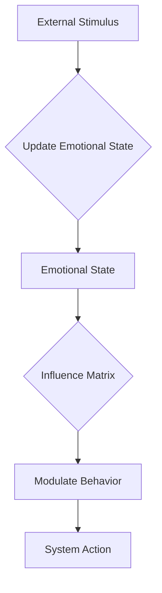

# NIS Protocol Emotional State System

The Emotional State System is a unique feature of the NIS Protocol that modulates agent behavior based on context-sensitive dimensions analogous to human emotions. Unlike traditional priority systems, these dimensions decay over time and influence multiple aspects of system behavior.

## Key Concepts

*   **Emotional Dimensions**: The system is built around a set of core emotional dimensions that represent different aspects of the system's state. These dimensions include:
    *   `suspicion`: Influences the level of scrutiny and validation applied to incoming data.
    *   `urgency`: Affects the processing priority and resource allocation for tasks.
    *   `confidence`: Modulates the decision-making threshold and the boldness of actions taken by the system.
    *   `interest`: Guides the focus of attention and the level of detail in processing.
    *   `novelty`: Influences the learning rate and the system's sensitivity to new patterns.

*   **Decay Over Time**: Each emotional dimension has a decay rate, which causes its value to return to a neutral state over time. This prevents the system from getting stuck in a particular emotional state and ensures that its behavior remains adaptive.

*   **Influence Matrix**: The system uses an influence matrix to map emotional dimensions to specific system behaviors. This allows for a flexible and configurable way to define how emotions affect the system's actions.

## Architecture

The Emotional State System is implemented in the `EmotionalStateSystem` class, which is located in `src/emotion/emotional_state.py`. This class provides methods for updating and querying the emotional state, as well as for managing the influence matrix.

### Dataflow Diagram

## How It Works

1.  **Initialization**: The `EmotionalStateSystem` is initialized with a set of default emotional dimensions and their decay rates. The initial values of these dimensions are calculated based on the system's context, such as whether it is a life-critical or real-time system.

2.  **State Updates**: The emotional state is updated in response to external stimuli or internal events. For example, if the system encounters a piece of data that is inconsistent with its current knowledge, it might increase the `suspicion` dimension.

3.  **Behavior Modulation**: The system's behavior is modulated by the current emotional state through the influence matrix. For example, a high level of `urgency` might cause the system to allocate more resources to a particular task, while a high level of `suspicion` might cause it to perform additional validation checks.

4.  **Decay**: Over time, the values of the emotional dimensions decay towards a neutral state. This ensures that the system's behavior remains adaptive and does not become overly influenced by past events. 