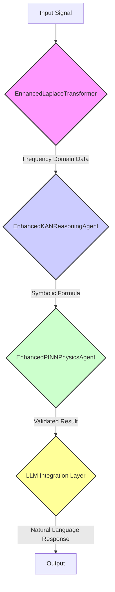

# NIS Protocol v3.1 System Architecture

## 1. Overview

The NIS Protocol is an advanced, containerized, and multi-layered AI framework. Its design is centered on achieving **scientifically grounded, interpretable, and self-aware artificial intelligence.** The architecture is built on three core pillars:

1.  **The Scientific Pipeline (Laplace → KAN → PINN → LLM):** A unique processing flow that grounds AI reasoning in mathematics and physics.
2.  **A Multi-Agent Cognitive Framework:** A system of specialized, coordinated agents that handle distinct cognitive functions.
3.  **A Meta-Control Layer:** A strategic oversight system, led by the `EnhancedConsciousAgent`, that governs the behavior and strategy of the entire agent ecosystem.

## 2. Core Architectural Principles

- **Interpretability by Design:** The system is built to be transparent. The use of Kolmogorov-Arnold Networks (KAN) allows the core reasoning process to be expressed as verifiable symbolic formulas.
- **Physical Grounding:** The system's outputs are not just statistically probable; they are validated against the fundamental laws of physics by Physics-Informed Neural Networks (PINN). This prevents AI "hallucinations" and ensures outputs are consistent with reality.
- **Modular & Agent-Based:** The system is composed of specialized, independent agents. This makes the system robust, scalable, and easy to maintain. Each agent is an expert in its domain (e.g., signal processing, reasoning, physics).
- **Self-Awareness and Introspection:** The protocol includes a dedicated "consciousness" layer that monitors the system's own performance, integrity, and alignment with its goals.

## 3. The Scientific Pipeline: From Signal to Validated Insight

This is the intellectual core of the NIS Protocol. Every complex query flows through this validated, multi-stage pipeline.



1.  **Laplace Transform (`EnhancedLaplaceTransformer`):** Ingests raw input (text, sensor data, etc.) and transforms it into the frequency domain. This is crucial for identifying underlying patterns and periodicities that are not visible in the time domain.
2.  **KAN Reasoning (`EnhancedKANReasoningAgent`):** Analyzes the frequency data and discovers the underlying mathematical relationships. It produces a symbolic formula (e.g., `f(x) = sin(2πx) + 0.1x²`), providing a fully interpretable model of the data.
3.  **PINN Validation (`EnhancedPINNPhysicsAgent`):** Takes the symbolic formula from the KAN and validates it against a set of physical laws (e.g., conservation of energy, thermodynamics). This step acts as a powerful "reality check."
4.  **LLM Integration (`GeneralLLMProvider`):** The final, validated, and interpretable result is passed to a Large Language Model, which translates the structured output into a coherent, natural language response for the user.

## 4. The Meta-Control Layer: Strategic Governance

The NIS Protocol's most advanced feature is its meta-control layer, which provides strategic oversight for the entire system.

```mermaid
graph TD
    subgraph "Meta-Control Layer"
        A[EnhancedConsciousAgent (The Strategist)] --> B{EnhancedScientificCoordinator (The Orchestrator)};
        B --> C[DRLResourceManager (The Resource Manager)];
    end

    subgraph "Cognitive Agents"
        D[Laplace, KAN, PINN, etc.]
    end

    B -- Adjusts Parameters --> D;
    C -- Allocates CPU/Memory --> D;
```

- **The Strategist (`EnhancedConsciousAgent`):** This is the highest level of control. It performs continuous introspection and sets the global **Behavior Mode** for the entire system (e.g., `HIGH_PERFORMANCE`, `ENERGY_SAVING`, `MAX_INTEGRITY`).
- **The Orchestrator (`EnhancedScientificCoordinator`):** This is the tactical layer. It receives the `BehaviorMode` from the Strategist and translates it into specific commands for the cognitive agents (e.g., "Laplace, reduce your resolution to 128 points to save energy").
- **The Resource Manager (`DRLResourceManager`):** This is the logistics layer. It executes the Orchestrator's commands at the infrastructure level by managing the allocation of CPU, memory, and other computational resources.

## 5. Deployment Architecture: Docker

The entire system is containerized with Docker and managed by a single `docker-compose.yml` file. A simple `start.sh` script handles the entire deployment process, making the system easy to run and manage.

- **`nis-backend`:** The main FastAPI application container where all agents and the scientific pipeline run.
- **`nis-redis-simple`:** A Redis container for high-speed caching and working memory.
- **`nis-kafka` & `nis-zookeeper`:** Kafka and Zookeeper for robust, asynchronous messaging between agents (though the current implementation relies more on direct calls for simplicity).
- **`nis-nginx`:** An Nginx container that acts as a reverse proxy, directing traffic to the backend.

This architecture ensures that the NIS Protocol is not just a theoretical model but a production-ready framework for building the next generation of intelligent systems. 