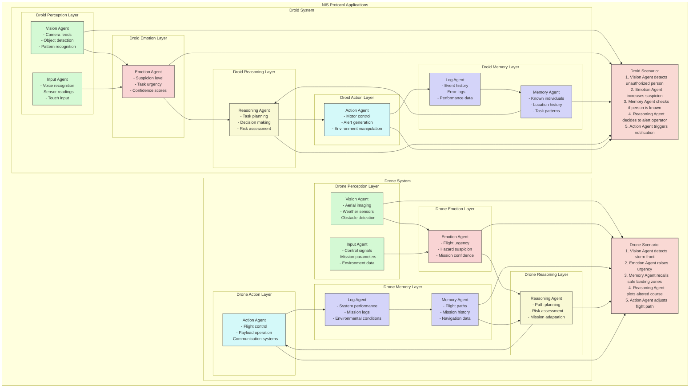

# NIS Protocol Applications: Droids and Drones

This diagram illustrates how the Neuro-Inspired System Protocol can be applied to both autonomous droids (robots) and drones (UAVs), creating more adaptable and intelligent systems.

## System Architecture

Both droids and drones follow the same biologically-inspired layered architecture:

1. **Perception Layer** - Processes sensory inputs specific to each platform
2. **Memory Layer** - Stores and retrieves relevant historical data
3. **Emotion Layer** - Modulates priorities and responses based on context
4. **Reasoning Layer** - Makes decisions by synthesizing all available information
5. **Action Layer** - Executes physical actions in the environment

## Droid-Specific Implementation

The droid system specializes in ground-based operations with:
- **Vision Agent** processing (implemented) (implemented) camera feeds for object/person recognition
- **Input Agent** handling voice commands and environmental sensors
- **Memory Agent** maintaining knowledge of people, locations, and contexts
- **Emotion Agent** adjusting suspicion for security applications
- **Reasoning Agent** making decisions about security risks and responses
- **Action Agent** controlling motors, locks, alerts, and communication

## Drone-Specific Implementation

The drone system focuses on aerial operations with:
- **Vision Agent** processing (implemented) (implemented) aerial imagery and detecting obstacles
- **Input Agent** handling flight control signals and mission parameters
- **Memory Agent** storing flight paths and navigation waypoints
- **Emotion Agent** heightening urgency for weather or obstacle avoidance
- **Reasoning Agent** planning optimal routes considering conditions
- **Action Agent** controlling flight systems and payloads

## Real-World Scenarios

The diagram includes two example scenarios:
1. **Security Droid Scenario** - Detecting and responding to unauthorized access
2. **Adaptive Drone Flight** - Navigating around hazardous weather conditions

In both cases, the emotional state system plays a crucial role in prioritizing responses and adjusting the level of scrutiny or urgency based on the situation.

This application of the NIS Protocol results in autonomous systems that can adapt to changing environments, learn from experience, and make context-aware decisions with human-like attention to priorities and risks. 