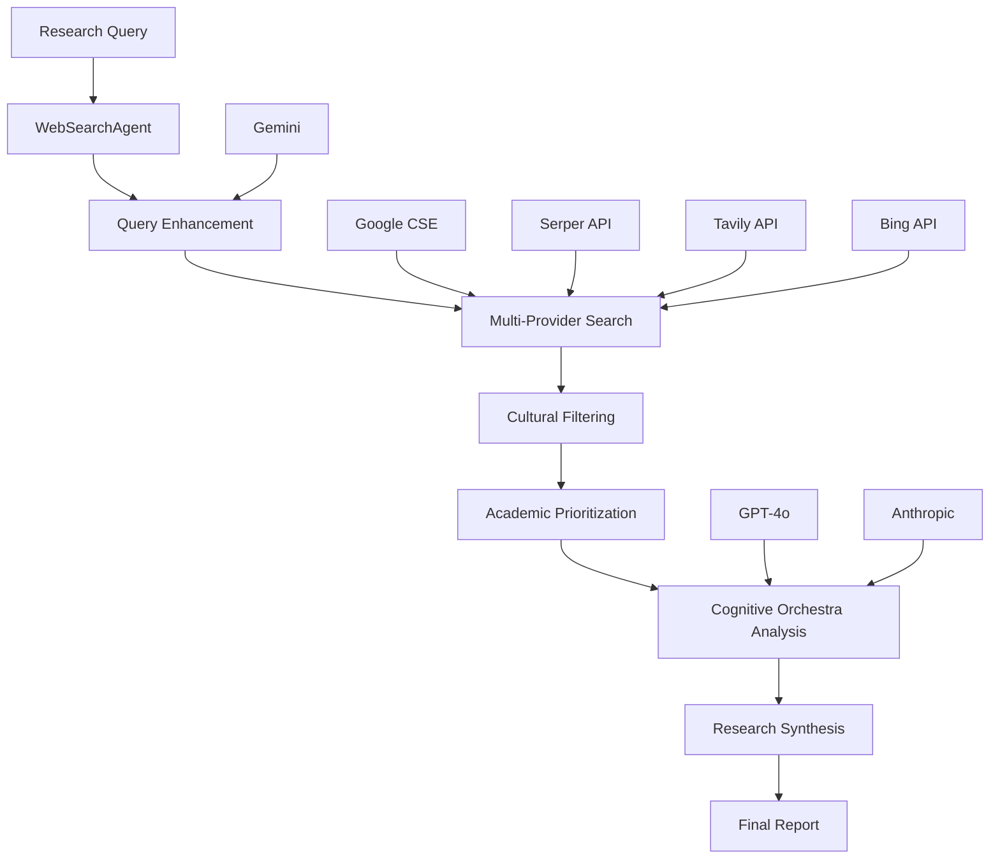

# Web Search Integration with Cognitive Orchestra

## Overview

The NIS Protocol Web Search Agent provides comprehensive research capabilities that integrate seamlessly with the Cognitive Orchestra for intelligent information gathering, analysis, and synthesis. This system is specifically designed for archaeological and cultural research with built-in cultural sensitivity and academic source prioritization.

## Architecture

### Core Components

1. **WebSearchAgent**: Main orchestration class for multi-provider search
2. **SearchProviders**: Multiple search API integrations (Google, Serper, Tavily, Bing)
3. **ResearchDomains**: Specialized configurations for different research areas
4. **CognitiveOrchestra Integration**: LLM-enhanced query generation and synthesis
5. **Cultural Sensitivity Engine**: Filtering and ranking based on cultural considerations

### Integration Flow



## Features

### Multi-Provider Search Integration

- **Google Custom Search Engine**: High-quality web search with custom configurations
- **Serper API**: Fast Google search results via API
- **Tavily API**: Research-focused search with academic source prioritization
- **Bing Search API**: Microsoft's search engine integration
- **Fallback System**: Graceful degradation when providers are unavailable

### Domain-Specific Research

#### Archaeological Domain
- Academic source prioritization (JSTOR, Cambridge, Academia.edu)
- Cultural heritage preservation focus
- Excavation methodology emphasis
- Recent discovery highlighting

#### Cultural Domain
- Indigenous rights and perspectives
- UNESCO and heritage organization sources
- Traditional knowledge systems
- Cultural sensitivity filtering

#### Historical Domain
- Primary source prioritization
- Chronological evidence analysis
- Historical methodology focus
- Cross-cultural historical perspectives

### Cognitive Orchestra Integration

The Web Search Agent integrates with the Cognitive Orchestra to provide:

1. **Enhanced Query Generation**: Using specialized LLMs for intelligent query expansion
2. **Multi-Function Analysis**: Parallel processing (implemented) (implemented) across different cognitive functions
3. **Cultural Intelligence**: Specialized cultural analysis and sensitivity checking
4. **Archaeological Expertise**: Domain-specific analysis and methodology assessment
5. **Synthesis Coordination**: Combining search results with cognitive analysis

## Configuration

### Environment Variables

```bash
# Search Providers
GOOGLE_API_KEY=your_google_api_key
GOOGLE_CSE_ID=your_custom_search_engine_id
SERPER_API_KEY=your_serper_api_key
TAVILY_API_KEY=your_tavily_api_key
BING_SEARCH_API_KEY=your_bing_api_key

# LLM Providers (for Cognitive Orchestra integration)
OPENAI_API_KEY=your_openai_api_key
ANTHROPIC_API_KEY=your_anthropic_api_key

# Configuration
CULTURAL_SENSITIVITY=true
ACADEMIC_PRIORITY=true
MAX_RESULTS_PER_PROVIDER=10
SEARCH_TIMEOUT=30
```

### Domain Configuration

Each research domain has specific configurations:

```python
domain_configs = {
    ResearchDomain.ARCHAEOLOGICAL: {
        "academic_sources": True,
        "cultural_sensitivity": True,
        "preferred_domains": ["jstor.org", "cambridge.org", "academia.edu"],
        "keywords_boost": ["archaeology", "cultural heritage", "excavation"]
    },
    ResearchDomain.CULTURAL: {
        "academic_sources": True,
        "cultural_sensitivity": True,
        "preferred_domains": ["unesco.org", "smithsonianmag.com"],
        "keywords_boost": ["culture", "indigenous", "heritage"]
    }
}
```

## Usage Examples

### Basic Research

```python
from agents.research import WebSearchAgent, ResearchDomain

# Initialize the agent
search_agent = WebSearchAgent()

# Conduct basic research
results = await search_agent.research(
    query="Mayan civilization recent discoveries",
    domain=ResearchDomain.ARCHAEOLOGICAL
)

print(f"Found {results['total_results']} sources")
print(f"Top result: {results['top_results'][0].title}")
```

### Comprehensive Research Query

```python
from agents.research import ResearchQuery, ResearchDomain

# Create detailed research query
research_query = ResearchQuery(
    query="indigenous archaeological sites preservation methods",
    domain=ResearchDomain.CULTURAL,
    context={
        "focus": "indigenous rights and cultural preservation",
        "sensitivity_level": "high",
        "academic_priority": True
    },
    max_results=15,
    academic_sources_only=True,
    cultural_sensitivity=True
)

# Execute research
results = await search_agent.research(research_query)
```

### Cognitive Orchestra Integration

```python
from llm.cognitive_orchestra import CognitiveOrchestra, CognitiveFunction

# Initialize both systems
search_agent = WebSearchAgent()
cognitive_orchestra = CognitiveOrchestra()

# Step 1: Web search
search_results = await search_agent.research(
    query="archaeological drone survey techniques",
    domain=ResearchDomain.ARCHAEOLOGICAL
)

# Step 2: Cognitive analysis
analysis_result = await cognitive_orchestra.execute_function(
    function=CognitiveFunction.ARCHAEOLOGICAL,
    prompt=f"Analyze these drone survey findings: {search_results}",
    context={"domain": "archaeological", "method": "drone_survey"}
)

# Step 3: Combined synthesis
combined_report = {
    "web_search": search_results,
    "cognitive_analysis": analysis_result,
    "integration_method": "web_search_plus_cognitive_orchestra"
}
```

## Cultural Sensitivity Features

### Filtering Mechanisms

1. **Sensitive Term Detection**: systematically filters results containing culturally insensitive language
2. **Indigenous Rights Protection**: Prioritizes sources that respect indigenous perspectives
3. **Academic Source Verification**: Ensures sources meet academic standards for cultural research
4. **Context-Aware Ranking**: Adjusts relevance scores based on cultural considerations

### Sensitive Terms Filter

The system systematically reduces relevance scores for results containing:
- "primitive"
- "savage" 
- "backward"
- "undeveloped"
- Other culturally insensitive terminology

### Academic Source Prioritization

Preferred academic domains receive relevance boosts:
- jstor.org (+0.3)
- academia.edu (+0.3)
- researchgate.net (+0.3)
- cambridge.org (+0.3)
- unesco.org (+0.2)

## Performance Optimization

### Caching Strategy

- **Search Result Caching**: 1-hour TTL for search results
- **Query Enhancement Caching**: Cached enhanced queries for common research topics
- **Provider Health Monitoring (implemented in src/monitoring/) (see src/Monitoring (implemented in src/monitoring/)/) ([health tracking](src/infrastructure/integration_coordinator.py))**: Automatic failover for unavailable providers

### Parallel processing (implemented) (implemented)

- **Multi-Provider Searches**: Concurrent searches across all available providers
- **Cognitive Function Coordination**: Parallel execution of different cognitive analyses
- **Result Aggregation**: Efficient deduplication and ranking of combined results

### Rate Limiting

- **Provider-Specific Limits**: Respects individual API rate limits
- **Graceful Degradation**: Falls back to available providers when limits are reached
- **Retry Logic**: Exponential backoff for temporary failures

## Integration with Archaeological Workflows

### Drone Survey Research

```python
# Research drone survey techniques
drone_research = await search_agent.research(
    query="archaeological drone survey cultural heritage sites",
    domain=ResearchDomain.ARCHAEOLOGICAL,
    context={"application": "heritage_preservation", "technology": "drone_survey"}
)

# Analyze with cognitive orchestra
technical_analysis = await cognitive_orchestra.execute_function(
    function=CognitiveFunction.REASONING,
    prompt="Analyze technical feasibility of drone surveys for archaeological sites",
    context=drone_research
)

cultural_analysis = await cognitive_orchestra.execute_function(
    function=CognitiveFunction.CULTURAL,
    prompt="Evaluate cultural sensitivity considerations for drone surveys",
    context=drone_research
)
```

### Site Documentation Research

```python
# Research documentation methodologies
doc_research = await search_agent.research(
    query="archaeological site documentation recommended practices",
    domain=ResearchDomain.ARCHAEOLOGICAL,
    context={"focus": "digital_preservation", "standards": "international"}
)

# Generate methodology recommendations
methodology = await cognitive_orchestra.execute_function(
    function=CognitiveFunction.ARCHAEOLOGICAL,
    prompt="Recommend documentation methodology based on current recommended practices",
    context=doc_research
)
```

## Error Handling and Fallbacks

### Provider Failures

1. **Automatic Failover**: Switches to available providers when one fails
2. **Mock Search Mode**: Provides test results when no providers are available
3. **Partial Results**: Returns available results even if some providers fail
4. **Error Logging**: Comprehensive logging for debugging and Monitoring (implemented in src/monitoring/) (see src/Monitoring (implemented in src/monitoring/)/) ([health tracking](src/infrastructure/integration_coordinator.py))

### Network Issues

1. **Timeout Handling**: Configurable timeouts for each provider
2. **Retry Logic**: Exponential backoff for temporary network issues
3. **Offline Mode**: Cached results when network is unavailable
4. **Status Monitoring (implemented in src/monitoring/) (see src/Monitoring (implemented in src/monitoring/)/) ([health tracking](src/infrastructure/integration_coordinator.py))**: Real-time provider health checking

## Monitoring (implemented in src/monitoring/) (see src/Monitoring (implemented in src/monitoring/)/) ([health tracking](src/infrastructure/integration_coordinator.py)) and Analytics

### Research Statistics

```python
# Get agent statistics
stats = search_agent.get_research_statistics()

print(f"Search providers: {stats['search_providers']}")
print(f"LLM providers: {stats['llm_providers']}")
print(f"Domain configurations: {stats['domain_configs']}")
print(f"Cache size: {stats['cache_size']}")
```

### Performance Metrics

- **Search Response Times**: Average response time per provider
- **Result Quality Scores**: Relevance and academic quality metrics
- **Cultural Sensitivity Scores**: Effectiveness of cultural filtering
- **Cognitive Orchestra Harmony**: Integration effectiveness metrics

## Future Enhancements

### Planned Features

1. **Real-time Search**: Live search result updates for ongoing research
2. **Collaborative Research**: Multi-user research session support
3. **Comprehensive Synthesis**: More comprehensive LLM-based synthesis
4. **Visual Search**: Image and video search integration
5. **Multilingual Support**: Research in multiple languages

### Domain Expansion

1. **Environmental Research**: Climate change impact on archaeological sites
2. **Space Archaeology**: Satellite imagery and space-based research
3. **Underwater Archaeology**: Marine archaeological research capabilities
4. **Digital Humanities**: Integration with digital humanities tools

## recommended Practices

### Research Query Design

1. **Specific Keywords**: Use domain-specific terminology
2. **Cultural Context**: Include cultural sensitivity requirements
3. **Academic Focus**: Specify academic source preferences
4. **Temporal Scope**: Define time periods for historical research

### Result Interpretation

1. **Source Verification**: Always verify academic sources
2. **Cultural Validation**: Check cultural appropriateness with domain experts
3. **Bias Awareness**: Consider potential biases in search results
4. **Cross-Reference**: Compare results across multiple providers

### Integration Guidelines

1. **Cognitive Orchestra Coordination**: Use appropriate cognitive functions for analysis
2. **Context Preservation**: Maintain research context across function calls
3. **Result Synthesis**: Combine web search and cognitive analysis effectively
4. **Error Handling**: Implement robust error handling for production use

## Troubleshooting

### Common Issues

1. **API Key Configuration**: Ensure all required API keys are properly configured
2. **Network Connectivity**: Verify internet connection and firewall settings
3. **Rate Limiting**: Monitor API usage to avoid rate limit violations
4. **Provider Availability**: Check individual provider status pages

### Debug Mode

Enable debug logging for detailed troubleshooting:

```python
import logging
logging.basicConfig(level=logging.DEBUG)

search_agent = WebSearchAgent()
# Detailed logs will show provider interactions and errors
```

## Security Considerations

### API Key Management

1. **Environment Variables**: Store API keys in environment variables
2. **Key Rotation**: Regularly rotate API keys
3. **Access Control**: Limit API key permissions where possible
4. **Monitoring (implemented in src/monitoring/) (see src/Monitoring (implemented in src/monitoring/)/) ([health tracking](src/infrastructure/integration_coordinator.py))**: Monitor API key usage for unusual activity

### Data Privacy

1. **Search Query Logging**: Implement appropriate logging policies
2. **Result Caching**: Consider privacy implications of cached results
3. **Cultural Sensitivity**: Ensure culturally sensitive information is handled appropriately
4. **Academic Ethics**: Follow academic research ethics guidelines

This comprehensive web search integration provides the NIS Protocol with powerful research capabilities while maintaining the highest standards of cultural sensitivity and academic rigor.