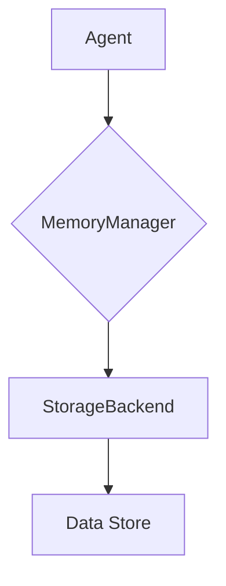

# NIS Protocol Memory System

The NIS Protocol's memory system is designed to provide a flexible and extensible way for agents to store and retrieve information. It is built around a `MemoryManager` class that provides a unified interface for interacting with various storage backends.

## Key Concepts

*   **Storage Backends**: The memory system supports different storage backends, allowing you to choose the one that recommended suits your needs. The default backend is an in-memory storage system, but you can easily extend the system to support other backends like Redis or a database.

*   **Unified Interface**: The `MemoryManager` class provides a consistent set of methods for storing, retrieving, deleting, and searching for data, regardless of the underlying storage backend. This makes it easy to switch between different backends without having to change your agent's code.

*   **Time-to-Live (TTL)**: You can set a time-to-live (TTL) for each piece of data you store in memory. This allows you to systematically expire old data and keep your memory system from growing too large.

*   **Access Log**: The `MemoryManager` keeps a log of all memory accesses, which can be useful for debugging and performance analysis.

## Architecture

The memory system is composed of two main components:

*   **`MemoryManager`**: This class provides the main interface for interacting with the memory system. It is responsible for logging memory accesses and for delegating storage and retrieval operations to the appropriate storage backend.

*   **`StorageBackend`**: This is an abstract base class that defines the interface for all storage backends. To add support for a new storage backend, you simply need to create a new class that inherits from `StorageBackend` and implements its abstract methods.

### Dataflow Diagram

## How It Works

1.  **Initialization**: The `MemoryManager` is initialized with a storage backend. If no backend is specified, it defaults to the `InMemoryStorage` backend.

2.  **Storing Data**: When an agent wants to store data, it calls the `store` method on the `MemoryManager`. The `MemoryManager` adds some metadata to the data (e.g., a timestamp and TTL) and then calls the `set` method on the storage backend to actually store the data.

3.  **Retrieving Data**: When an agent wants to retrieve data, it calls the `retrieve` method on the `MemoryManager`. The `MemoryManager` calls the `get` method on the storage backend and then removes the metadata before returning the data to the agent.

4.  **Searching for Data**: When an agent wants to search for data, it calls the `search` method on the `MemoryManager` with a search pattern. The `MemoryManager` calls the `search` method on the storage backend and then returns the results to the agent. 